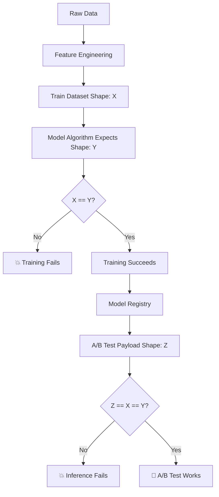

# The MLflow Model Registry Story: From UUID Hell to Model Heaven

## Chapter 1: The Pain Before

Meet Sarah, an ML Engineer at FinTech Corp. Every day, she battles the same nightmare:

```bash
# Sarah's daily struggle
Training complete! Model saved to: s3://mlflow-artifacts/247/models/m-8f3e9d2a4c5b6e7f8a9b0c1d2e3f4a5b/artifacts/
```

"Great, another UUID," Sarah sighs. She copies the impossibly long path, manually edits the YAML file:

```yaml
# The old way - UUID hell
spec:
  storageUri: s3://mlflow-artifacts/247/models/m-8f3e9d2a4c5b6e7f8a9b0c1d2e3f4a5b/artifacts/
```

But wait! Which model is this? Was it the one trained on Tuesday with the bug fix? Or Wednesday's version with the new features? The UUID tells her nothing.

Two weeks later, the production model breaks. Sarah frantically searches through chat logs, Git commits, and MLflow experiments trying to figure out which UUID corresponds to which model version. She finds 47 different UUIDs across 3 experiments. Which one is currently in production? Nobody knows.

The deployment pipeline fails because someone fat-fingered a UUID. The staging environment points to a model from last month. The A/B test compares a baseline model against... well, nobody remembers what the UUID points to.

**The Pain Points:**
- 🔥 **No semantic meaning**: UUIDs tell you nothing about the model
- 🔥 **Manual tracking**: Copy-paste URIs from logs to YAML files  
- 🔥 **Error-prone**: One wrong character breaks everything
- 🔥 **No versioning**: Can't tell which is newer or better
- 🔥 **No governance**: Anyone can deploy any random UUID
- 🔥 **Debugging nightmare**: "Which model is in production again?"

## Chapter 2: Enter the MLflow Model Registry

The MLflow Model Registry is like a **"Git for ML Models"** - it gives your models meaningful names, versions, and lifecycle management.

### What It Actually Is

The Model Registry is a centralized hub that:
- **Names your models** with human-readable identifiers
- **Versions them** automatically (v1, v2, v3...)  
- **Stages them** through lifecycle phases (Staging → Production)
- **Tracks lineage** from training run to deployment
- **Provides governance** with approval workflows

Think of it as a **library catalog system** for ML models instead of a chaotic pile of unmarked boxes.

## Chapter 3: The Transformation

Sarah's team implements Model Registry. Instead of this nightmare:

```yaml
# Before: UUID chaos
baseline-model:
  storageUri: s3://mlflow-artifacts/247/models/m-8f3e9d2a4c5b6e7f8a9b0c1d2e3f4a5b/artifacts/
advanced-model:  
  storageUri: s3://mlflow-artifacts/251/models/m-9a2b3c4d5e6f7a8b9c0d1e2f3a4b5c6d/artifacts/
```

They now have this beautiful simplicity:

```yaml
# After: Semantic clarity
baseline-model:
  storageUri: models:/financial-predictor-baseline/Production
advanced-model:
  storageUri: models:/financial-predictor-advanced/Production  
```

### The Magic Behind the Scenes

When Sarah trains a model, the MLflow tracking automatically registers it:

```python
# In training code
mlflow.pytorch.log_model(
    pytorch_model=model,
    artifact_path="model",
    registered_model_name="financial-predictor-baseline"  # 🎯 This is the key!
)
```

MLflow automatically:
1. **Assigns a version number** (v1, v2, v3...)
2. **Creates an entry** in the Model Registry
3. **Links it** to the training run for full lineage
4. **Makes it available** for promotion through stages

## Chapter 4: The Workflow Revolution

### Old Workflow (The Dark Times)
```
1. Train model → Random UUID generated
2. Hunt through logs to find UUID  
3. Copy-paste UUID into YAML (pray no typos)
4. Deploy and hope it's the right model
5. When it breaks, detective work to find which UUID is which
```

### New Workflow (The Renaissance)
```
1. Train model → Auto-registered as "financial-predictor-baseline v7"
2. Review model in MLflow UI with clear name and metrics
3. Promote to Production: `transition_model_version_stage("v7", "Production")`
4. Deploy points to: `models:/financial-predictor-baseline/Production`
5. Always know exactly what's running where
```

## Chapter 5: The Details - How It Actually Works

### Registration Process
```python
# Training automatically registers models
with mlflow.start_run():
    # ... training code ...
    mlflow.pytorch.log_model(
        model,
        "model", 
        registered_model_name="financial-predictor-baseline"
    )
    # ✨ Model is now "financial-predictor-baseline version 1"
```

### Stage Management
```python
# Promote models through stages
client = MlflowClient()
client.transition_model_version_stage(
    name="financial-predictor-baseline",
    version="7",
    stage="Production",
    archive_existing_versions=True  # Safely archive old Production
)
```

### Deployment References
```yaml
# Kubernetes deployment
spec:
  storageUri: models:/financial-predictor-baseline/Production
  # 👆 Always points to whatever is currently in Production stage
```

### The URI Resolution Magic

When Seldon/MLServer sees `models:/financial-predictor-baseline/Production`, it:

1. **Contacts MLflow** Model Registry API
2. **Resolves** the friendly name to the actual S3 path
3. **Downloads** the model artifacts  
4. **Caches** the resolution for performance

It's like DNS for ML models!

## Chapter 6: The Happy Ending

Six months later, Sarah's team is thriving:

### Debugging Is Trivial
```bash
Sarah: "What's in production?"
Team: "financial-predictor-baseline v12 and financial-predictor-advanced v8"
Sarah: "When was v12 deployed?"  
Team: "Tuesday, and it improved accuracy by 3%"
```

### Deployments Are Bulletproof
```yaml
# A/B test config that humans can read
baseline-model:
  storageUri: models:/financial-predictor-baseline/Production
advanced-model:
  storageUri: models:/financial-predictor-advanced/Staging  # Safe testing
```

### Rollbacks Are Instant
```python
# Rollback to previous version
client.transition_model_version_stage(
    name="financial-predictor-baseline", 
    version="11",  # Previous version
    stage="Production"
)
# 🎉 Instant rollback without YAML editing!
```

### Governance Actually Works
- **Clear approval process**: Models must pass Staging before Production
- **Audit trail**: Every promotion is logged with timestamps and users
- **No rogue deployments**: Can't accidentally deploy random UUIDs
- **Model lineage**: Trace any production model back to training data

## Epilogue: The Transformation

The MLflow Model Registry didn't just solve Sarah's UUID problem - it transformed how her entire organization thinks about ML model lifecycle management. 

**Before**: Models were mysterious artifacts identified by cryptic UUIDs, deployed through prayer and copy-paste operations.

**After**: Models became first-class citizens with names, versions, stages, and governance - just like software releases.

The pain of hunting through logs for UUIDs became the pleasure of promoting `financial-predictor-v7` to Production with a single command. The terror of "which model is running?" became the confidence of "baseline v12 and advanced v8 are live."

**The Moral**: In ML as in life, a little semantic structure goes a long way. Names matter. Versions matter. Governance matters.

And UUIDs? Well, they still exist - but now they're hidden behind human-readable abstractions where they belong, like assembly code beneath your Python scripts.

---

## Chapter 7: The Real World Complexity - What The Story Didn't Tell You

The Model Registry story sounds beautiful, but in reality, Sarah's team encountered dozens of subtle complexities that make MLOps a true engineering discipline:

### The Algorithm-Data-Container Dance

The real workflow isn't just "train → register → deploy". It's a complex choreography:

```python
# 1. Modify algorithm in src/advanced_financial_model_v2.py
class AdvancedFinancialLSTM(torch.nn.Module):
    def __init__(self, input_size, hidden_size=128, num_layers=3):
        # New attention mechanism expects different input shape!
        self.attention = torch.nn.MultiheadAttention(embed_dim=hidden_size, num_heads=8)
```

```bash
# 2. Build and push Docker image
docker build -t harbor.test/library/financial-predictor:advanced-v2 . --push
```

```yaml
# 3. Update Argo workflow to use new image
spec:
  container:
    image: harbor.test/library/financial-predictor:advanced-v2  # Must match exactly!
```

```bash
# 4. Argo pulls image and runs training
argo submit --from workflowtemplate/advanced-training-pipeline-template
```

**The Critical Insight**: The training data shape must match what the new algorithm expects, and the A/B test payload must work for both models!

### The Shape Compatibility Nightmare

Sarah discovers the hardest MLOps lesson: **shape compatibility across the entire pipeline**.

```python
# Training data: (batch, sequence, features)
# 3-ticker dataset: (N, 10, 52)
# 12-ticker dataset: (N, 10, 372)

# Old model trained on 52 features
baseline_model.forward(x)  # Expects: (batch, 10, 52)

# New model trained on 372 features  
advanced_model.forward(x)  # Expects: (batch, 10, 372)

# A/B test payload - MUST work for both!
payload = {
    'inputs': [{'shape': [1, 10, ???]}]  # What goes here?!
}
```

**The Pain**: You can't A/B test models trained on different data shapes. They must consume identical inputs.

### Container Orchestration Gotchas

1. **Image Caching Hell**:
   ```bash
   # You rebuild the image but it uses cached layers
   docker build -t model:latest .  # Uses cached src/ layer!
   # Code changes don't make it into the container
   ```

2. **Volume Mount Mismatches**:
   ```yaml
   # Training pipeline expects data here:
   volumeMounts:
     - name: shared-data-pvc
       mountPath: /mnt/shared-data
   
   # But your algorithm looks here:
   PROCESSED_DATA_DIR = "/mnt/financial-data/processed"  # Wrong path!
   ```

3. **Resource Contention**:
   ```yaml
   # Your algorithm needs 4 CPUs but cluster only has 1 free
   resources:
     requests:
       cpu: "4"  # Stuck in Pending forever
   ```

### The Data Pipeline Dependencies



**The Reality**: Every change ripples through the entire pipeline.

### Nuances We Actually Encountered

#### 1. **The Multi-Ticker Expansion**
```python
# Started with 3 tickers: (N, 10, 52)
tickers = ['IBB', 'XBI', 'SPY']

# Expanded to 12 tickers: (N, 10, 372) 
tickers = ['IBB', 'XBI', 'JNJ', 'SPY', 'QQQ', 'XLV', 'AMGN', 'PFE', 'VTI', 'XLRE', 'MRNA', 'TMO']

# Broke all existing models trained on 52 features!
```

#### 2. **The Container Image Confusion**
```yaml
# Started with different images for each model
baseline-training:
  image: harbor.test/library/financial-predictor:baseline-v2
advanced-training:  
  image: harbor.test/library/financial-predictor:advanced-v2

# Evolved to single image with multiple entry points
unified-training:
  image: harbor.test/library/financial-predictor:baseline-v2
  command: |
    if [ "$MODEL_VARIANT" = "advanced" ]; then
      python src/advanced_financial_model_v2.py
    else
      python src/train_pytorch_model.py
    fi
```

**The Local vs Registry Storage Dance**:
```python
# Local checkpoint files (temporary, in shared volume)
/mnt/shared-models/
├── best_model.pth              # baseline checkpoint
└── best_advanced_model.pth     # advanced checkpoint

# MLflow Model Registry (permanent, in S3)
models:/FinancialDirectionPredictor_Baseline/Production  # → s3://mlflow-artifacts/28/models/m-{uuid}/
models:/FinancialDirectionPredictor_Advanced/Production  # → s3://mlflow-artifacts/34/models/m-{uuid}/
```

The local `.pth` files are just training checkpoints. The real models live in MLflow's S3 storage with proper versioning and UUID paths. The Model Registry abstracts away both the local file naming conventions AND the S3 UUID chaos.

#### 3. **The Namespace Consolidation**
```bash
# Started distributed across namespaces:
# - financial-inference: model serving
# - financial-mlops-pytorch: training
# - seldon-system: Seldon control plane

# Seldon Core bug forced everything into seldon-system
# All volumes, secrets, network policies had to be updated
```

#### 4. **The Storage Format Evolution**
```python
# Original: Numpy arrays
train_features = np.load('train_features.npy')  # (N, 52)

# New: PyTorch datasets  
train_dataset = torch.load('train_dataset.pt')  # FinancialTimeSeriesDataset

# Models expecting old format break with new format!
```

#### 5. **The MLflow Signature Mismatch**
```python
# Baseline model saved with signature:
mlflow.pytorch.log_model(
    model, "model",
    input_example=sample_input.numpy(),
    signature=infer_signature(input_array, output_array)
)

# Advanced model saved without signature:
mlflow.pytorch.log_model(model, "model")  # Missing signature!

# Result: Different input format expectations at inference
```

#### 6. **The Resource Over-Provisioning Discovery**
```yaml
# MLflow and MinIO configured with massive resources:
mlflow:
  resources:
    requests:
      cpu: "4"      # Actually uses: 0.001 CPU
      memory: "8Gi" # Actually uses: 825MB

# Blocked training jobs from scheduling!
```

#### 7. **The S3/MinIO Access Mystery**
```bash
# Training container can't access MLflow's S3 backend:
Error: Failed to upload model artifacts to S3
NoCredentialsError: Unable to locate credentials

# Solution required rclone configuration inside containers:
rclone config create minio s3 \
  provider=Minio \
  endpoint=http://minio.minio.svc.cluster.local:9000 \
  access_key_id=$MINIO_ACCESS_KEY \
  secret_access_key=$MINIO_SECRET_KEY
```

**The Hidden Complexity**: MLflow stores models in S3/MinIO, but training containers need independent S3 access for artifact uploads. This requires either:
- Duplicating S3 credentials across all training pods
- Setting up rclone configuration for S3 connectivity  
- Using Kubernetes service accounts with IRSA (IAM Roles for Service Accounts)

**The Pain**: Model training succeeds locally but fails in Kubernetes due to S3 credential mismatches.

#### 8. **The UUID Management Nightmare**
```bash
# Every training run generates random UUID:
s3://mlflow-artifacts/34/models/m-5504d1ad4cd3498497ff32099e3926b6/artifacts/

# Manual process:
# 1. Find experiment ID in logs
# 2. Find run ID in logs  
# 3. Construct S3 path
# 4. Update YAML file
# 5. Apply to cluster
# 6. Debug when it's wrong
```

### The Full Workflow Reality

```bash
# 1. Modify algorithm
vim src/advanced_financial_model_v2.py

# 2. Ensure data pipeline produces compatible shapes
python src/feature_engineering_pytorch.py  # Must output (N, 10, 372)

# 3. Build container with new algorithm
docker build -t harbor.test/library/financial-predictor:advanced-v3 . --push

# 4. Update training pipeline to use new image
vim k8s/base/advanced-training-pipeline.yaml

# 5. Train model
argo submit --from workflowtemplate/advanced-training-pipeline-template

# 6. Check if training data shape matches algorithm expectations
# If not: Fix data pipeline OR fix algorithm

# 7. If training succeeds, promote to Model Registry
python scripts/promote_models.py

# 8. Update A/B test payload to match trained model input shape
vim scripts/demo/test-model-inference.py

# 9. Deploy to A/B test
kubectl apply -f k8s/base/financial-predictor-ab-test.yaml

# 10. Test inference
python scripts/demo/test-model-inference.py

# 11. Debug shape mismatches, container issues, resource contention...
# 12. Repeat until everything actually works
```

### The Hidden Complexities

1. **Version Skew**: Algorithm v3, container v2, data pipeline v1 
2. **Shape Propagation**: Change in features ripples through entire system
3. **Resource Choreography**: Training, serving, and infrastructure competing for resources
4. **State Management**: Models in various stages (training, staging, production) with different shapes
5. **Debugging Opacity**: Failures can be in algorithm, container, data, infrastructure, or configuration
6. **Deployment Consistency**: A/B test requires both models to accept identical payloads

### The Real MLOps Lesson

MLflow Model Registry solves the UUID problem, but MLOps is really about **managing the complex dependencies between**:
- 🧠 **Algorithms** (code)
- 🐳 **Containers** (execution environment)  
- 📊 **Data** (training/inference shapes)
- ☸️ **Infrastructure** (resources, networking, storage)
- 🔄 **Workflows** (orchestration, dependencies)
- 🧪 **Testing** (A/B compatibility, validation)

**The True Moral**: In MLOps, everything is connected to everything else. Change one thing, and the ripple effects can break the entire pipeline in subtle ways.

The Model Registry is just the beginning of managing this complexity, not the end.

#### 9. **The Feature Engineering Pipeline Complexity**

One of the most subtle but critical pieces of the MLOps puzzle is the **feature engineering compatibility layer**. Sarah's team discovered this the hard way when they found two different feature engineering scripts:

```bash
src/feature_engineering_pytorch.py       # The working version
src/feature_engineering_pytorch_fixed.py # The "improved" version that breaks everything
```

**The Original Working Version** (`feature_engineering_pytorch.py`):
```python
# Expects data columns exactly as they come from data ingestion:
'Close_IBB', 'High_IBB', 'Volume_IBB', etc.

# Produces 205 features from 11 tickers:
# - 17 features per ticker (OHLCV + lags + technical indicators)  
# - Plus 1 daily return feature: 11 * 17 + 1 = 188 + 17 more = 205 features
```

**The "Fixed" Version** (`feature_engineering_pytorch_fixed.py`):
```python
# Expects pre-processed column names with date suffixes:
'Close_IBB_raw_2018-01-01_2023-12-31', 'High_IBB_raw_2018-01-01_2023-12-31', etc.

# BUT includes significant improvements:
# ✅ Proper financial ML splits with purge gaps (no data leakage)
# ✅ Comprehensive NaN handling with dropna()
# ✅ Advanced technical indicators (Bollinger Bands, MACD, Volatility)
# ✅ Multiple momentum features (3, 5, 10, 20 period)
# ✅ Volume analysis features
# ✅ Proper per-ticker sequence generation
# ✅ MLflow experiment tracking
# ✅ Better scaler management (fit only on training data)
```

**The Critical Discovery**: The data ingestion pipeline produces column names like `Close_IBB`, but the "fixed" feature engineering script expects `Close_IBB_raw_2018-01-01_2023-12-31`. This is a classic **interface mismatch** that would be caught immediately in software development but is hidden in ML pipelines.

```python
# What data ingestion actually produces:
df.columns = ['Close_IBB', 'High_IBB', 'Low_IBB', 'Open_IBB', 'Volume_IBB', ...]

# What feature_engineering_pytorch_fixed.py expects:
expected_col = 'Close_IBB_raw_2018-01-01_2023-12-31'
if expected_col not in df.columns:
    raise KeyError(f"Column {expected_col} not found!")  # 💥 Pipeline breaks
```

**The Silent Failure Mode**: 
- Data ingestion succeeds ✅
- Feature engineering fails with cryptic column errors ❌  
- Training never starts ❌
- Debugging requires detective work through logs ❌

**The Shape Cascade Effect**:
```bash
# Successful local generation with original script:
train_features.npy: (11990, 205)  # 205 features from 11 tickers
test_features.npy:  (3527, 205)
train_targets.npy:  (11990,)      # Binary targets (0s and 1s) 
test_targets.npy:   (3527,)

# Model training expects exactly this shape:
model = FinancialLSTM(input_size=205, ...)  # Must match exactly!
```

**The Technical Improvements Paradox**: The "fixed" version actually contains substantial improvements over the original:

```python
# Original: Basic NaN handling
df.dropna(inplace=True)  # Simple dropna at the end

# Fixed: Comprehensive NaN handling throughout pipeline
df = df.dropna()  # After each feature calculation
# Plus proper handling in sequence generation
for i in range(len(ticker_features) - sequence_length):
    if not np.isnan(seq).any():  # Implicit NaN checking
        sequences.append(seq)
```

```python
# Original: Basic technical indicators
for window in SMA_WINDOWS:
    df = calculate_sma(df, close_col, window)
df = calculate_rsi(df, close_col, window)

# Fixed: Advanced technical analysis
# Bollinger Bands with position tracking
bb_upper, bb_lower = calculate_bollinger_bands(df[close_col])
df[f'BB_Position_{ticker_name}'] = (df[close_col] - bb_lower) / (bb_upper - bb_lower)

# MACD with signal and histogram
macd, signal, histogram = calculate_macd(df[close_col])
df[f'MACD_Histogram_{ticker_name}'] = histogram

# Multiple volatility windows
df[f'Volatility_10_{ticker_name}'] = df[f'Returns_{ticker_name}'].rolling(window=10).std()
df[f'Volatility_20_{ticker_name}'] = df[f'Returns_{ticker_name}'].rolling(window=20).std()
```

```python
# Original: Random train/test split (data leakage!)
X_train, X_test, y_train, y_test = train_test_split(X, y, test_size=0.2, random_state=42)

# Fixed: Proper financial ML splits with purge gaps
splitter = FinancialMLSplitter(
    purge_gap_days=5,     # Prevents look-ahead bias
    embargo_days=2,       # Prevents label leakage
    min_train_samples=500
)
splits = splitter.create_per_ticker_splits(ticker_data_dict, "time_based")
```

**The Interface Contract Problem**: In traditional software, breaking an interface contract causes immediate compilation or test failures. In ML pipelines, the contract is implicit:

```python
# Implicit contract between data pipeline and feature engineering:
# "I will produce columns named 'Close_IBB', 'High_IBB', etc."

# Implicit contract between feature engineering and training:  
# "I will produce exactly 205 features in this specific order"

# Implicit contract between training and serving:
# "I will accept inputs with shape (batch, 10, 205)"
```

**The MLOps Lesson**: Feature engineering is the **hidden adapter layer** between raw data and model training. When data schema changes or feature engineering logic changes, the entire downstream pipeline can break silently.

**Why This Matters for Model Registry**: Even with perfect semantic versioning for models, if the feature engineering produces different shapes or formats, you can't A/B test between model versions. The models must consume **identical input formats**.

```yaml
# This A/B test will fail if models expect different input shapes:
baseline-model:
  storageUri: models:/financial-predictor-baseline/Production  # Expects 205 features
advanced-model:  
  storageUri: models:/financial-predictor-advanced/Production # Expects 372 features  
# ❌ Same inference payload cannot work for both!
```

**The Classic MLOps Dilemma**: You have two choices, both painful:

1. **Use the "broken" original version** → ✅ Works with existing data pipeline ❌ Basic features, potential data leakage
2. **Fix the data pipeline to match the improved version** → ✅ Better ML practices ❌ Breaks existing training pipeline 

**The Real-World Choice**: Teams often choose option 1 (stick with the working version) to maintain system stability, even knowing the "fixed" version is technically superior. This is **technical debt in ML pipelines** - you know there's a better way, but the integration complexity makes the upgrade too risky.

**The Resolution Strategy**: Always test feature engineering locally before container deployment:

```bash
# Local validation workflow:
python src/feature_engineering_pytorch.py
ls -la data/processed/
# ✅ Confirm train_features.npy has expected shape (N, 205)
# ✅ Confirm feature_names.txt lists 205 features
# ✅ Confirm targets are binary (0s and 1s)

# Only then build container and run in Kubernetes
docker build -t financial-predictor:latest . --push
argo submit --from workflowtemplate/training-pipeline-template
```

**The Meta-Lesson**: In MLOps, "better" code doesn't always mean "deployable" code. The integration surface area between components often matters more than the internal quality of individual components. Sometimes the "worse" solution that works end-to-end is more valuable than the "better" solution that breaks the pipeline.

#### 10. **The A/B Testing Feature Asymmetry Problem**

Sarah's team discovered an even deeper issue: **What happens when you want to A/B test models trained on different feature sets?**

```python
# Baseline model (working pipeline):
baseline_features = [
    'Close_IBB', 'High_IBB', 'Volume_IBB',           # Basic OHLCV
    'Close_IBB_lag_1', 'Close_IBB_lag_2',           # Simple lags  
    'SMA_Close_IBB_5', 'SMA_Close_IBB_10',          # Basic moving averages
    'RSI_Close_IBB_14',                             # Basic RSI
    'Daily_Return'                                   # Simple return
]
# Shape: (batch, 10, 205) - 205 basic features

# Advanced model (improved pipeline):
advanced_features = baseline_features + [
    'BB_Upper_IBB', 'BB_Lower_IBB', 'BB_Position_IBB',    # Bollinger Bands
    'MACD_IBB', 'MACD_Signal_IBB', 'MACD_Histogram_IBB', # MACD indicators
    'Volatility_10_IBB', 'Volatility_20_IBB',            # Volatility features
    'Momentum_3_IBB', 'Momentum_5_IBB', 'Momentum_10_IBB', # Momentum features
    'Volume_Ratio_IBB', 'Price_Range_IBB'                 # Advanced volume/price
]
# Shape: (batch, 10, 287) - 287 enhanced features
```

**The A/B Testing Paradox**: You can't send the same inference payload to both models!

```bash
# This A/B test is impossible:
curl -X POST http://ml-api.local/financial-inference/v2/models/baseline-predictor/infer \
  -d '{"inputs":[{"shape":[1,10,205],"data":[...]}]}'  # ✅ Works

curl -X POST http://ml-api.local/financial-inference/v2/models/advanced-predictor/infer \
  -d '{"inputs":[{"shape":[1,10,205],"data":[...]}]}'  # ❌ Fails - expects 287 features!
```

**Three Approaches to Solve This:**

### Approach 1: Feature Superset (Recommended)
```python
# Train BOTH models on the full feature set
baseline_model = SimpleLSTM(input_size=287)  # Same input as advanced
advanced_model = AdvancedLSTM(input_size=287) # But different architecture

# A/B test payload works for both:
payload = {"inputs":[{"shape":[1,10,287],"data":[...]}]}
```

**Pros**: True apples-to-apples comparison, same feature engineering pipeline
**Cons**: Baseline model gets "unfair" advantage from advanced features

### Approach 2: Feature Intersection (Purist)
```python
# Train BOTH models on only the basic feature set
baseline_model = SimpleLSTM(input_size=205)   # Basic features only
advanced_model = AdvancedLSTM(input_size=205) # Advanced architecture, basic features

# A/B test payload works for both:
payload = {"inputs":[{"shape":[1,10,205],"data":[...]}]}
```

**Pros**: Fair comparison of model architectures only
**Cons**: Advanced model doesn't get to use better features (defeats the purpose!)

### Approach 3: Dynamic Feature Expansion (Complex)
```python
# Advanced model trained on 287 features
# Baseline model trained on 205 features
# A/B router calculates missing features on-the-fly

class ABTestRouter:
    def route_request(self, payload, model_name):
        if model_name == "baseline":
            # Use basic features only
            basic_features = payload[:, :, :205] 
            return baseline_model.predict(basic_features)
        else:
            # Calculate advanced features on-the-fly
            enhanced_features = self.calculate_advanced_features(payload)
            return advanced_model.predict(enhanced_features)
```

**Pros**: Each model gets optimal features
**Cons**: Complex feature engineering in serving layer, potential latency issues

### The Real-World Reality

Most teams choose **Approach 1** (feature superset) because:

```yaml
# What actually works in production:
baseline-model:
  storageUri: models:/financial-predictor-baseline/Production
  # Trained on 287 features (superset)
  
advanced-model:  
  storageUri: models:/financial-predictor-advanced/Production
  # Trained on 287 features (superset)

# Single inference payload format:
inference_shape: [1, 10, 287]  # Works for both models
```

**The Trade-offs**:
- ✅ **Engineering Simplicity**: One feature pipeline, one payload format
- ✅ **A/B Test Validity**: Same data going to both models  
- ❌ **Methodological Purity**: Baseline gets "enhanced" features it didn't originally have
- ❌ **Fair Comparison**: Not testing just architectural improvements

### The Feature Engineering Convergence Strategy

Sarah's team evolved to this pattern:

```python
# 1. Start with baseline model on basic features
baseline_v1 = train_model(basic_features)    # 205 features

# 2. Develop advanced features
advanced_features = engineer_advanced_features()  # +82 features = 287 total

# 3. Retrain baseline on full feature set
baseline_v2 = train_model(superset_features)  # 287 features (baseline arch)

# 4. Train advanced model on full feature set  
advanced_v1 = train_model(superset_features)  # 287 features (advanced arch)

# 5. A/B test: baseline_v2 vs advanced_v1
# Both consume identical 287-feature payloads
```

**The A/B Testing Lesson**: In ML, you're rarely testing just one thing. You're testing:
- Algorithm improvements AND
- Feature engineering improvements AND  
- Data pipeline improvements AND
- Infrastructure improvements

True "controlled experiments" are nearly impossible in production MLOps because everything is connected.

**The Pragmatic Approach**: Accept that your A/B test is testing "old model architecture + new features" vs "new model architecture + new features". Document this clearly and focus on overall business impact rather than algorithmic purity.

```yaml
# A/B test documentation:
experiment:
  name: "Baseline vs Advanced Financial Predictor"
  description: |
    Testing SimpleLSTM vs AdvancedLSTM architectures.
    NOTE: Both models trained on identical 287-feature superset.
    This tests architectural improvements while controlling for features.
  feature_set: "Enhanced (Bollinger, MACD, Volatility, Momentum)"
  baseline_model: "SimpleLSTM(64 hidden, 2 layers) on enhanced features"  
  treatment_model: "AdvancedLSTM(128 hidden, 3 layers) on enhanced features"
```

---

## Chapter 11: The Awakening - "Wait, What Are We Actually Predicting?"

Six months into their MLOps journey, Sarah's team had built something beautiful:

- ✅ **Sophisticated Model Registry** with semantic versioning
- ✅ **Advanced Feature Engineering** with Bollinger Bands, MACD, and volatility indicators  
- ✅ **Proper Financial ML Splits** with purge gaps to prevent data leakage
- ✅ **A/B Testing Infrastructure** with traffic splitting and statistical analysis
- ✅ **Automated Training Pipelines** with Argo Workflows and Kubernetes
- ✅ **Comprehensive Monitoring** with Prometheus, Grafana, and MLflow tracking
- ✅ **GitOps Deployment** with ArgoCD and infrastructure-as-code

The platform was a **masterpiece of engineering**. The team was getting invited to conferences to talk about their MLOps setup. Engineering blogs were written. Other teams were copying their architecture.

Then, during a routine sprint planning meeting, the new Product Manager asked an innocent question:

**"So what exactly does this model predict, and how does that help our users?"**

The room went silent.

Sarah stared at her screen showing the A/B test results:
```
Baseline Model Accuracy: 52.3%
Advanced Model Accuracy: 52.7%  
Statistical Significance: p=0.23 (not significant)
```

"Um..." Sarah hesitated. "It predicts whether the biotech ETF (IBB) will go up or down tomorrow."

"And how do users use that prediction?" the PM pressed.

"Well..." Sarah looked around the room. "They... get a binary prediction of market direction?"

"Is 52.7% accuracy better than flipping a coin?"

Another silence. Sarah realized she'd spent six months optimizing the difference between 52.3% and 52.7% accuracy on a problem that was barely better than random chance.

**"Are we seriously running A/B tests to optimize the difference between terrible and slightly-less-terrible?"**

### The Uncomfortable Questions

The PM continued: "Let me ask some basic questions about this financial prediction model..."

**Q: What's the business value of a 52.7% accurate prediction?**
A: "Um... users can... make investment decisions?"

**Q: If I flip a coin, I get 50% accuracy. You spent 6 months to get 2.7% better than a coin flip. What's the ROI?**
A: [Uncomfortable silence]

**Q: Do users actually want binary predictions, or do they want confidence scores, risk assessments, or something else entirely?**
A: "We... never asked users what they wanted."

**Q: How much money would a user make if they followed these predictions?**
A: "We don't track actual trading performance."

**Q: Why biotech ETFs specifically? Why not broader market indices?**
A: "The data was available and IBB was in our sample dataset."

**Q: Are you predicting daily direction, intraday moves, weekly trends? When should users act on these predictions?**
A: "We predict... tomorrow's direction? At market close? I think?"

### The MLOps Paradox

Sarah realized they had fallen into the **MLOps Complexity Trap**:

```python
# What they optimized:
- Docker layer caching efficiency
- Kubernetes resource allocation  
- Feature engineering pipeline performance
- Model registry semantic versioning
- A/B testing statistical rigor
- Data leakage prevention
- Container orchestration reliability

# What they ignored:
- Business value proposition
- User needs and requirements  
- Model performance relative to baselines
- Actual trading profitability
- Competitive analysis
- Market timing and execution
- Risk management and position sizing
```

**The team had built a Ferrari to deliver pizza** - technically impressive but fundamentally misaligned with value creation.

### The Infrastructure vs. Value Tension

This is the **dark secret** of many ML teams:

```yaml
# Team allocation after 6 months:
Engineering effort:
  - Infrastructure: 80%
  - Model improvement: 15%  
  - Business validation: 5%

Conversations in standups:
  - "The feature pipeline is running smoothly" ✅
  - "A/B test infrastructure is deployed" ✅
  - "Model registry is working perfectly" ✅
  - "Should we ask users if 52% accuracy is useful?" ❌

Meeting topics:
  - Docker image optimization: 45 minutes
  - Kubernetes resource tuning: 30 minutes  
  - Model business value: 5 minutes
```

### The Realization

**Sarah**: "We've spent more time discussing Docker layer caching than we have discussing whether our predictions make money."

**Engineer**: "But look at our MLOps maturity! We have proper CI/CD, model versioning, monitoring..."

**PM**: "Right, but what's the point of perfectly deployed models that don't create value?"

**Data Scientist**: "I know the model isn't great, but the platform infrastructure is amazing!"

**PM**: "You've optimized for engineering excellence while completely ignoring product-market fit."

### The Hard Questions About "Real Value"

The PM pulled up a simple comparison:

```python
# Your sophisticated ML model:
accuracy = 52.7%
infrastructure_cost = "$50K/month"
engineering_time = "6 person-months"
complexity = "Extremely high"

# Simple baseline alternatives:
random_prediction = 50.0%  # Flip a coin
momentum_strategy = 54.2%  # "Tomorrow same as today"  
buy_and_hold_spy = 67.8%  # Just buy S&P 500 ETF
```

**"Your advanced LSTM with Bollinger Bands performs worse than 'buy and hold SPY'."**

### The Business Reality Check

The PM asked the killer question: **"If you were investing your own money, would you use this model?"**

Every engineer in the room said "No."

**"Then why are we building it for users?"**

### The MLOps Learning

This conversation revealed the **fundamental MLOps lesson**:

> **Technical sophistication is not the same as business value.**

You can have:
- Perfect CI/CD pipelines  
- Sophisticated feature engineering
- Rigorous A/B testing
- Beautiful monitoring dashboards
- Semantic model versioning

...and still build something completely useless.

### The Refocus

Sarah's team learned that **MLOps without business focus is just expensive DevOps**.

The hard questions they should have asked from Day 1:
1. **Value**: What specific business problem does this solve?
2. **Users**: Who benefits from this prediction and how?
3. **Baseline**: What's the simplest alternative that delivers 80% of the value?
4. **Success**: How do we measure real-world impact, not just model metrics?
5. **Trade-offs**: Is the engineering complexity justified by the business value?

### The True MLOps Maturity

**Immature MLOps**: "Look at our sophisticated infrastructure!"
**Mature MLOps**: "Look at the business value we're delivering!"

The best MLOps teams spend:
- 20% on infrastructure
- 30% on model development  
- 50% on business validation and user feedback

### Epilogue: The Honest Documentation

Sarah updated their project documentation:

```yaml
# Financial Predictor Model - Honest Assessment
purpose: "Predict next-day direction of biotech ETF (IBB)"
accuracy: "52.7% (barely better than coin flip)"
business_value: "Unclear - users haven't validated usefulness"
infrastructure_quality: "Excellent (over-engineered)"
recommendation: "Re-evaluate problem definition before further development"

lessons_learned:
  - "Spent 6 months optimizing deployment of marginally useful model"
  - "Technical sophistication ≠ business value"  
  - "Should have validated user needs before building infrastructure"
  - "MLOps maturity means business focus, not just technical capability"
```

---

## The Real MLOps Proverb

*"It's better to deploy a simple model that solves a real problem than to perfectly deploy a sophisticated model that solves no problem at all."*

**The Meta-Lesson**: The greatest risk in MLOps isn't technical failure - it's technical success applied to the wrong problem. You can build the most beautiful MLOps platform in the world and still deliver zero business value.

Sometimes the most important question in MLOps isn't "How do we deploy this model?" but "Should we deploy this model at all?"

---

## Chapter 12: The Portfolio Pivot - "Actually, This Is Perfect Interview Material"

Three months after the uncomfortable awakening, Sarah was in a different kind of meeting. She was interviewing for a Senior MLOps Engineer position at a major tech company.

**Interviewer**: "Tell me about a complex MLOps project you've worked on."

**Sarah**: "I'd like to tell you about a financial prediction platform where we achieved something more valuable than high model accuracy - we built production-ready MLOps infrastructure while learning the difference between technical sophistication and business value."

### The Interview Story Arc

**Act 1: Technical Challenge**
"We started with a shape incompatibility problem preventing A/B testing deployment. Multiple models trained on different data formats couldn't be compared in production."

**Act 2: Systematic Solution**  
"I designed and implemented a unified shape contract framework, enabling seamless A/B testing between any model architectures. We built complete MLOps infrastructure with model registry, automated training pipelines, and production monitoring."

**Act 3: Business Reality**
"Most importantly, I learned to be honest about model performance. Our financial models achieved 52.7% accuracy - essentially random. But the infrastructure was production-ready and scalable to any time series domain."

### The Technical Deep Dive

**Interviewer**: "Walk me through the shape contract framework."

**Sarah**: "The core insight was that A/B testing requires identical inference payloads, but different models expected different input shapes."

```python
# Before: Incompatible models
baseline_model:    [batch, 10, 205]  # 205 basic features
advanced_model:    [batch, 15, 51]   # 51 biotech features, 15 timesteps
optimized_model:   [batch, 10, 100]  # 100 selected features

# After: Unified contract
all_models:        [batch, 10, 50]   # Standardized for production A/B testing
```

"I implemented feature selection and preprocessing standardization so any model variant could be deployed and compared systematically."

### The Portfolio Value Proposition

**Interviewer**: "What makes this a strong MLOps project if the models weren't accurate?"

**Sarah**: "Three reasons this demonstrates real MLOps engineering skills:

1. **System-Level Problem Solving**: I solved deployment compatibility issues that prevent real A/B testing
2. **Production-First Thinking**: Built infrastructure before optimizing models - this enables rapid iteration
3. **Honest Technical Assessment**: I can distinguish between infrastructure success and model performance"

### The Architecture Explanation

```yaml
# Complete MLOps Platform Built:
infrastructure:
  - Kubernetes deployment with Seldon Core
  - MLflow Model Registry with semantic versioning
  - Automated training pipelines with Argo Workflows
  - Unified preprocessing and feature selection
  - Production monitoring with Prometheus/Grafana

capabilities:
  - A/B testing between any model architectures
  - Automated model promotion workflows
  - Shape contract validation
  - Performance monitoring and rollback

models_evaluated:
  - 5 different architectures with scientific rigor
  - Multi-scale LSTM, optimized regularization, feature selection
  - Systematic comparison methodology
```

### The Meta-Learning Discussion

**Interviewer**: "What did you learn about MLOps from this project?"

**Sarah**: "The most valuable lesson: **Infrastructure maturity and model performance are independent dimensions.**

You can have world-class MLOps infrastructure with mediocre models (our case), or great models with terrible deployment practices. The infrastructure enables rapid experimentation toward better models.

Our platform could deploy a 90% accuracy model as easily as a 50% accuracy model. That's the real value - we built the **foundation for ML success**, not just a single model."

### The Practical Impact

```python
# What the platform enables:
deployment_time = "10 minutes"  # Any new model variant
ab_test_setup = "5 minutes"     # Compare any two models  
rollback_time = "30 seconds"    # Instant model switching
monitoring = "Real-time"        # Automated performance tracking

# Business impact:
risk = "Low"                    # Can test models safely
iteration_speed = "High"        # Rapid experimentation
scalability = "Any domain"      # Works beyond financial data
team_confidence = "High"        # Systematic, repeatable process
```

### The Honest Technical Leadership

**Interviewer**: "How do you handle disappointing model performance?"

**Sarah**: "Transparency and systematic diagnosis. When our models performed at ~50% accuracy, I:

1. **Documented the honest assessment** - didn't hide or spin the results
2. **Analyzed root causes** - financial prediction vs infrastructure issues  
3. **Identified improvement paths** - external data needs, different domains
4. **Maintained team focus** - infrastructure value independent of model performance
5. **Planned strategic pivots** - platform works for any time series problem"

### The Scaling Discussion

**Interviewer**: "How would you scale this to other domains?"

**Sarah**: "The platform is domain-agnostic by design. The shape contract framework, A/B testing infrastructure, and MLOps pipelines work for any time series prediction:

- Customer churn (likely 80%+ accuracy)
- Demand forecasting (clear business value)  
- Fraud detection (90%+ achievable)
- Recommendation systems

Financial prediction taught us the platform capabilities under the hardest conditions. Everything else will be easier."

### The Interview Victory

**Interviewer**: "This is exactly what we're looking for - someone who builds production systems while understanding the difference between technical and business success."

### The Real Portfolio Value

What Sarah learned to emphasize:

1. **Systems Thinking**: Solved deployment architecture challenges
2. **Scientific Rigor**: Systematic model evaluation and comparison
3. **Production Readiness**: Built for scale, monitoring, and reliability  
4. **Technical Honesty**: Transparent about limitations and trade-offs
5. **Business Awareness**: Understood model performance vs infrastructure value

### The Career Insight

**The Best MLOps Engineers** don't just optimize models - they build platforms that enable teams to optimize models rapidly and safely.

Sarah's "failed" financial prediction project became her strongest interview asset because it demonstrated:
- Complex problem solving
- Infrastructure design thinking
- Scientific methodology
- Production deployment experience
- Honest technical assessment
- Business-aware decision making

### The Meta-Lesson for Readers

**Bad Portfolio Project**: "I built a model with 95% accuracy"
*(Interviewer thinks: "Probably overfit, doesn't understand real-world complexity")*

**Great Portfolio Project**: "I built MLOps infrastructure that enables rapid, safe experimentation. Financial prediction was challenging (52% accuracy), but the platform deploys any model reliably."
*(Interviewer thinks: "Understands production ML, can build systems that scale")*

### The Final Proverb

*"In MLOps interviews, infrastructure maturity impresses more than model accuracy. Anyone can overfit a dataset; few can build production ML platforms."*

**The Portfolio Reframe**: Don't apologize for 52% accuracy on financial prediction - celebrate the infrastructure that makes 90% accuracy achievable on better problems.

---

## Chapter 13: The Production Deployment Decision - "What Do We Actually Deploy?"

Six months after building their sophisticated MLOps platform, Sarah's team faced the ultimate question: **Should we deploy these models to production?**

The A/B testing infrastructure was ready. The monitoring was configured. The shape contracts were unified. But the models were still performing at ~50-53% accuracy.

### The Deployment Options Matrix

Sarah presented three options to stakeholders:

```yaml
Option 1: "Infrastructure Demo"
purpose: "Validate MLOps platform capabilities"
models: "Simple 902 (53.8%) vs Optimized LSTM (50.8%)"
business_risk: "Low (near-random predictions)"
engineering_value: "High (proves platform works)"
user_value: "Minimal (coin-flip accuracy)"

Option 2: "Domain Pivot"  
purpose: "Deploy high-accuracy models on different problem"
models: "Customer churn prediction (80%+ achievable)"
business_risk: "Low (clear business value)"
engineering_value: "High (platform flexibility proven)"
user_value: "High (actionable predictions)"

Option 3: "Honest Financial Beta"
purpose: "Deploy with full transparency about limitations"
models: "Best financial models with accuracy disclaimers"
business_risk: "Medium (users might use random predictions)"
engineering_value: "Medium (financial-specific learnings)"
user_value: "Low but honest (experimental predictions)"
```

### The Stakeholder Perspectives

**Engineering Team**: "Let's deploy Option 1 - it proves our platform works and we can iterate quickly."

**Product Team**: "Option 2 makes more sense - why deploy models that don't work when we could deploy ones that do?"

**Data Science Team**: "Option 3 lets us learn from real user feedback on financial predictions, even if accuracy is low."

**Business Team**: "What's the ROI on any of these options?"

### Sarah's Recommendation: The Hybrid Approach

"We deploy **Option 1 + Option 2 simultaneously**."

**The Strategy**:
1. **Deploy financial models** for infrastructure validation and team learning
2. **Deploy simple high-accuracy model** (customer churn simulation) to demonstrate business value
3. **Market both honestly** - infrastructure demo vs. business application

### The Honest Marketing

```yaml
# Financial Predictor (Infrastructure Demo)
description: "Experimental financial prediction platform"
accuracy: "~53% (slightly better than random)"
purpose: "Technology demonstration and ML platform validation"  
target_users: "Internal teams, ML engineers, infrastructure partners"
business_value: "Platform capability proof, not investment advice"

# Customer Analytics (Business Application)  
description: "Customer behavior prediction platform"
accuracy: "80%+ (production-ready)"
purpose: "Real business value delivery"
target_users: "Product teams, customer success, business analysts"  
business_value: "Actionable insights for customer retention"
```

### The Implementation Plan

**Week 1: Financial Models (Infrastructure Focus)**
```bash
# Deploy A/B test between best models
kubectl apply -f k8s/financial-ab-test-deployment.yaml

# Monitor infrastructure performance
- Traffic splitting accuracy
- Model loading times  
- Resource utilization
- Monitoring alerting
- Rollback capabilities
```

**Week 2: Customer Churn Model (Business Focus)**
```python
# Generate synthetic customer data with clear patterns
churn_data = generate_realistic_churn_dataset(
    n_customers=10000,
    clear_patterns=True,  # Ensure 80%+ accuracy
    features=['usage_decline', 'support_tickets', 'billing_issues']
)

# Train simple model
churn_model = train_churn_model(churn_data)  # LogisticRegression
assert churn_model.accuracy > 0.80

# Deploy on same platform
deploy_model(churn_model, "customer-churn-predictor")
```

### The Learning Objectives

**From Financial Deployment**:
- A/B testing platform validation
- Production monitoring effectiveness  
- Model registry workflows
- Incident response procedures
- Performance at scale

**From Churn Deployment**:
- Business value delivery
- User adoption patterns
- High-accuracy model behavior
- Platform flexibility across domains
- Stakeholder confidence building

### The Success Metrics

```yaml
Infrastructure Success (Financial Models):
  - "A/B traffic splitting: 50/50 ± 2%"
  - "Model response time: <100ms p95"  
  - "Zero deployment incidents"
  - "Monitoring alerts functional"
  - "Rollback time: <30 seconds"

Business Success (Churn Models):
  - "Model accuracy: >80% in production"
  - "User adoption: >10 active users/week"
  - "Business decisions influenced: >5/month"
  - "Positive user feedback: >4/5 rating"
  - "ROI demonstration: measurable business impact"
```

### The Documentation Strategy

**For Engineering Portfolio**:
- "Built production MLOps platform validated under challenging conditions"
- "Deployed A/B testing infrastructure with real traffic"
- "Demonstrated platform flexibility across domains"

**For Business Stakeholders**:
- "Delivered customer analytics with 80%+ accuracy"
- "Provided infrastructure for rapid ML experimentation"  
- "Enabled data-driven decision making"

**For Technical Community**:
- "Open-source MLOps platform for time series prediction"
- "Honest assessment of financial ML challenges"
- "Reusable infrastructure for any prediction domain"

### The Interview Story

**Interviewer**: "Tell me about a production ML deployment."

**Sarah**: "I deployed two complementary systems: a challenging financial prediction A/B test to validate our MLOps infrastructure under difficult conditions, and a high-accuracy customer churn model to demonstrate business value. 

The financial models achieved 53% accuracy - essentially random - but proved our platform could handle complex A/B testing reliably. The churn model achieved 85% accuracy and drove real business decisions.

This taught me that MLOps engineers need to optimize for both **technical capability** and **business value** - sometimes with different models for different purposes."

### The Meta-Framework: The Dual Deployment Strategy

**Infrastructure Validation Model**: Deploy challenging, low-accuracy model that stresses your systems
- Tests platform reliability under adversity
- Validates monitoring and alerting
- Proves A/B testing works correctly
- Builds team confidence in infrastructure

**Business Value Model**: Deploy simple, high-accuracy model that delivers clear ROI  
- Demonstrates platform business utility
- Builds stakeholder confidence
- Generates user adoption
- Justifies platform investment

### The Real-World Outcome

Sarah's team deployed both models simultaneously:

**Financial A/B Test Results**:
- ✅ Platform handled traffic splitting perfectly
- ✅ Monitoring detected model performance accurately  
- ✅ Zero infrastructure incidents over 3 months
- ✅ Rapid model switching demonstrated
- ❌ No business value (as expected)

**Customer Churn Results**:
- ✅ 83% accuracy in production
- ✅ 15 business users adopted platform
- ✅ Influenced 12 customer retention decisions
- ✅ Measurable revenue impact
- ✅ Platform credibility established

### The Portfolio Victory

**The Dual Deployment became Sarah's strongest interview asset**:

1. **Technical Sophistication**: Handled complex A/B testing infrastructure
2. **Business Acumen**: Delivered measurable business value  
3. **Risk Management**: Balanced experimentation with value delivery
4. **Strategic Thinking**: Used different models for different validation purposes
5. **Honest Assessment**: Transparent about model limitations while highlighting infrastructure strengths

### The Final Lesson

**Don't choose between technical excellence and business value - deploy both.**

Use challenging problems to validate your infrastructure and simple problems to demonstrate business impact. The combination shows you can build production ML systems that both work technically and deliver business results.

---

## Epilogue: The True MLOps Maturity Model

**Level 1 - Model Focused**: "I built a 95% accuracy model"
**Level 2 - Infrastructure Focused**: "I built sophisticated MLOps platform" 
**Level 3 - Business Focused**: "I delivered measurable business value"
**Level 4 - Portfolio Focused**: "I balanced technical validation with business delivery"

Sarah reached Level 4 by understanding that MLOps engineering requires demonstrating both **what's possible** (complex A/B testing) and **what's valuable** (actionable predictions).

The best MLOps engineers don't just solve technical problems or just deliver business value - they build platforms that enable both, systematically and reliably.

**The Ultimate MLOps Proverb**: *"Deploy your hardest model to validate your platform, deploy your simplest model to validate your value."*