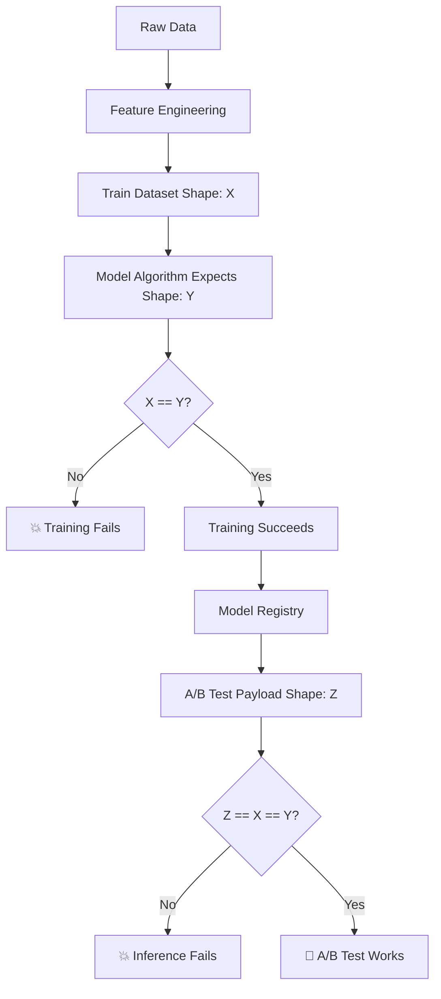

# The MLflow Model Registry Story: From UUID Hell to Model Heaven

## Chapter 1: The Pain Before

Meet Sarah, an ML Engineer at FinTech Corp. Every day, she battles the same nightmare:

```bash
# Sarah's daily struggle
Training complete! Model saved to: s3://mlflow-artifacts/247/models/m-8f3e9d2a4c5b6e7f8a9b0c1d2e3f4a5b/artifacts/
```

"Great, another UUID," Sarah sighs. She copies the impossibly long path, manually edits the YAML file:

```yaml
# The old way - UUID hell
spec:
  storageUri: s3://mlflow-artifacts/247/models/m-8f3e9d2a4c5b6e7f8a9b0c1d2e3f4a5b/artifacts/
```

But wait! Which model is this? Was it the one trained on Tuesday with the bug fix? Or Wednesday's version with the new features? The UUID tells her nothing.

Two weeks later, the production model breaks. Sarah frantically searches through chat logs, Git commits, and MLflow experiments trying to figure out which UUID corresponds to which model version. She finds 47 different UUIDs across 3 experiments. Which one is currently in production? Nobody knows.

The deployment pipeline fails because someone fat-fingered a UUID. The staging environment points to a model from last month. The A/B test compares a baseline model against... well, nobody remembers what the UUID points to.

**The Pain Points:**
- 🔥 **No semantic meaning**: UUIDs tell you nothing about the model
- 🔥 **Manual tracking**: Copy-paste URIs from logs to YAML files  
- 🔥 **Error-prone**: One wrong character breaks everything
- 🔥 **No versioning**: Can't tell which is newer or better
- 🔥 **No governance**: Anyone can deploy any random UUID
- 🔥 **Debugging nightmare**: "Which model is in production again?"

## Chapter 2: Enter the MLflow Model Registry

The MLflow Model Registry is like a **"Git for ML Models"** - it gives your models meaningful names, versions, and lifecycle management.

### What It Actually Is

The Model Registry is a centralized hub that:
- **Names your models** with human-readable identifiers
- **Versions them** automatically (v1, v2, v3...)  
- **Stages them** through lifecycle phases (Staging → Production)
- **Tracks lineage** from training run to deployment
- **Provides governance** with approval workflows

Think of it as a **library catalog system** for ML models instead of a chaotic pile of unmarked boxes.

## Chapter 3: The Transformation

Sarah's team implements Model Registry. Instead of this nightmare:

```yaml
# Before: UUID chaos
baseline-model:
  storageUri: s3://mlflow-artifacts/247/models/m-8f3e9d2a4c5b6e7f8a9b0c1d2e3f4a5b/artifacts/
advanced-model:  
  storageUri: s3://mlflow-artifacts/251/models/m-9a2b3c4d5e6f7a8b9c0d1e2f3a4b5c6d/artifacts/
```

They now have this beautiful simplicity:

```yaml
# After: Semantic clarity
baseline-model:
  storageUri: models:/financial-predictor-baseline/Production
advanced-model:
  storageUri: models:/financial-predictor-advanced/Production  
```

### The Magic Behind the Scenes

When Sarah trains a model, the MLflow tracking automatically registers it:

```python
# In training code
mlflow.pytorch.log_model(
    pytorch_model=model,
    artifact_path="model",
    registered_model_name="financial-predictor-baseline"  # 🎯 This is the key!
)
```

MLflow automatically:
1. **Assigns a version number** (v1, v2, v3...)
2. **Creates an entry** in the Model Registry
3. **Links it** to the training run for full lineage
4. **Makes it available** for promotion through stages

## Chapter 4: The Workflow Revolution

### Old Workflow (The Dark Times)
```
1. Train model → Random UUID generated
2. Hunt through logs to find UUID  
3. Copy-paste UUID into YAML (pray no typos)
4. Deploy and hope it's the right model
5. When it breaks, detective work to find which UUID is which
```

### New Workflow (The Renaissance)
```
1. Train model → Auto-registered as "financial-predictor-baseline v7"
2. Review model in MLflow UI with clear name and metrics
3. Promote to Production: `transition_model_version_stage("v7", "Production")`
4. Deploy points to: `models:/financial-predictor-baseline/Production`
5. Always know exactly what's running where
```

## Chapter 5: The Details - How It Actually Works

### Registration Process
```python
# Training automatically registers models
with mlflow.start_run():
    # ... training code ...
    mlflow.pytorch.log_model(
        model,
        "model", 
        registered_model_name="financial-predictor-baseline"
    )
    # ✨ Model is now "financial-predictor-baseline version 1"
```

### Stage Management
```python
# Promote models through stages
client = MlflowClient()
client.transition_model_version_stage(
    name="financial-predictor-baseline",
    version="7",
    stage="Production",
    archive_existing_versions=True  # Safely archive old Production
)
```

### Deployment References
```yaml
# Kubernetes deployment
spec:
  storageUri: models:/financial-predictor-baseline/Production
  # 👆 Always points to whatever is currently in Production stage
```

### The URI Resolution Magic

When Seldon/MLServer sees `models:/financial-predictor-baseline/Production`, it:

1. **Contacts MLflow** Model Registry API
2. **Resolves** the friendly name to the actual S3 path
3. **Downloads** the model artifacts  
4. **Caches** the resolution for performance

It's like DNS for ML models!

## Chapter 6: The Happy Ending

Six months later, Sarah's team is thriving:

### Debugging Is Trivial
```bash
Sarah: "What's in production?"
Team: "financial-predictor-baseline v12 and financial-predictor-advanced v8"
Sarah: "When was v12 deployed?"  
Team: "Tuesday, and it improved accuracy by 3%"
```

### Deployments Are Bulletproof
```yaml
# A/B test config that humans can read
baseline-model:
  storageUri: models:/financial-predictor-baseline/Production
advanced-model:
  storageUri: models:/financial-predictor-advanced/Staging  # Safe testing
```

### Rollbacks Are Instant
```python
# Rollback to previous version
client.transition_model_version_stage(
    name="financial-predictor-baseline", 
    version="11",  # Previous version
    stage="Production"
)
# 🎉 Instant rollback without YAML editing!
```

### Governance Actually Works
- **Clear approval process**: Models must pass Staging before Production
- **Audit trail**: Every promotion is logged with timestamps and users
- **No rogue deployments**: Can't accidentally deploy random UUIDs
- **Model lineage**: Trace any production model back to training data

## Epilogue: The Transformation

The MLflow Model Registry didn't just solve Sarah's UUID problem - it transformed how her entire organization thinks about ML model lifecycle management. 

**Before**: Models were mysterious artifacts identified by cryptic UUIDs, deployed through prayer and copy-paste operations.

**After**: Models became first-class citizens with names, versions, stages, and governance - just like software releases.

The pain of hunting through logs for UUIDs became the pleasure of promoting `financial-predictor-v7` to Production with a single command. The terror of "which model is running?" became the confidence of "baseline v12 and advanced v8 are live."

**The Moral**: In ML as in life, a little semantic structure goes a long way. Names matter. Versions matter. Governance matters.

And UUIDs? Well, they still exist - but now they're hidden behind human-readable abstractions where they belong, like assembly code beneath your Python scripts.

---

## Chapter 7: The Real World Complexity - What The Story Didn't Tell You

The Model Registry story sounds beautiful, but in reality, Sarah's team encountered dozens of subtle complexities that make MLOps a true engineering discipline:

### The Algorithm-Data-Container Dance

The real workflow isn't just "train → register → deploy". It's a complex choreography:

```python
# 1. Modify algorithm in src/advanced_financial_model_v2.py
class AdvancedFinancialLSTM(torch.nn.Module):
    def __init__(self, input_size, hidden_size=128, num_layers=3):
        # New attention mechanism expects different input shape!
        self.attention = torch.nn.MultiheadAttention(embed_dim=hidden_size, num_heads=8)
```

```bash
# 2. Build and push Docker image
docker build -t harbor.test/library/financial-predictor:advanced-v2 . --push
```

```yaml
# 3. Update Argo workflow to use new image
spec:
  container:
    image: harbor.test/library/financial-predictor:advanced-v2  # Must match exactly!
```

```bash
# 4. Argo pulls image and runs training
argo submit --from workflowtemplate/advanced-training-pipeline-template
```

**The Critical Insight**: The training data shape must match what the new algorithm expects, and the A/B test payload must work for both models!

### The Shape Compatibility Nightmare

Sarah discovers the hardest MLOps lesson: **shape compatibility across the entire pipeline**.

```python
# Training data: (batch, sequence, features)
# 3-ticker dataset: (N, 10, 52)
# 12-ticker dataset: (N, 10, 372)

# Old model trained on 52 features
baseline_model.forward(x)  # Expects: (batch, 10, 52)

# New model trained on 372 features  
advanced_model.forward(x)  # Expects: (batch, 10, 372)

# A/B test payload - MUST work for both!
payload = {
    'inputs': [{'shape': [1, 10, ???]}]  # What goes here?!
}
```

**The Pain**: You can't A/B test models trained on different data shapes. They must consume identical inputs.

### Container Orchestration Gotchas

1. **Image Caching Hell**:
   ```bash
   # You rebuild the image but it uses cached layers
   docker build -t model:latest .  # Uses cached src/ layer!
   # Code changes don't make it into the container
   ```

2. **Volume Mount Mismatches**:
   ```yaml
   # Training pipeline expects data here:
   volumeMounts:
     - name: shared-data-pvc
       mountPath: /mnt/shared-data
   
   # But your algorithm looks here:
   PROCESSED_DATA_DIR = "/mnt/financial-data/processed"  # Wrong path!
   ```

3. **Resource Contention**:
   ```yaml
   # Your algorithm needs 4 CPUs but cluster only has 1 free
   resources:
     requests:
       cpu: "4"  # Stuck in Pending forever
   ```

### The Data Pipeline Dependencies



**The Reality**: Every change ripples through the entire pipeline.

### Nuances We Actually Encountered

#### 1. **The Multi-Ticker Expansion**
```python
# Started with 3 tickers: (N, 10, 52)
tickers = ['IBB', 'XBI', 'SPY']

# Expanded to 12 tickers: (N, 10, 372) 
tickers = ['IBB', 'XBI', 'JNJ', 'SPY', 'QQQ', 'XLV', 'AMGN', 'PFE', 'VTI', 'XLRE', 'MRNA', 'TMO']

# Broke all existing models trained on 52 features!
```

#### 2. **The Container Image Confusion**
```yaml
# Started with different images for each model
baseline-training:
  image: harbor.test/library/financial-predictor:baseline-v2
advanced-training:  
  image: harbor.test/library/financial-predictor:advanced-v2

# Evolved to single image with multiple entry points
unified-training:
  image: harbor.test/library/financial-predictor:baseline-v2
  command: |
    if [ "$MODEL_VARIANT" = "advanced" ]; then
      python src/advanced_financial_model_v2.py
    else
      python src/train_pytorch_model.py
    fi
```

**The Local vs Registry Storage Dance**:
```python
# Local checkpoint files (temporary, in shared volume)
/mnt/shared-models/
├── best_model.pth              # baseline checkpoint
└── best_advanced_model.pth     # advanced checkpoint

# MLflow Model Registry (permanent, in S3)
models:/FinancialDirectionPredictor_Baseline/Production  # → s3://mlflow-artifacts/28/models/m-{uuid}/
models:/FinancialDirectionPredictor_Advanced/Production  # → s3://mlflow-artifacts/34/models/m-{uuid}/
```

The local `.pth` files are just training checkpoints. The real models live in MLflow's S3 storage with proper versioning and UUID paths. The Model Registry abstracts away both the local file naming conventions AND the S3 UUID chaos.

#### 3. **The Namespace Consolidation**
```bash
# Started distributed across namespaces:
# - financial-inference: model serving
# - financial-mlops-pytorch: training
# - seldon-system: Seldon control plane

# Seldon Core bug forced everything into seldon-system
# All volumes, secrets, network policies had to be updated
```

#### 4. **The Storage Format Evolution**
```python
# Original: Numpy arrays
train_features = np.load('train_features.npy')  # (N, 52)

# New: PyTorch datasets  
train_dataset = torch.load('train_dataset.pt')  # FinancialTimeSeriesDataset

# Models expecting old format break with new format!
```

#### 5. **The MLflow Signature Mismatch**
```python
# Baseline model saved with signature:
mlflow.pytorch.log_model(
    model, "model",
    input_example=sample_input.numpy(),
    signature=infer_signature(input_array, output_array)
)

# Advanced model saved without signature:
mlflow.pytorch.log_model(model, "model")  # Missing signature!

# Result: Different input format expectations at inference
```

#### 6. **The Resource Over-Provisioning Discovery**
```yaml
# MLflow and MinIO configured with massive resources:
mlflow:
  resources:
    requests:
      cpu: "4"      # Actually uses: 0.001 CPU
      memory: "8Gi" # Actually uses: 825MB

# Blocked training jobs from scheduling!
```

#### 7. **The S3/MinIO Access Mystery**
```bash
# Training container can't access MLflow's S3 backend:
Error: Failed to upload model artifacts to S3
NoCredentialsError: Unable to locate credentials

# Solution required rclone configuration inside containers:
rclone config create minio s3 \
  provider=Minio \
  endpoint=http://minio.minio.svc.cluster.local:9000 \
  access_key_id=$MINIO_ACCESS_KEY \
  secret_access_key=$MINIO_SECRET_KEY
```

**The Hidden Complexity**: MLflow stores models in S3/MinIO, but training containers need independent S3 access for artifact uploads. This requires either:
- Duplicating S3 credentials across all training pods
- Setting up rclone configuration for S3 connectivity  
- Using Kubernetes service accounts with IRSA (IAM Roles for Service Accounts)

**The Pain**: Model training succeeds locally but fails in Kubernetes due to S3 credential mismatches.

#### 8. **The UUID Management Nightmare**
```bash
# Every training run generates random UUID:
s3://mlflow-artifacts/34/models/m-5504d1ad4cd3498497ff32099e3926b6/artifacts/

# Manual process:
# 1. Find experiment ID in logs
# 2. Find run ID in logs  
# 3. Construct S3 path
# 4. Update YAML file
# 5. Apply to cluster
# 6. Debug when it's wrong
```

### The Full Workflow Reality

```bash
# 1. Modify algorithm
vim src/advanced_financial_model_v2.py

# 2. Ensure data pipeline produces compatible shapes
python src/feature_engineering_pytorch.py  # Must output (N, 10, 372)

# 3. Build container with new algorithm
docker build -t harbor.test/library/financial-predictor:advanced-v3 . --push

# 4. Update training pipeline to use new image
vim k8s/base/advanced-training-pipeline.yaml

# 5. Train model
argo submit --from workflowtemplate/advanced-training-pipeline-template

# 6. Check if training data shape matches algorithm expectations
# If not: Fix data pipeline OR fix algorithm

# 7. If training succeeds, promote to Model Registry
python scripts/promote_models.py

# 8. Update A/B test payload to match trained model input shape
vim scripts/demo/test-model-inference.py

# 9. Deploy to A/B test
kubectl apply -f k8s/base/financial-predictor-ab-test.yaml

# 10. Test inference
python scripts/demo/test-model-inference.py

# 11. Debug shape mismatches, container issues, resource contention...
# 12. Repeat until everything actually works
```

### The Hidden Complexities

1. **Version Skew**: Algorithm v3, container v2, data pipeline v1 
2. **Shape Propagation**: Change in features ripples through entire system
3. **Resource Choreography**: Training, serving, and infrastructure competing for resources
4. **State Management**: Models in various stages (training, staging, production) with different shapes
5. **Debugging Opacity**: Failures can be in algorithm, container, data, infrastructure, or configuration
6. **Deployment Consistency**: A/B test requires both models to accept identical payloads

### The Real MLOps Lesson

MLflow Model Registry solves the UUID problem, but MLOps is really about **managing the complex dependencies between**:
- 🧠 **Algorithms** (code)
- 🐳 **Containers** (execution environment)  
- 📊 **Data** (training/inference shapes)
- ☸️ **Infrastructure** (resources, networking, storage)
- 🔄 **Workflows** (orchestration, dependencies)
- 🧪 **Testing** (A/B compatibility, validation)

**The True Moral**: In MLOps, everything is connected to everything else. Change one thing, and the ripple effects can break the entire pipeline in subtle ways.

The Model Registry is just the beginning of managing this complexity, not the end.

---

*"MLOps is like conducting an orchestra where every instrument is playing a different song, and you have to make them sound harmonious."* - The Real MLOps Proverb