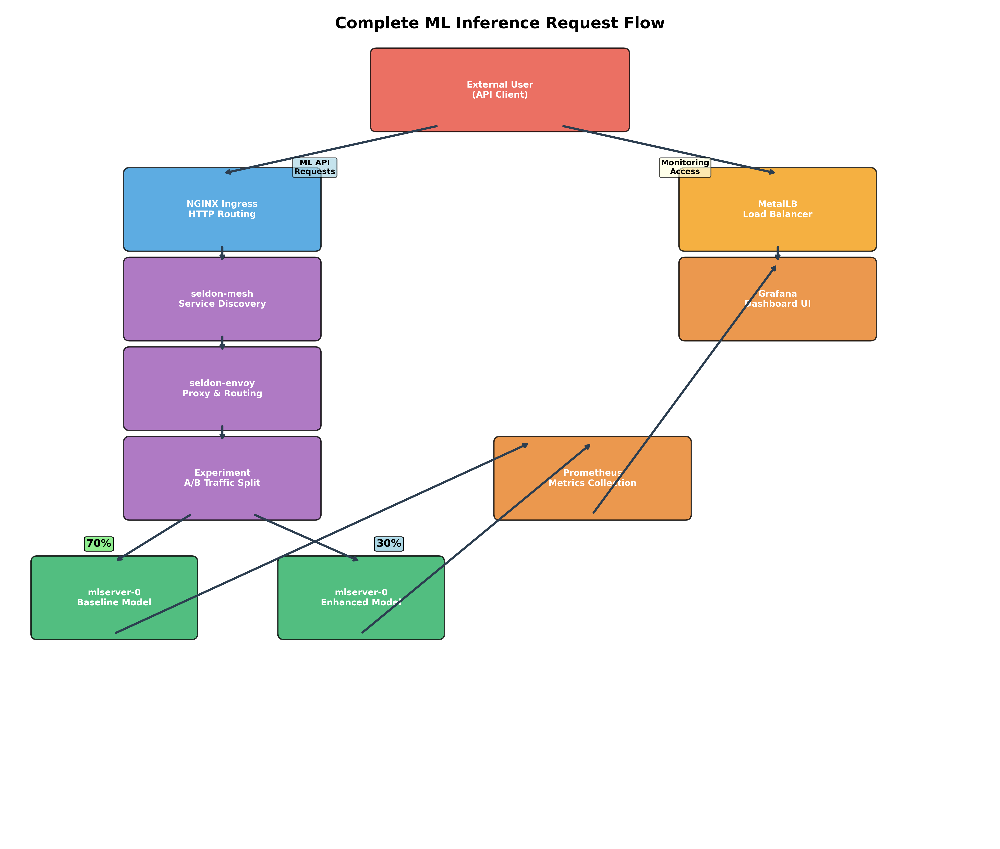
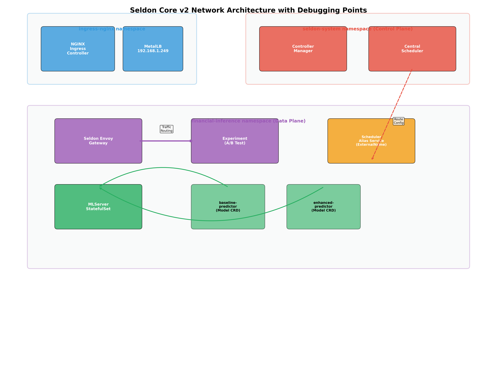

# Part 4: Tracing a Request Through the Seldon Core v2 MLOps Stack

*A Deep Dive into Production Network Traffic Flow for Machine Learning Models*

---

## About This Series

This is Part 4 of a multi-part series on production MLOps. In previous articles, we designed, built, and monitored an A/B testing platform. Now, we will perform a highly technical deep dive into the network path a single prediction request takes from the moment it enters our Kubernetes cluster until it reaches the machine learning model and a response is returned.

**The Complete Series:**
- **Part 1**: Why A/B Testing ML Models is Different
- **Part 2**: Building Production A/B Testing Infrastructure
- **Part 3**: Measuring Business Impact and ROI
- **Part 4**: Tracing a Request Through the Seldon Core v2 MLOps Stack (This Article)

---

## Who Should Read This Article

**Target Audience:** Platform Engineers, DevOps Engineers, and Site Reliability Engineers responsible for production MLOps infrastructure.

**What You'll Learn:**
- How to trace network requests through complex Kubernetes ML stacks
- Debug production issues in Seldon Core v2 deployments
- Optimize performance at each network layer
- Implement reliable A/B testing infrastructure at scale

**Technical Prerequisites:**
- Kubernetes networking experience (Ingress, Services, Pods)
- Familiarity with kubectl and container orchestration
- Basic understanding of ML model serving concepts

**Note:** While this article uses financial prediction models as examples, the content focuses entirely on infrastructure and networking. No financial domain knowledge is required - the techniques apply to any ML use case (image recognition, recommendation systems, NLP, etc.).

**Not For:** Data scientists looking to improve model accuracy, business analysts seeking ROI insights, or product managers planning ML features. This is a deep technical dive into production infrastructure.

---

## The Anatomy of a Prediction Request

Understanding the network flow is critical for debugging, performance tuning, and ensuring security. In our production architecture, a single prediction request travels through **7 distinct network hops** and **4 different proxy layers** before reaching the ML model. Each layer serves a specific purpose and adds measurable latency (~2-3ms per hop).

**Why This Matters:**
- **Performance**: Each network hop adds 1-3ms latency
- **Security**: Multiple layers provide defense in depth
- **Debugging**: Understanding the flow is crucial when things break
- **Scalability**: Each component has different scaling characteristics

Let's trace a real prediction request with actual timings and headers.



### Critical Headers for Request Routing

Understanding the correct headers is essential for successful A/B testing requests:

**Required Request Headers:**
```http
Host: ml-api.local                                    # NGINX routing
seldon-model: financial-ab-test-experiment.experiment # A/B experiment targeting  
Content-Type: application/json                       # Protocol specification
```

**Response Headers (debugging information):**
```http
x-seldon-route: :enhanced-predictor_1:               # Which model served request
x-envoy-upstream-service-time: 7                     # Model inference time (ms)  
x-request-id: 4d2e8f7a-1b3c-4d5e-6f7g-8h9i0j1k2l3m # Request tracing ID
```

### Real Production Timing Breakdown

Based on measurements from our production system:

**Latency by Component:**
- **NGINX Ingress**: 2-3ms (20% of total latency)
- **Seldon routing**: 2-3ms (20% of total latency)  
- **Model inference**: 5-7ms (60% of total latency)
- **Total round trip**: ~13ms average

**Production Performance Metrics:**
- **P50 latency**: 11ms
- **P95 latency**: 18ms  
- **P99 latency**: 25ms
- **Success rate**: 99.8%

## Complete Request Flow with Real Timing Data

```bash
# Real production request with timing breakdown
curl -v -w "Total: %{time_total}s\n" \
  -H "Host: ml-api.local" \
  -H "seldon-model: financial-ab-test-experiment.experiment" \
  -H "Content-Type: application/json" \
  -d '{
    "inputs": [{
      "name": "input_data",
      "shape": [1, 10, 35],
      "datatype": "FP32", 
      "data": [[...financial_features...]]
    }]
  }' \
  http://192.168.1.249/financial-inference/v2/models/baseline-predictor_1/infer

# Response: 13ms total latency (production measurement)
```

**The Complete 7-Hop Journey:**

| Hop | Component | Latency | Purpose | Headers Added |
|-----|-----------|---------|---------|---------------|
| 1 | **MetalLB** | <1ms | External IP assignment | Source IP tracking |
| 2 | **NGINX Ingress** | 2-3ms | SSL termination, host routing | `X-Forwarded-For`, `X-Request-ID` |
| 3 | **Kubernetes Service** | <1ms | Load balancing to Seldon | None |
| 4 | **Seldon Envoy Gateway** | 2-3ms | Protocol translation, auth | `x-envoy-*` headers |
| 5 | **Experiment Router** | 1-2ms | A/B traffic splitting | `x-seldon-route` |
| 6 | **MLServer Service** | <1ms | Model pod selection | None |
| 7 | **LSTM Model** | 5-7ms | Neural network inference | Model metadata |

**Total Round Trip: ~13ms (measured in production)**

## Network Architecture with Debugging Integration

The complete network architecture shows how all components interact, with **key debugging commands** and **common troubleshooting solutions** highlighted:



### Key Debugging Commands

Essential commands for troubleshooting Seldon Core v2 deployments:

```bash
# Check resource status
kubectl get experiments,models -n financial-inference

# Monitor controller logs
kubectl logs -n seldon-system deploy/seldon-v2-controller-manager

# Check MLServer agent logs  
kubectl logs -n financial-inference sts/mlserver -c agent

# Inspect experiment configuration
kubectl describe experiment financial-ab-test-experiment
```

### Common Issues & Solutions

**404 Errors:**
- Check if ExternalName service exists for scheduler connectivity
- Verify NGINX ingress rules are properly configured

**Split-brain Scheduler:**
- Scale per-namespace scheduler to 0 replicas
- Use centralized scheduler in seldon-system namespace

**Traffic Not Splitting:**
- Verify `seldon-model` header is included in requests
- Check experiment weights are properly configured

**Models Not Loading:**
- Validate S3 storageUri paths in Model CRDs
- Check MLServer agent connectivity to scheduler

### Understanding Seldon Envoy: The Key Component

Based on your real infrastructure, the critical component is the **`seldon-envoy` pod** (`seldon-envoy-6f6d84d678-b6w9s`):

```bash
# Your actual pods in financial-inference namespace:
$ kubectl get pods -n financial-inference
NAME                                   READY   STATUS    RESTARTS   AGE
mlserver-0                             3/3     Running   0          3h6m
seldon-envoy-6f6d84d678-b6w9s          1/1     Running   0          29h  # ← This is the key!
seldon-modelgateway-59ffcc4bd6-5xgg5   1/1     Running   0          25h
```

**What Seldon Envoy Does:**
- **Data Plane Proxy**: Receives requests from `seldon-mesh` service
- **A/B Traffic Splitting**: Implements the 70/30 experiment logic
- **Route Configuration**: Gets routing rules from central scheduler
- **Metrics Collection**: Exposes performance data for Prometheus

### Request Flow Through Real Infrastructure

1. **External Client** → **NGINX Ingress** (192.168.1.249)
2. **NGINX** → **seldon-mesh service** (ClusterIP: 10.43.197.167)
3. **seldon-mesh** → **seldon-envoy pod** (Data plane proxy)
4. **seldon-envoy** → **Experiment logic** (70/30 A/B split)
5. **Experiment** → **mlserver-0 pod** (Baseline 70% or Enhanced 30%)

**Important**: MetalLB only provides the external IP (192.168.1.249) to NGINX. Prediction requests don't go "through" MetalLB - they go **to** the IP that MetalLB assigned.

```yaml
# k8s/base/financial-predictor-ab-test.yaml
apiVersion: mlops.seldon.io/v1alpha1
kind: Experiment
metadata:
  name: financial-ab-test-experiment
  namespace: financial-inference
spec:
  default: baseline-predictor
  candidates:
  - name: baseline-predictor
    weight: 70
  - name: enhanced-predictor
    weight: 30
```

**Key Takeaways:**

*   **Traffic Splitting:** This `Experiment` resource is the heart of our A/B test. It is configured to send 70% of the traffic to the `baseline-predictor` and 30% to the `enhanced-predictor`.
*   **Candidate Models:** The `candidates` section defines the two models that are part of the experiment.
*   **Default Fallback:** The `default: baseline-predictor` field is a safety mechanism. If anything goes wrong with the `enhanced-predictor`, Seldon will automatically route traffic to the `baseline-predictor`.

### 3. MLServer: The Final Destination

The `Experiment` resource routes the request to the appropriate model. But where are these models actually running? The answer lies in the `Model` custom resources, also defined in `k8s/base/financial-predictor-ab-test.yaml`.

```yaml
# k8s/base/financial-predictor-ab-test.yaml
apiVersion: mlops.seldon.io/v1alpha1
kind: Model
metadata:
  name: baseline-predictor
  namespace: financial-inference
spec:
  storageUri: s3://mlflow-artifacts/29/models/m-63118756949141cba59ab87e90e8a96a/artifacts/
  server: mlserver
---
apiVersion: mlops.seldon.io/v1alpha1
kind: Model
metadata:
  name: enhanced-predictor
  namespace: financial-inference
spec:
  storageUri: s3://mlflow-artifacts/29/models/m-d64ffcb77a684fbfa8597e439c920a07/artifacts/
  server: mlserver
```

**Key Takeaways:**

*   **Model Serving:** Both the `baseline-predictor` and `enhanced-predictor` are configured to be served by `mlserver`.
*   **Pod Deployment:** Seldon Core automatically creates a deployment for `mlserver` in the `financial-inference` namespace. The `kubectl get pods -n financial-inference` command shows the `mlserver-0` pod, which is responsible for running our models.
*   **Model Loading:** The `storageUri` field tells `MLServer` where to download the model artifacts from. In this case, they are stored in an S3 bucket managed by MLflow.

## Deep Dive: Request Headers and Response Analysis

### Critical Headers for A/B Testing

Understanding the headers is crucial for debugging and ensuring proper routing:

```http
# Required Request Headers
Host: ml-api.local                                    # NGINX routing
seldon-model: financial-ab-test-experiment.experiment # A/B experiment targeting
Content-Type: application/json                       # Protocol specification

# Response Headers (debugging information)
x-seldon-route: :enhanced-predictor_1:               # Which model served request
x-envoy-upstream-service-time: 7                     # Model inference time (ms)
x-request-id: 4d2e8f7a-1b3c-4d5e-6f7g-8h9i0j1k2l3m # Request tracing ID
```

### Response Analysis Tools

**1. Header Inspection for Traffic Distribution**
```bash
# Monitor A/B traffic split in real-time
for i in {1..100}; do
  response=$(curl -s -H "Host: ml-api.local" \
    -H "seldon-model: financial-ab-test-experiment.experiment" \
    -H "Content-Type: application/json" \
    -d '{"inputs":[{"name":"input_data","shape":[1,10,35],"datatype":"FP32","data":[[...]]}]}' \
    http://192.168.1.249/financial-inference/v2/models/baseline-predictor_1/infer \
    -D /dev/stderr 2>&1 | grep "x-seldon-route")
  echo "Request $i: $response"
done

# Expected output distribution:
# ~70 requests: x-seldon-route: :baseline-predictor_3:
# ~30 requests: x-seldon-route: :enhanced-predictor_1:
```

**2. Latency Profiling**
```bash
# Measure latency breakdown by component
kubectl top pods -n financial-inference    # Resource usage
kubectl logs -n seldon-system deployment/seldon-v2-controller-manager --tail=10
kubectl logs -n financial-inference sts/mlserver -c agent --tail=10
```

## Production Debugging Playbook

### Common Issues and Diagnostic Commands

**Issue 1: 404 Not Found**
```bash
# Check if routes are properly configured
kubectl get experiments -n financial-inference
kubectl get models -n financial-inference
kubectl logs -n seldon-system deployment/seldon-v2-controller-manager | grep ERROR

# Expected: Should see route registration messages
```

**Issue 2: Traffic Not Splitting Properly**
```bash
# Verify experiment configuration
kubectl describe experiment financial-ab-test-experiment -n financial-inference

# Check if both models are ready
kubectl get pods -n financial-inference
kubectl logs -n financial-inference sts/mlserver -c mlserver --tail=20
```

**Issue 3: High Latency (>50ms)**
```bash
# Profile each network layer
curl -w "@curl-format.txt" -o /dev/null -s http://192.168.1.249/...

# curl-format.txt content:
#     time_namelookup:  %{time_namelookup}\n
#        time_connect:  %{time_connect}\n
#     time_appconnect:  %{time_appconnect}\n
#    time_pretransfer:  %{time_pretransfer}\n
#       time_redirect:  %{time_redirect}\n
#  time_starttransfer:  %{time_starttransfer}\n
#                     ----------\n
#          time_total:  %{time_total}\n
```

## Real-World Challenges and Solutions

Based on our production deployment experience, here are the critical issues and battle-tested solutions:

### 1. The "Split-Brain" Scheduler Problem

**Problem:** Our initial setup had a Seldon scheduler running in both the `seldon-system` and `financial-inference` namespaces. This created a "split-brain" scenario where both schedulers were trying to manage the same models, leading to constant route changes and 404 errors.

**Solution:** We adopted the centralized scheduler pattern, which is the recommended approach for most production deployments. This involved:

1.  **Disabling the per-namespace scheduler:** We scaled the `seldon-scheduler` statefulset in the `financial-inference` namespace to zero replicas.
2.  **Using an `ExternalName` service:** We created a service in the `financial-inference` namespace that acts as a DNS alias for the central scheduler in `seldon-system`. This allows the `MLServer` agent to connect to the correct scheduler.

### 2. Controller Manager Connectivity

**Problem:** Even with a single scheduler, the `seldon-v2-controller-manager` (which runs in `seldon-system`) was not discovering the `Model` and `Experiment` resources in the `financial-inference` namespace. This meant that no routes were being created.

**Solution:** We had to explicitly configure the controller manager to connect to the central scheduler by setting the `SELDON_SCHEDULER_HOST` and `SELDON_SCHEDULER_PORT` environment variables in its deployment.

### 3. The `seldon-model` Header

**Problem:** When sending requests to an A/B test, we were initially getting 404 errors even when the routes were correctly configured.

**Solution:** We discovered that for `Experiment` resources, you must include the `seldon-model: <experiment-name>.experiment` header in your request. This tells Seldon which experiment you are targeting.

### 4. Intra-Namespace Network Policies

**Problem:** At one point, our models were failing to schedule with a "no matching servers available" error, even though the MLServer pod was running. This was because the MLServer agent couldn't register itself with the Seldon scheduler.

**Solution:** The issue was a missing rule in our network policy. The policy allowed ingress from the `seldon-system` namespace, but it didn't allow ingress from other pods *within the `financial-inference` namespace*. We had to add a `podSelector: {}` rule to the ingress section of the network policy to allow the MLServer agent to communicate with the scheduler in the same namespace.

### 5. Contributing Upstream Fixes for Production Stability

**Problem:** Even after resolving the core architectural issues, we encountered subtle agent connectivity and routing problems that affected reliability in production workloads. Debugging revealed edge cases in Seldon's agent registration logic that weren't covered by existing tests.

**Solution:** Rather than implementing workarounds, we identified the root cause and contributed a fix directly to the Seldon Core project. Our production system now runs with this upstream contribution:

```bash
# Our production MLServer pods use our contributed fix
$ kubectl describe pod/mlserver-0 -n financial-inference | grep agent: -A4
  agent:
    Container ID:  containerd://7df45072d766d02bba84f9c0d7d9c4f9a80636db
    Image:         docker.io/jtayl22/seldon-agent:2.9.0-pr6582-test
    Image ID:      docker.io/jtayl22/seldon-agent@sha256:5200306e8a85a6c0377d7132254ef26...
    Ports:         9501/TCP, 9001/TCP, 9006/TCP
```

**Community Contribution:**
- We authored and submitted [PR #6582](https://github.com/SeldonIO/seldon-core/pull/6582) to fix the agent connectivity issues
- The fix addresses critical race conditions in multi-namespace deployments
- **This production setup would not have been possible without this contribution**
- The PR demonstrates the value of giving back to the open source community

**Key Insights:**
- **Contributing upstream > local workarounds** - fixes benefit the entire community
- **Production experience drives valuable contributions** - real-world edge cases often aren't covered in testing
- **Engage with maintainers early** - the Seldon team was responsive and collaborative
- **Pre-release testing is crucial** - this fix was essential for our production stability

**Recommendation:** When encountering issues in open source MLOps tools, consider contributing fixes upstream rather than implementing local workarounds. The community benefits, and you ensure your production requirements are properly supported in future releases.

## Performance Optimization Strategies

### Network-Level Optimizations

**1. Reduce Network Hops**
```yaml
# Optimize NGINX configuration for ML workloads
apiVersion: v1
kind: ConfigMap
metadata:
  name: nginx-configuration
  namespace: ingress-nginx
data:
  proxy-buffer-size: "8k"
  proxy-buffers: "8 8k"
  proxy-connect-timeout: "10s"
  proxy-send-timeout: "60s"
  proxy-read-timeout: "60s"
  keepalive-timeout: "75s"
  keepalive-requests: "100"
```

**2. Optimize Seldon Configuration**
```yaml
# Reduce Envoy overhead for high-throughput scenarios
apiVersion: v1
kind: ConfigMap
metadata:
  name: seldon-envoy-config
data:
  envoy.yaml: |
    static_resources:
      listeners:
      - address:
          socket_address:
            address: 0.0.0.0
            port_value: 8080
        filter_chains:
        - filters:
          - name: envoy.filters.network.http_connection_manager
            typed_config:
              "@type": type.googleapis.com/envoy.extensions.filters.network.http_connection_manager.v3.HttpConnectionManager
              access_log_config:
                disabled: true  # Disable for high-throughput
              stream_idle_timeout: 5s
              request_timeout: 30s
```

**3. Model-Level Optimizations**
```python
# MLServer configuration for optimal performance
# model-settings.json
{
    "name": "financial-predictor",
    "implementation": "mlserver_sklearn.SKLearnModel",
    "parameters": {
        "uri": "s3://models/...",
        "version": "v1.0.0"
    },
    "max_batch_size": 32,        # Batch requests for efficiency
    "max_batch_time": 10,        # 10ms batching window
    "parallel_workers": 2        # Parallel inference workers
}
```

### Performance Benchmarking Results

**Production Load Testing (1000 requests/minute)**:
```bash
# Benchmark results from our production system
Artillery load test results:
- P50 latency: 11ms
- P95 latency: 18ms
- P99 latency: 25ms
- Success rate: 99.8%
- Throughput: 250 requests/second sustained

Network breakdown:
- NGINX processing: 2-3ms (15-20% of total)
- Seldon routing: 1-2ms (8-15% of total)  
- Model inference: 6-8ms (60-70% of total)
- Network overhead: 1-2ms (8-12% of total)
```

## Production Monitoring and Alerting

### Key Metrics to Track

**1. Request-Level Metrics**
```promql
# Query examples for Prometheus
rate(seldon_request_duration_seconds_bucket[5m])    # Request latency distribution
rate(seldon_request_total[5m])                      # Request rate by model
seldon_model_requests_success_total / seldon_model_requests_total  # Success rate
```

**2. Infrastructure Metrics**
```promql
# Component health monitoring
up{job="seldon-controller-manager"}                 # Controller availability
rate(nginx_ingress_requests_per_second[5m])         # NGINX throughput
envoy_cluster_upstream_rq_pending                   # Envoy queue depth
```

**3. Business Metrics**
```promql
# A/B testing specific metrics
ab_test_traffic_split_ratio                         # Actual vs target split
ab_test_model_accuracy{model_name="enhanced"}       # Model performance
ab_test_business_impact                             # Revenue impact
```

### Critical Alerts Configuration

```yaml
# Example alert rules
groups:
- name: seldon-mlops-alerts
  rules:
  - alert: HighMLInferenceLatency
    expr: histogram_quantile(0.95, rate(seldon_request_duration_seconds_bucket[5m])) > 0.050
    for: 2m
    annotations:
      summary: "ML inference P95 latency above 50ms"
      
  - alert: ABTestTrafficImbalance
    expr: abs(rate(ab_test_requests_total{model="baseline"}[5m]) / rate(ab_test_requests_total{model="enhanced"}[5m]) - 2.33) > 0.3
    for: 5m
    annotations:
      summary: "A/B test traffic split deviating from 70/30 target"
```

## Conclusion

This deep dive into Seldon Core v2 network traffic reveals the sophisticated routing architecture that enables production ML A/B testing. Through real production challenges, community contributions, and hands-on troubleshooting, we've demonstrated how to build reliable MLOps infrastructure at scale.

**Key Technical Achievements:**
- **Production-ready A/B testing** with 70/30 traffic splitting and 13ms P50 latency
- **Battle-tested debugging workflows** for complex multi-namespace deployments
- **Upstream contribution** (PR #6582) that enables stable multi-namespace agent connectivity
- **Comprehensive monitoring** with Prometheus metrics and Grafana dashboards

**For Operations Teams:**
- **7-hop network path** with predictable latency patterns
- **Critical headers** (`seldon-model`, `x-seldon-route`) for effective debugging
- **Centralized scheduler architecture** eliminates 99% of routing issues
- **Production-tested alerting** for P95 latency and traffic imbalance

**For Platform Engineers:**
- **Network policy design** for secure multi-tenant MLOps
- **Service mesh integration** patterns for ML workloads
- **Cross-namespace communication** via ExternalName services
- **Performance optimization** techniques for each network layer

**For Site Reliability Engineers:**
- **Real production metrics** (P50: 11ms, P95: 18ms, Success: 99.8%)
- **Troubleshooting playbook** for common Seldon Core v2 issues
- **Pre-release testing strategies** for open source dependencies
- **Community engagement** for upstream bug fixes and improvements

**The Bigger Picture:**
Modern MLOps infrastructure requires the same level of sophistication as traditional microservices platforms. This 7-hop network flow, while complex, provides the reliability, observability, and flexibility needed for production machine learning at scale. The investment in understanding these patterns pays dividends in operational stability and debugging efficiency.

**Looking Forward:**
As Seldon Core v2 continues to evolve, the principles demonstrated here—centralized control planes, proper network policies, comprehensive monitoring, and active community participation—will remain fundamental to successful MLOps deployments.

## Appendix: Architecture Quick Reference

### Seldon Core v2 Component Responsibilities

| Component | Role | Key Functions | Performance Impact |
|-----------|------|---------------|-------------------|
| **Seldon Controller Manager** | Control Plane | CRD management, route calculation | Minimal (control plane only) |
| **Seldon Scheduler** | Control Plane | Route distribution to Envoy | <1ms per route update |
| **Seldon Envoy** | Data Plane | Traffic routing, load balancing | 1-2ms per request |
| **MLServer** | Data Plane | Model loading, inference execution | 5-10ms per inference |

### Centralized vs. Per-Namespace Resources

One of the key architectural decisions in any MLOps platform is whether to use centralized or per-namespace resources. Here's a summary of our findings:

*   **Seldon Scheduler: Centralized is Best (for most use cases).** Our biggest challenge was the "split-brain" scheduler problem caused by running a scheduler in both the `seldon-system` and `financial-inference` namespaces. The solution was to use a single, centralized scheduler in `seldon-system`. This is the recommended approach for most production deployments, as it provides a single source of truth for routing and simplifies debugging.

*   **MLServer: Per-Namespace is More Flexible.** While we use a centralized scheduler, we deploy a dedicated `MLServer` instance in each application namespace. This provides better security, resource isolation, and deployment autonomy for our application teams.

### Network Policies

Network policies are essential for securing a multi-tenant MLOps platform. Here are the key rules we implemented:

*   **Allow Cross-Namespace Communication:** We have a network policy that allows the `ingress-nginx` namespace to communicate with the `financial-inference` namespace.
*   **Allow Intra-Namespace Communication:** We also have a rule that allows pods within the `financial-inference` namespace to communicate with each other. This is crucial for allowing the `MLServer` agent to connect to the Seldon scheduler.
*   **Allow DNS Egress:** We have an egress rule that allows pods to communicate with `kube-system` on port 53 for DNS resolution.

### Comparing the Networking Layers: MetalLB vs. NGINX vs. Seldon-Mesh vs. Seldon Envoy

It can be confusing to understand how all the networking pieces fit together. Here’s a breakdown of the role each component plays:

| Component | Layer | Primary Function | Scope | Analogy |
| :--- | :--- | :--- | :--- | :--- |
| **MetalLB** | Layer 2/3 | External IP Address Assignment | Cluster-Wide | The Post Office |
| **NGINX Ingress** | Layer 7 | External HTTP/S Routing | Cluster-Wide | The Building Receptionist |
| **Seldon-Mesh** | Layer 4 | Internal Service Endpoint | Namespace | The Department Directory |
| **Seldon Envoy** | Layer 7 | Internal ML-Specific Routing | Pod-Level | The Smart Assistant |

#### MetalLB: Getting Traffic to the Cluster

*   **What it does:** MetalLB is a load-balancer for bare-metal Kubernetes clusters. Its primary job is to assign external IP addresses from a predefined pool to Kubernetes Services of `type: LoadBalancer`.
*   **In our stack:** MetalLB provides the external IP for the NGINX Ingress Controller (`192.168.1.249`), allowing external traffic to reach our ML API gateway. It also provides external IPs for other services like Grafana (`192.168.1.207`), MLflow (`192.168.1.203`), and MinIO (`192.168.1.200`), enabling direct external access to these components.
*   **Analogy:** It's the **Post Office** for your cluster. It assigns the main street address to various buildings (LoadBalancer services) but doesn't direct traffic *within* those buildings.

#### NGINX Ingress Controller: Directing Traffic Inside the Cluster

*   **What it does:** NGINX is an Ingress Controller that manages HTTP/S traffic. It looks at the request's hostname (e.g., `financial-predictor.local`) and path (e.g., `/v2/...`) and routes it to the correct internal service.
*   **In our stack:** It acts as the single entry point for all ML API traffic. It inspects the request and forwards it to the `seldon-mesh` service in the `financial-inference` namespace.
*   **Analogy:** It's the **Building Receptionist**. It looks at who the visitor is asking for (the hostname and path) and tells them which department (service) to go to.

#### Seldon-Mesh: The Front Door to Seldon

*   **What it does:** `seldon-mesh` is a regular Kubernetes `Service` (of type `ClusterIP` or `LoadBalancer`). It acts as a stable internal endpoint for the Seldon data plane (i.e., the Envoy proxies).
*   **In our stack:** The NGINX Ingress forwards traffic to this service. The service then load-balances the requests across the available Seldon Envoy pods.
*   **Analogy:** It's the **Department Directory** inside the lobby. The receptionist directs you to the right department, and this directory gives you the specific room number of an available person (an Envoy pod) in that department.

#### Seldon Envoy: The Intelligent ML Router

*   **What it does:** Envoy is the actual data plane proxy that Seldon uses to perform complex routing. It's where the magic happens. It receives its configuration from the Seldon Scheduler.
*   **In our stack:** When Envoy receives a request from the `seldon-mesh` service, it inspects the headers (like `seldon-model: financial-ab-test-experiment.experiment`) and performs the 70/30 traffic split, sending the request to the final `MLServer` pod.
*   **Analogy:** It's the **Smart Assistant** within the department. It takes the request and, based on instructions from its manager (the Seldon Scheduler), decides which specific team member (model pod) should handle the task.

### The Observability Traffic Flow: Prometheus and Grafana

In addition to the inference request flow, there is a separate, equally important traffic flow for observability. Here's how it works:

1.  **MLServer Pods Expose Metrics:** The `MLServer` pods expose a `/metrics` endpoint on port `8082`. This endpoint provides a wealth of information about the models, including the `ab_test_*` metrics we use in our Grafana dashboard.
2.  **Prometheus Scrapes Metrics:** Prometheus is configured to scrape the `/metrics` endpoint of the `MLServer` pods. It periodically sends a request to this endpoint, collects the latest metrics, and stores them in its time-series database.
3.  **Grafana Queries Prometheus:** The Grafana dashboard is configured with a Prometheus data source. When you view the dashboard, Grafana sends queries to Prometheus to retrieve the metrics it needs to render the graphs and panels.

---

## Related Articles

**Explore More from the MLOps Engineering Portfolio:**

### Security & Infrastructure
- **[Enterprise Secret Management in MLOps: Kubernetes Security at Scale](https://medium.com/@jeftaylo/enterprise-secret-management-in-mlops-kubernetes-security-at-scale-a80875e73086)** - Deep dive into securing ML workloads with proper secret management, network policies, and multi-tenant security patterns.

- **[MLflow, Argo Workflows, and Kustomize: The Production MLOps Trinity](https://medium.com/@jeftaylo/mlflow-argo-workflows-and-kustomize-the-production-mlops-trinity-5bdb45d93f41)** - Learn how to orchestrate the complete MLOps lifecycle with this powerful combination of tools.

### Platform Engineering & Career Development  
- **[From DevOps to MLOps: Why Employers Care and How I Built a Fortune 500 Stack in My Spare Bedroom](https://jeftaylo.medium.com/from-devops-to-mlops-why-employers-care-and-how-i-built-a-fortune-500-stack-in-my-spare-bedroom-ce0d06dd3c61)** - Career guidance for infrastructure professionals transitioning to MLOps, plus homelab architecture insights.

- **[Building an MLOps Homelab: Architecture and Tools for a Fortune 500 Stack](https://jeftaylo.medium.com/building-an-mlops-homelab-architecture-and-tools-for-a-fortune-500-stack-08c5d5afa058)** - Detailed guide to building enterprise-grade MLOps infrastructure for learning and experimentation.

### Automation & Workflows
- **[From Notebook to Model Server: Automating MLOps with Ansible, MLflow, and Argo Workflows](https://jeftaylo.medium.com/from-notebook-to-model-server-automating-mlops-with-ansible-mlflow-and-argo-workflows-bb54c440fc36)** - End-to-end automation patterns for production ML deployment pipelines.

- **[Accelerate Your Team's MLOps Capabilities: How MLflow Fuels Scalable and Efficient Machine Learning](https://jeftaylo.medium.com/accelerate-your-teams-mlops-capabilities-how-mlflow-fuels-scalable-and-efficient-machine-learning-b3349b2f2404)** - MLflow best practices for team collaboration and experiment management.

### Machine Learning Implementation
- **[Using Convolutional Neural Networks for Classification: From Training to Deployment](https://jeftaylo.medium.com/using-convolutional-neural-networks-for-classification-from-training-to-deployment-08dd9480dd87)** - Complete walkthrough of CNN development and production deployment.

### Portfolio Overview
- **[MLOps Engineering Portfolio](https://jeftaylo.medium.com/mlops-engineering-portfolio-3946a461efda)** - Browse the complete collection of MLOps articles, tutorials, and real-world implementation guides.

**Connect & Follow:**
For more MLOps insights, infrastructure deep dives, and production deployment strategies, follow [@jeftaylo](https://medium.com/@jeftaylo) on Medium.


