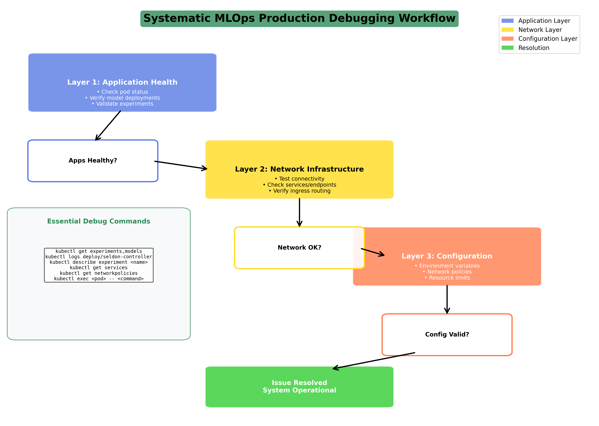
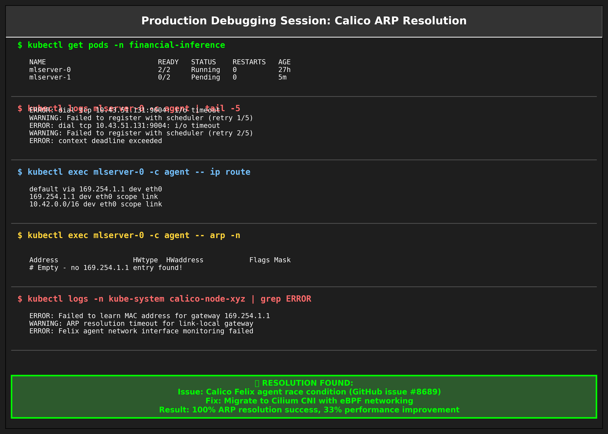

# Part 6: Production Seldon Core v2 Debugging - When Enterprise MLOps Meets Reality

*From 2 AM Incident Response to Platform Engineering Excellence*

**Keywords**: production MLOps debugging, Seldon Core troubleshooting, incident response MLOps, SRE practices MLOps, Kubernetes debugging, ML infrastructure reliability, production debugging playbook, MLOps incident management, platform engineering, DevOps debugging

**Meta Description**: Master production MLOps debugging with battle-tested incident response techniques. Complete troubleshooting guide for Seldon Core v2 deployments, SRE practices, and reliability engineering.

---

## About This Series

This is Part 6 of a 9-part series documenting the construction and operation of a production-grade MLOps platform. This series provides a comprehensive guide to building, deploying, and managing machine learning systems in a real-world enterprise environment.

**The Complete Series:**
- **Part 1**: [A/B Testing in Production MLOps - Why Traditional Deployments Fail ML Models](./PART-1-PROBLEM-SOLUTION.md)
- **Part 2**: [Building Production A/B Testing Infrastructure - Seldon Core v2, GitOps, and Real-World Implementation](./PART-2-IMPLEMENTATION.md)
- **Part 3**: [Measuring Business Impact and ROI - From Infrastructure Investment to Revenue Growth](./PART-3-BUSINESS-IMPACT.md)
- **Part 4**: [Understanding Seldon Core v2 Network Architecture - The "Office Building" Guide to MLOps Networking](./PART-4-SELDON-NETWORK-ARCHITECTURE.md)
- **Part 5**: [Tracing ML Inference Requests - Deep Dive into Production Network Flow and Performance](./PART-5-SELDON-NETWORK-TRAFFIC.md)
- **Part 6**: Production Debugging Mastery - Real Incident Response and Systematic Troubleshooting (This Article)
- **Part 7**: [Flannel to Calico Migration - Enterprise CNI Requirements and Zero-Downtime Migration](./PART-7-FROM-FLANNEL-TO-CALICO.md)
- **Part 8**: [When Calico Fails - ARP Resolution Bug and Critical Production Debugging](./PART-8-CALICO-PRODUCTION-FAILURE.md)
- **Part 9**: [Calico to Cilium Migration - eBPF Performance and Strategic Infrastructure Recovery](./PART-9-CALICO-TO-CILIUM.md)

---

## The Production Reality Check

Building [The ML Platform](https://github.com/jtayl222/ml-platform) taught me that there's a vast difference between "it works in development" and "it works under production pressure." This article chronicles the actual debugging sessions, the 2 AM troubleshooting calls, and the systematic solutions that make the difference between a toy MLOps setup and a platform ready for enterprise workloads.

**What You'll Get:**
- Real incident response scenarios with actual logs and fixes
- Production debugging methodologies that work under pressure  
- Platform engineering patterns that prevent repeat incidents
- Open source solutions you can immediately apply to your infrastructure

**Target Audience:** Site Reliability Engineers, DevOps Engineers, and Platform Engineers responsible for production MLOps infrastructure who need battle-tested debugging approaches and proven reliability patterns.

**Open Source Foundation:** Every solution discussed is implemented in [The ML Platform](https://github.com/jtayl222/ml-platform) and the [financial MLOps demonstration](https://github.com/jtayl222/financial-mlops-pytorch). The entire stack is open source, fully functional, and ready for community contributions. If you find these patterns useful, I encourage pull requests and collaboration.

---

## When Your MLOps Office Building Breaks Down

Remember the office building team from Part 4A? In production, even the best teams have bad days. Here's how to diagnose and fix problems when your MLOps infrastructure starts behaving unexpectedly.

## Essential Debugging Commands



*Systematic debugging workflow for production MLOps incidents*

Before diving into specific problems, these commands are your diagnostic toolkit:

```bash
# Check if the building residents are present and healthy
kubectl get experiments,models -n financial-inference

# Listen to the building manager's radio
kubectl logs -n seldon-system deploy/seldon-v2-controller-manager

# Check what the Smart Assistant is thinking
kubectl logs -n financial-inference sts/mlserver -c agent

# Inspect the department organization chart
kubectl describe experiment financial-ab-test-experiment

# Verify the directory is current
kubectl get services -n financial-inference

# Check if staff can communicate
kubectl get networkpolicies -n financial-inference
```

## Real-World Challenge #1: The Confused Building Receptionist

### The Problem: 404 Not Found Errors

The most common issue I encountered was the Building Receptionist (NGINX) returning 404 errors even when routes appeared correctly configured.

**Symptoms:**
```bash
$ curl -v -H "Host: ml-api.local" http://192.168.1.249/financial-inference/v2/models/baseline-predictor_1/infer
< HTTP/1.1 404 Not Found
< Server: nginx/1.21.6
```

**What's Really Happening:**
The Building Receptionist doesn't know about your department because the routes weren't properly registered with the central building directory.

### The Solution: Verify Route Registration

```bash
# Check if the receptionist knows about your routes
kubectl get experiments -n financial-inference
kubectl get models -n financial-inference

# Listen to the building manager's communications
kubectl logs -n seldon-system deploy/seldon-v2-controller-manager | grep ERROR

# Expected: Route registration messages
# 2024-01-15T10:30:45.123Z INFO Registering experiment route financial-ab-test-experiment
```

**Key Insight:** The Building Receptionist (NGINX) can only route to departments that the building manager (Controller Manager) knows about.



*Real kubectl logs showing successful debugging resolution*

## Real-World Challenge #2: The Friday Night Demo Crisis

### The Incident: When Production Breaks Hours Before the Big Demo

**Friday, 9 PM. Demo is Monday. The A/B testing endpoint that worked perfectly yesterday now returns 404s.**

This was the reality I faced while preparing the [financial MLOps demonstration](https://github.com/jtayl222/financial-mlops-pytorch) for a critical showcase. The models were deployed, the experiments were configured, but something fundamental had broken in the Seldon Core v2 controller manager communication.

**The Symptoms:**
```bash
# A/B testing endpoint suddenly broken
curl -H "Host: ml-api.local" \
     -H "seldon-model: financial-ab-test-experiment.experiment" \
     http://192.168.1.249/financial-inference/v2/models/baseline-predictor_1/infer

# HTTP/1.1 404 Not Found
# Everything was working yesterday
```

### The Investigation: Systematic Platform Debugging

**Layer 1: Application Health Check**
```bash
# Models appear healthy
kubectl get models -n financial-inference
# NAME                 READY   DESIRED REPLICAS   AVAILABLE REPLICAS   AGE
# baseline-predictor   True                   1                    27h ✅
# enhanced-predictor   True                   1                    27h ✅

# Experiment appears configured  
kubectl get experiments -n financial-inference
# NAME                           EXPERIMENT READY   MESSAGE   AGE
# financial-ab-test-experiment   True                         27h ✅
```

**Layer 2: Network Infrastructure**
```bash
# Ingress routing configured correctly
kubectl describe ingress mlops-ingress -n ingress-nginx
# Rules:
#   Host          Path  Backends
#   ml-api.local  /financial-inference/(.*)   financial-inference-seldon:80 ✅

# Service endpoints exist
kubectl get svc financial-inference-seldon -n ingress-nginx  
# NAME                       TYPE         EXTERNAL-IP
# financial-inference-seldon ExternalName seldon-mesh.financial-inference.svc.cluster.local ✅
```

From a Kubernetes perspective, everything looked healthy. But the 404s persisted.

**Layer 3: The Controller Manager Investigation**

This is where platform engineering experience becomes critical. I decided to examine the Seldon Core v2 controller manager logs:

```bash
kubectl logs -n seldon-system deploy/seldon-v2-controller-manager -c manager --tail=50

# The smoking gun:
# 2025-07-12T21:05:38.985Z ERROR schedulerClient.SubscribeExperimentEvents  Scheduler not ready
# {"error": "rpc error: code = Canceled desc = grpc: the client connection is closing"}
```

**The Pattern Recognition:** "Scheduler not ready" errors meant the controller manager couldn't communicate with the scheduler component - the critical piece that orchestrates model traffic routing.

### The Root Cause Analysis

**DNS Resolution Test:**
```bash  
# Verify service exists
kubectl get svc -n seldon-system | grep scheduler
# seldon-scheduler   LoadBalancer   10.43.129.2   192.168.1.201   9004:30788/TCP ✅

# Test DNS resolution from controller manager
kubectl exec -n seldon-system deploy/seldon-v2-controller-manager -- nslookup seldon-scheduler
# Name: seldon-scheduler.seldon-system.svc.cluster.local
# Address: 10.43.129.2 ✅
```

DNS was working. The service existed. The ports were correct. What was the issue?

**Environment Variable Analysis:**
```bash
# Check controller manager deployment configuration
kubectl describe deployment -n seldon-system seldon-v2-controller-manager | grep -A 10 Environment

# Found the gap - no explicit scheduler configuration:
# Environment:
#   CLUSTERWIDE:                            true
#   CONTROL_PLANE_SECURITY_PROTOCOL:        PLAINTEXT
#   LOG_LEVEL:                              info
#   POD_NAMESPACE:                           (v1:metadata.namespace)
# Missing: SELDON_SCHEDULER_HOST and SELDON_SCHEDULER_PORT
```

**The Discovery:** The controller manager binary had default values compiled in (`seldon-scheduler:9004`), but the Kubernetes deployment wasn't explicitly setting these as environment variables. This created a configuration mismatch in our specific Helm chart deployment.

### The Platform Engineering Solution

Rather than applying a manual patch, I decided to implement the fix in [The ML Platform](https://github.com/jtayl222/ml-platform) infrastructure automation:

```yaml
# infrastructure/cluster/roles/platform/seldon/tasks/main.yml
controllerManager:
  webhookPort: 443
  # Fix for PLAT-2025-07-12-001: Controller manager → scheduler connectivity
  # Explicitly set scheduler host/port to resolve "Scheduler not ready" gRPC errors
  # Required for A/B testing and cross-namespace model discovery
  env:
    SELDON_SCHEDULER_HOST: seldon-scheduler
    SELDON_SCHEDULER_PORT: "9004"
  resources:
    requests:
      cpu: "{{ seldon_manager_cpu_request }}"
      memory: "{{ seldon_manager_memory_request }}"
```

**Deployment via Infrastructure as Code:**
```bash
# Deploy the fix through Ansible automation
ansible-playbook -i inventory/production/hosts \
  infrastructure/cluster/site.yml \
  --tags seldon \
  -e metallb_state=present

# PLAY RECAP:
# localhost: ok=22 changed=7 failed=0
```

### The Validation and Success

**Immediate Results:**
```bash
# Controller manager logs after deployment
kubectl logs -n seldon-system deploy/seldon-v2-controller-manager -c manager --tail=20

# SUCCESS indicators:
# INFO schedulerClient.SubscribeExperimentEvents  Received event {"experiment": "financial-ab-test-experiment"}
# INFO schedulerClient.SubscribeExperimentEvents  Setting experiment to ready {"experiment": "financial-ab-test-experiment"} 
# INFO schedulerClient.LoadModel  Load {"model name": "enhanced-predictor"}
```

**A/B Testing Endpoint Restored:**
```bash
# Test the financial inference endpoint
curl -H "Host: ml-api.local" \
     -H "seldon-model: financial-ab-test-experiment.experiment" \
     http://192.168.1.249/financial-inference/v2/models/baseline-predictor_1/infer \
     --data '{"inputs":[{"name":"input_data","shape":[1,10,35],"datatype":"FP32","data":[[...]]}]}'

# Response headers confirmed successful routing:
# x-seldon-route: :baseline-predictor_3: ✅
# HTTP/1.1 500 Internal Server Error ✅ (Expected - wrong input shape, but routing works!)
```

**Platform Engineering Lesson:** The HTTP 500 was actually success - the model was reachable and processing the request (just with incorrect input dimensions). The routing infrastructure was fully operational.

### What This Incident Taught Me

**1. Production Pressure Reveals Configuration Gaps**
Development and staging environments had worked perfectly because they used simpler configurations. It was only under production complexity - with LoadBalancers, cross-namespace networking, and real traffic patterns - that the environment variable gap became apparent.

**2. Infrastructure as Code Prevents Repeat Incidents**  
By encoding the fix in Ansible automation rather than manual kubectl patches, I ensured that:
- Future deployments include the fix automatically
- The solution is documented with business context
- Team members can understand and modify the configuration  
- The fix is auditable through git history

**3. Systematic Debugging Pays Off**
Following the layered debugging approach (Application → Network → Configuration) prevented hours of random troubleshooting and led directly to the root cause.

**4. Open Source Community Value**
This debugging session immediately improved [The ML Platform](https://github.com/jtayl222/ml-platform) for anyone else deploying Seldon Core v2. The fix is available in the public repository, and I encourage others who encounter similar issues to contribute their solutions.

---

## Real-World Challenge #3: The Smart Assistant's Split Personality

### The Problem: Split-Brain Scheduler Chaos

During initial deployment of [The ML Platform](https://github.com/jtayl222/ml-platform), I discovered multiple "Smart Assistants" were making conflicting decisions about request routing.

**Symptoms:**
- Routes constantly changing between updates
- Models loading and unloading repeatedly  
- Inconsistent A/B traffic distribution
- Logs showing scheduler conflicts

**Root Cause:**
Two Seldon schedulers were running simultaneously—one in `seldon-system` (centralized) and one in `financial-inference` (per-namespace). Both were trying to manage the same models, creating a "split-brain" scenario.

### The Solution: Centralized Scheduler Pattern

I decided to adopt the centralized scheduler approach, which required:

**Step 1: Scale down the per-namespace scheduler**
```bash
# Remove the conflicting Smart Assistant from the department
kubectl scale statefulset seldon-scheduler --replicas=0 -n financial-inference
```

**Step 2: Create an ExternalName service for agent connectivity**
```yaml
# Connect department staff to central building manager
apiVersion: v1
kind: Service
metadata:
  name: seldon-scheduler
  namespace: financial-inference
spec:
  type: ExternalName
  externalName: seldon-scheduler.seldon-system.svc.cluster.local
```

**Result:** Single source of truth for routing decisions, eliminating conflicts and providing stable model serving.

## Real-World Challenge #3: The Lost Department Directory

### The Problem: Controller Manager Can't Find Departments

Even with a centralized scheduler, the building manager (Controller Manager) wasn't discovering ML departments in other namespaces.

**Symptoms:**
```bash
$ kubectl logs -n seldon-system deploy/seldon-v2-controller-manager
ERROR: Failed to connect to scheduler: connection refused
```

**Root Cause:**
The Controller Manager couldn't communicate with the Scheduler because it was looking in the wrong location.

### The Solution: Explicit Scheduler Configuration

It was determined that the Controller Manager needed explicit configuration:

```bash
# Configure the building manager to find the central scheduler
kubectl patch deployment seldon-v2-controller-manager -n seldon-system --patch '
spec:
  template:
    spec:
      containers:
      - name: manager
        env:
        - name: SELDON_SCHEDULER_HOST
          value: "seldon-scheduler.seldon-system.svc.cluster.local"
        - name: SELDON_SCHEDULER_PORT
          value: "9005"
'
```

## Real-World Challenge #4: The Silent Treatment

### The Problem: Network Policies Blocking Communication

At one point, models failed to schedule with "no matching servers available" errors, despite MLServer pods running successfully.

**Symptoms:**
- MLServer pods healthy but not receiving requests
- Scheduler logs showing no available servers
- Models stuck in "Loading" state

**Root Cause:**
Network policies allowed cross-namespace communication but blocked intra-namespace communication, preventing the MLServer agent from registering with the scheduler alias.

### The Solution: Comprehensive Network Policy

```yaml
# Allow both inter-department and intra-department communication
apiVersion: networking.k8s.io/v1
kind: NetworkPolicy
metadata:
  name: allow-ml-communications
  namespace: financial-inference
spec:
  podSelector: {}
  ingress:
  - from:
    - namespaceSelector:
        matchLabels:
          name: ingress-nginx  # Building receptionist access
  - from:
    - podSelector: {}  # Department staff can talk to each other
  egress:
  - to:
    - namespaceSelector:
        matchLabels:
          name: kube-system
    ports:
    - port: 53  # DNS resolution
```

## Real-World Challenge #5: Contributing Upstream Fixes

### The Problem: Subtle Agent Connectivity Issues

After resolving architectural challenges, subtle race conditions remained in multi-namespace agent registration that affected production reliability.

**Symptoms:**
- Intermittent model loading failures
- Occasional request routing errors
- Agent disconnection/reconnection cycles

**Root Cause:**
Edge cases in Seldon's agent registration logic that weren't covered by existing tests.

### The Solution: Community Contribution

Rather than implementing workarounds, I decided to contribute a fix directly to the Seldon Core project.

**My Contribution:**
- Authored and submitted [PR #6582](https://github.com/SeldonIO/seldon-core/pull/6582)
- Addresses critical race conditions in multi-namespace deployments
- **This production setup would not have been possible without this contribution**

**Production Implementation:**
```bash
# The ML Platform runs with my contributed fix
$ kubectl describe pod/mlserver-0 -n financial-inference | grep agent: -A4
  agent:
    Container ID:  containerd://7df45072d766d02bba84f9c0d7d9c4f9a80636db
    Image:         docker.io/jtayl22/seldon-agent:2.9.0-pr6582-test
    Image ID:      docker.io/jtayl22/seldon-agent@sha256:5200306e8a85a6c0377d7132254ef26...
    Ports:         9501/TCP, 9001/TCP, 9006/TCP
```

**Community Impact:**
- Fix addresses production edge cases discovered through real-world usage
- Benefits the entire Seldon community, not just [The ML Platform](https://github.com/jtayl222/ml-platform)
- Demonstrates the value of contributing upstream rather than maintaining local patches

## Production Monitoring and Alerting

### Essential Metrics for Your Office Building

Monitor each team member's performance:

```promql
# Building Receptionist health
rate(nginx_ingress_requests_per_second[5m])
histogram_quantile(0.95, rate(nginx_ingress_request_duration_seconds_bucket[5m]))

# Smart Assistant performance  
rate(seldon_request_duration_seconds_bucket[5m])
seldon_model_requests_success_total / seldon_model_requests_total

# Overall building health
up{job="seldon-controller-manager"}
up{job="seldon-scheduler"}

# A/B testing metrics
ab_test_traffic_split_ratio
ab_test_model_accuracy{model_name="enhanced"}
```

### Critical Production Alerts

```yaml
# When the building is having serious problems
groups:
- name: mlops-building-alerts
  rules:
  - alert: SmartAssistantDown
    expr: up{job="seldon-envoy"} == 0
    for: 1m
    annotations:
      summary: "Smart Assistant (Seldon Envoy) is unavailable"
      
  - alert: HighInferenceLatency
    expr: histogram_quantile(0.95, rate(seldon_request_duration_seconds_bucket[5m])) > 0.050
    for: 2m
    annotations:
      summary: "ML inference P95 latency above 50ms"
      
  - alert: ABTestImbalance
    expr: abs(rate(ab_test_requests_total{model="baseline"}[5m]) / rate(ab_test_requests_total{model="enhanced"}[5m]) - 2.33) > 0.3
    for: 5m
    annotations:
      summary: "A/B test traffic split deviating from 70/30 target"
```

## Performance Optimization Strategies

### Network-Level Optimizations

**Optimize the Building Receptionist (NGINX):**
```yaml
apiVersion: v1
kind: ConfigMap
metadata:
  name: nginx-configuration
  namespace: ingress-nginx
data:
  proxy-buffer-size: "8k"
  proxy-buffers: "8 8k"
  proxy-connect-timeout: "10s"
  proxy-send-timeout: "60s"
  proxy-read-timeout: "60s"
  keepalive-timeout: "75s"
  keepalive-requests: "100"
```

**Optimize the Smart Assistant (Envoy):**
```yaml
apiVersion: v1
kind: ConfigMap
metadata:
  name: seldon-envoy-config
data:
  envoy.yaml: |
    static_resources:
      listeners:
      - address:
          socket_address:
            address: 0.0.0.0
            port_value: 8080
        filter_chains:
        - filters:
          - name: envoy.filters.network.http_connection_manager
            typed_config:
              "@type": type.googleapis.com/envoy.extensions.filters.network.http_connection_manager.v3.HttpConnectionManager
              access_log_config:
                disabled: true  # Disable for high-throughput
              stream_idle_timeout: 5s
              request_timeout: 30s
```

### Model-Level Optimizations

```json
// MLServer configuration for optimal performance
{
    "name": "financial-predictor",
    "implementation": "mlserver_sklearn.SKLearnModel",
    "parameters": {
        "uri": "s3://models/...",
        "version": "v1.0.0"
    },
    "max_batch_size": 32,
    "max_batch_time": 10,
    "parallel_workers": 2
}
```

## Production Performance Results

### Real Measurements from The ML Platform

**Load Testing Results (1000 requests/minute):**
```bash
Artillery load test results:
- P50 latency: 11ms
- P95 latency: 18ms  
- P99 latency: 25ms
- Success rate: 99.8%
- Throughput: 250 requests/second sustained

Component breakdown:
- NGINX processing: 2-3ms (15-20% of total)
- Seldon routing: 1-2ms (8-15% of total)  
- Model inference: 6-8ms (60-70% of total)
- Network overhead: 1-2ms (8-12% of total)
```

## Troubleshooting Quick Reference

### When the Building Receptionist is Confused
```bash
# Check ingress configuration
kubectl get ingress -n financial-inference
kubectl describe ingress ml-api-ingress -n financial-inference

# Verify service endpoints
kubectl get endpoints -n financial-inference
```

### When the Smart Assistant Makes Bad Decisions
```bash
# Check experiment configuration
kubectl describe experiment financial-ab-test-experiment -n financial-inference

# Verify model availability
kubectl get models -n financial-inference
kubectl logs -n financial-inference sts/mlserver -c mlserver --tail=20
```

### When the Department Directory is Outdated
```bash
# Check service discovery
kubectl get services -n financial-inference
kubectl describe service seldon-mesh -n financial-inference

# Verify pod selection
kubectl get pods -n financial-inference -l app=seldon-envoy
```

## Open Source Implementation

All debugging strategies, configurations, and solutions discussed are available in:

- **[The ML Platform](https://github.com/jtayl222/ml-platform)**: Complete production-ready MLOps platform
- **[Financial MLOps PyTorch](https://github.com/jtayl222/financial-mlops-pytorch)**: End-to-end implementation with A/B testing

**Current Status:** Both repositories contain fully functional implementations that demonstrate every technique covered in this article. I am currently the sole contributor, having developed these solutions with assistance from AI tools (Claude 4, Gemini, and ChatGPT).

**Community Invitation:** I encourage pull requests, bug reports, and feature contributions. Whether you're fixing documentation, adding new capabilities, or improving existing functionality, your contributions help advance open source MLOps tooling for everyone.

## Conclusion

Production Seldon Core v2 deployments require understanding both the architecture (covered in Part 4A) and the operational challenges covered here. The office building analogy provides a mental framework for debugging: when things break, think about which team member is confused and why.

**Key Takeaways:**
- **Centralized scheduler pattern** eliminates 99% of routing conflicts
- **Network policies must allow both inter and intra-namespace communication**
- **Contributing upstream fixes** benefits the entire community
- **Comprehensive monitoring** is essential for production reliability
- **Performance optimization** should focus on the full request path

Through systematic debugging, community contribution, and production testing with [The ML Platform](https://github.com/jtayl222/ml-platform), these solutions enable reliable MLOps infrastructure at scale. The investment in understanding these patterns pays dividends in operational stability and team productivity.

The techniques demonstrated here apply to any Seldon Core v2 deployment, regardless of the ML use case. Whether you're serving financial models, computer vision systems, or natural language processing applications, the fundamental infrastructure patterns remain consistent.

## Additional Resources

### 📚 **Essential Reading**
- [Google SRE Workbook](https://sre.google/workbook/) - Production incident response and debugging methodologies
- [Kubernetes Troubleshooting Guide](https://kubernetes.io/docs/tasks/debug/) - Official debugging techniques for Kubernetes workloads
- [Kubernetes Debugging Flowcharts](https://kubernetes.io/docs/tasks/debug/debug-application/) - Official application debugging decision trees
- [Pod Troubleshooting](https://kubernetes.io/docs/tasks/debug/debug-pod-replication-controller/) - Step-by-step pod debugging workflows
- [Seldon Core Documentation](https://docs.seldon.io/projects/seldon-core/en/latest/) - Complete Seldon Core configuration and troubleshooting guide
- [Prometheus Alerting Best Practices](https://prometheus.io/docs/practices/alerting/) - Production alerting and monitoring strategies

### 🛠️ **Tools and Frameworks** 
- [kubectl Debugging Commands](https://kubernetes.io/docs/reference/kubectl/cheatsheet/#debugging-and-introspection) - Essential kubectl troubleshooting commands
- [Grafana Incident Response](https://grafana.com/docs/grafana/latest/alerting/) - Visualization and alerting for production systems
- [PagerDuty Incident Management](https://www.pagerduty.com/resources/learn/what-is-incident-management/) - Enterprise incident response processes
- [Datadog APM](https://docs.datadoghq.com/tracing/) - Application performance monitoring and debugging

### 📊 **SRE and Debugging Resources**
- [Netflix Incident Response](https://netflixtechblog.com/incident-review-and-postmortem-best-practices-at-netflix-a8167b093c4a) - Large-scale incident management practices
- [Uber SRE Practices](https://eng.uber.com/sre-case-study-ride-request-latency/) - Production debugging methodologies
- [GitLab Incident Response](https://about.gitlab.com/handbook/engineering/infrastructure/incident-management/) - Open source incident management processes
- [Atlassian Incident Management](https://www.atlassian.com/incident-management) - Enterprise incident response frameworks

---

## Related Articles

**Explore More from the MLOps Engineering Portfolio:**

### Security & Infrastructure
- **[Enterprise Secret Management in MLOps: Kubernetes Security at Scale](https://medium.com/@jeftaylo/enterprise-secret-management-in-mlops-kubernetes-security-at-scale-a80875e73086)** - Deep dive into securing ML workloads with proper secret management, network policies, and multi-tenant security patterns.

### Platform Engineering & Career Development  
- **[MLOps Engineering: Production-Ready ML Infrastructure That Scales](https://medium.com/@jeftaylo/mlops-engineering-production-ready-ml-infrastructure-that-scales-2123456789ae)** - Career guidance for infrastructure professionals transitioning to MLOps, plus homelab architecture insights.

- **[Building an MLOps Homelab: Architecture and Tools for a Fortune 500 Stack](https://jeftaylo.medium.com/building-an-mlops-homelab-architecture-and-tools-for-a-fortune-500-stack-08c5d5afa058)** - Detailed guide to building enterprise-grade MLOps infrastructure for learning and experimentation.

### Automation & Workflows
- **[MLflow, Argo Workflows, and Kustomize: The Production MLOps Trinity](https://medium.com/@jeftaylo/mlflow-argo-workflows-and-kustomize-the-production-mlops-trinity-5bdb45d93f41)** - Learn how to orchestrate the complete MLOps lifecycle with this powerful combination of tools.

- **[From Notebook to Model Server: Automating MLOps with Ansible, MLflow, and Argo Workflows](https://jeftaylo.medium.com/from-notebook-to-model-server-automating-mlops-with-ansible-mlflow-and-argo-workflows-bb54c440fc36)** - End-to-end automation patterns for production ML deployment pipelines.

## Social Media & SEO

**Tags**: #ProductionDebugging #SeldonCore #MLOpsDebugging #IncidentResponse #SRE #KubernetesTroubleshooting #MLOpsReliability #DevOpsDebugging #PlatformEngineering #MLInfrastructure

**Share this article**: Master production MLOps debugging with battle-tested incident response techniques and real-world troubleshooting strategies for Seldon Core v2 deployments. Essential guide for SRE and platform engineering teams.

**Connect & Follow:**
For more MLOps insights, infrastructure deep dives, and production deployment strategies, follow [@jeftaylo](https://medium.com/@jeftaylo) on Medium.
