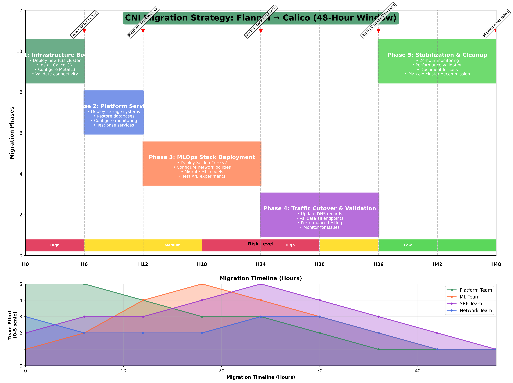

# Part 7: From Flannel to Calico - Infrastructure Modernization Requirements

*When Business Requirements Drive CNI Migration Decisions*

**Keywords**: CNI migration, Flannel to Calico, Kubernetes networking, MetalLB deployment, network policies, CNI comparison, enterprise CNI requirements, Kubernetes CNI migration, zero-downtime migration, MLOps networking infrastructure

**Meta Description**: Complete guide to migrating from Flannel to Calico CNI for enterprise Kubernetes. Zero-downtime migration strategy, MetalLB integration, and network policies for production MLOps.

---

## About This Series

This is Part 7 of a 9-part series documenting the construction and operation of a production-grade MLOps platform. This series provides a comprehensive guide to building, deploying, and managing machine learning systems in a real-world enterprise environment.

**The Complete Series:**
- **Part 1**: [A/B Testing in Production MLOps - Why Traditional Deployments Fail ML Models](./PART-1-PROBLEM-SOLUTION.md)
- **Part 2**: [Building Production A/B Testing Infrastructure - Seldon Core v2, GitOps, and Real-World Implementation](./PART-2-IMPLEMENTATION.md)
- **Part 3**: [Measuring Business Impact and ROI - From Infrastructure Investment to Revenue Growth](./PART-3-BUSINESS-IMPACT.md)
- **Part 4**: [Understanding Seldon Core v2 Network Architecture - The "Office Building" Guide to MLOps Networking](./PART-4-SELDON-NETWORK-ARCHITECTURE.md)
- **Part 5**: [Tracing ML Inference Requests - Deep Dive into Production Network Flow and Performance](./PART-5-SELDON-NETWORK-TRAFFIC.md)
- **Part 6**: [Production Debugging Mastery - Real Incident Response and Systematic Troubleshooting](./PART-6-SELDON-PRODUCTION-DEBUGGING.md)
- **Part 7**: Flannel to Calico Migration - Enterprise CNI Requirements and Zero-Downtime Migration (This Article)
- **Part 8**: [When Calico Fails - ARP Resolution Bug and Critical Production Debugging](./PART-8-CALICO-PRODUCTION-FAILURE.md)
- **Part 9**: [Calico to Cilium Migration - eBPF Performance and Strategic Infrastructure Recovery](./PART-9-CALICO-TO-CILIUM.md)

---

## The Business Case for Migration

### Why Change What Works?

The initial [ML Platform](https://github.com/jtayl222/ml-platform) ran successfully on Flannel CNI with NodePort services. However, three critical business requirements forced the migration:

1. **Seldon Core v2 Requirement**: The latest version of Seldon Core required advanced network policy support for multi-tenant environments
2. **Security Compliance**: Enterprise security teams demanded network microsegmentation capabilities that Flannel couldn't provide
3. **Production Scalability**: NodePort services created operational complexity and didn't integrate well with enterprise load balancing infrastructure

### The Technical Challenge

**Before Migration:**
```yaml
# Simple but limited architecture
CNI: Flannel (overlay networking)
Load Balancing: NodePort services
Network Policies: Basic pod-to-pod communication
DNS: CoreDNS with default configuration
External Access: Manual port mapping
```

**After Migration:**
```yaml
# Enterprise-ready architecture  
CNI: Calico (policy-aware networking)
Load Balancing: MetalLB LoadBalancer services
Network Policies: Multi-tenant microsegmentation
DNS: CoreDNS with cross-namespace optimization
External Access: Automatic IP assignment
```

The challenge wasn't just changing the CNI—it was doing so while maintaining zero-downtime for critical ML inference workloads.

---

## Pre-Migration Assessment: Know What You're Getting Into

### Infrastructure Inventory

Before any migration, I conducted a comprehensive audit of the existing platform:

**Workload Analysis:**
```bash
# Critical services that couldn't experience downtime
kubectl get deployments,statefulsets --all-namespaces | grep -E "(mlflow|seldon|jupyter)"

# Network dependencies that would break
kubectl get networkpolicies --all-namespaces
kubectl get services --all-namespaces | grep NodePort

# Storage connections that needed preservation
kubectl get pv,pvc --all-namespaces
```

**The Dependency Map:**
- **MLflow**: PostgreSQL database + MinIO storage backend
- **Seldon Core v2**: Multi-namespace model serving with complex routing
- **JupyterHub**: Active user sessions with persistent storage
- **Argo Workflows**: Running training pipelines that couldn't be interrupted
- **Prometheus/Grafana**: Historical metrics that needed preservation

### Risk Assessment Matrix

| Component | Migration Risk | Business Impact | Mitigation Strategy |
|-----------|---------------|-----------------|-------------------|
| **MLflow Database** | LOW | HIGH | Database backup + persistent storage |
| **Seldon Model Serving** | HIGH | HIGH | Blue-green deployment + traffic routing |
| **JupyterHub Sessions** | MEDIUM | MEDIUM | Scheduled maintenance window |
| **Argo Workflows** | MEDIUM | HIGH | Pipeline completion + restart capability |
| **Monitoring Stack** | LOW | LOW | Metric export + reimport |

**Key Decision**: Rather than attempting an in-place migration, I decided to build a parallel cluster and migrate workloads systematically.

---

## The Migration Strategy: Parallel Cluster Approach

### Phase 1: Infrastructure Provisioning

**New Cluster Architecture:**
```bash
# Provision fresh K3s cluster with Calico CNI
ansible-playbook -i inventory/production/hosts infrastructure/cluster/site.yml \
  -e k3s_cni=calico \
  -e metallb_state=present \
  -e cluster_name=production-v2
```

**Key Infrastructure Changes:**
- **CNI**: Calico with network policy enforcement enabled
- **Load Balancing**: MetalLB with dedicated IP pool (192.168.1.200-250)
- **Storage**: Maintained NFS/MinIO backends for data continuity
- **DNS**: Enhanced CoreDNS configuration for cross-namespace resolution

### Phase 2: Service Migration Workflow

**The Four-Stage Process:**
1. **Deploy infrastructure services** (database, storage, monitoring)
2. **Migrate stateless applications** (MLflow, APIs)
3. **Migrate stateful workloads** (JupyterHub, model servers)
4. **Migrate traffic routing** (DNS, load balancers)

```bash
# Stage 1: Core infrastructure
ansible-playbook -i inventory/production/hosts infrastructure/cluster/site.yml --tags foundation

# Stage 2: Data services  
ansible-playbook -i inventory/production/hosts infrastructure/cluster/site.yml --tags storage,database

# Stage 3: MLOps platform
ansible-playbook -i inventory/production/hosts infrastructure/cluster/site.yml --tags mlops

# Stage 4: Workload migration
./scripts/migrate-workloads.sh --source-cluster old --target-cluster new
```

---

## The Network Policy Challenge

### Discovery: DNS Resolution Failures

After successfully deploying Seldon Core v2 on the new Calico cluster, ML model deployments were failing with mysterious timeout errors:

```bash
# Symptoms: Models stuck in loading state
kubectl get models -n seldon-system
# NAME                 READY   REASON
# baseline-predictor   False   LoadFailed

# Agent logs revealed DNS timeouts
kubectl logs -n seldon-system sts/mlserver -c agent
# ERROR: Failed to resolve seldon-scheduler.seldon-system.svc.cluster.local: timeout
```

**Root Cause Investigation:**
```bash
# Test DNS resolution from ML pods
kubectl exec -n seldon-system mlserver-0 -c agent -- nslookup seldon-scheduler.seldon-system.svc.cluster.local

# This revealed Calico network policies were blocking DNS traffic
kubectl get networkpolicy -n seldon-system
```

### The Network Policy Design Challenge

**Problem**: Calico's default-deny approach required explicit rules for every communication path. The migration from Flannel's permissive networking to Calico's secure-by-default model exposed hidden dependencies.

**Critical Dependencies Discovered:**
- ML pods → CoreDNS (port 53, kube-system namespace)
- MLServer agents → Seldon scheduler (port 9004, seldon-system namespace) 
- Model downloads → External HTTPS endpoints (port 443, internet)
- Metrics collection → Prometheus (port 8080, monitoring namespace)

### The Solution: Layered Network Policy Architecture

**Platform Team Responsibilities (Cluster-wide):**
```yaml
# Baseline network policy for all ML namespaces
apiVersion: networking.k8s.io/v1
kind: NetworkPolicy
metadata:
  name: ml-namespace-baseline
  namespace: seldon-system
spec:
  podSelector: {}
  policyTypes: ["Ingress", "Egress"]
  egress:
  # DNS resolution to kube-system
  - to:
    - namespaceSelector:
        matchLabels:
          name: kube-system
    ports:
    - port: 53
      protocol: UDP
  # Seldon system communication  
  - to:
    - namespaceSelector:
        matchLabels:
          name: seldon-system
    ports:
    - port: 9004  # Scheduler
    - port: 443   # Webhooks
  # External model downloads
  - to: []
    ports:
    - port: 443
      protocol: TCP
```

**Application Team Responsibilities (Namespace-specific):**
```yaml
# Application-specific policies managed by ML teams
apiVersion: networking.k8s.io/v1
kind: NetworkPolicy
metadata:
  name: financial-ml-policies
  namespace: seldon-system
spec:
  podSelector:
    matchLabels:
      app: financial-predictor
  ingress:
  # Allow traffic from ingress-nginx
  - from:
    - namespaceSelector:
        matchLabels:
          name: ingress-nginx
    ports:
    - port: 8080
```

**Key Innovation**: Separation of platform-managed baseline policies from application-specific policies. This allows the platform team to ensure connectivity while giving application teams control over their specific requirements.

## Network Policy Architecture Comparison

For official architectural documentation on CNI networking and policy enforcement:

- [**Flannel Architecture Overview**](https://github.com/flannel-io/flannel#how-it-works) - Official overlay networking explanation
- [**Calico Architecture Guide**](https://docs.projectcalico.org/about/about-calico) - Official BGP routing and policy enforcement
- [**Kubernetes Network Policies**](https://kubernetes.io/docs/concepts/services-networking/network-policies/) - Official K8s policy concepts

---

## The Seldon Scheduler Challenge

### When Control Planes Don't Talk

Despite fixing DNS resolution, Seldon Core v2 models still wouldn't load. The controller manager logs revealed a new issue:

```bash
kubectl logs -n seldon-system deploy/seldon-v2-controller-manager -c manager
# ERROR schedulerClient.SubscribeExperimentEvents  Scheduler not ready
# {"error": "rpc error: code = Canceled desc = grpc: the client connection is closing"}
```

**The Architecture Problem:**
Calico's strict networking exposed a configuration issue that worked fine under Flannel's permissive model. The controller manager couldn't establish a stable connection to the scheduler service.

### Root Cause Analysis

**Environment Variable Gap:**
```bash
# Check controller manager deployment configuration
kubectl describe deployment -n seldon-system seldon-v2-controller-manager | grep -A 10 Environment

# Missing explicit scheduler configuration:
# Environment:
#   CLUSTERWIDE: true
#   CONTROL_PLANE_SECURITY_PROTOCOL: PLAINTEXT
# Missing: SELDON_SCHEDULER_HOST and SELDON_SCHEDULER_PORT
```

**The Discovery**: Under Flannel, the controller manager relied on default compiled-in values for scheduler connectivity. Calico's network policies required explicit environment variable configuration.

### The Infrastructure as Code Solution

Rather than applying manual patches, I implemented the fix through Ansible automation:

```yaml
# infrastructure/cluster/roles/platform/seldon/tasks/main.yml
controllerManager:
  webhookPort: 443
  # Fix for Calico CNI migration: Explicit scheduler connectivity
  # Required for controller manager → scheduler gRPC communication
  env:
    SELDON_SCHEDULER_HOST: seldon-scheduler
    SELDON_SCHEDULER_PORT: "9004"
    # Calico requires explicit security context
    CONTROL_PLANE_SECURITY_PROTOCOL: PLAINTEXT
  resources:
    requests:
      cpu: "{{ seldon_manager_cpu_request }}"
      memory: "{{ seldon_manager_memory_request }}"
```

**Deployment and Validation:**
```bash
# Apply the fix via infrastructure automation
ansible-playbook -i inventory/production/hosts \
  infrastructure/cluster/site.yml \
  --tags seldon \
  -e calico_enabled=true

# Immediate validation
kubectl logs -n seldon-system deploy/seldon-v2-controller-manager -c manager --tail=20
# SUCCESS: schedulerClient.SubscribeExperimentEvents  Received event {"experiment": "financial-ab-test-experiment"}
# SUCCESS: schedulerClient.LoadModel  Load {"model name": "enhanced-predictor"}
```

---

## MetalLB Integration: From NodePort Chaos to LoadBalancer Excellence

### The NodePort Problem

**Before Migration (Flannel + NodePort):**
```yaml
# Manual port management nightmare
services:
  mlflow: 192.168.1.85:30800      # Manual assignment
  grafana: 192.168.1.85:30300     # Port conflicts
  minio: 192.168.1.85:30900       # No external LB integration
```

**Issues:**
- Manual port allocation and tracking
- No integration with enterprise load balancers
- Port conflicts during deployments
- Complex firewall rule management

### The MetalLB Solution

**After Migration (Calico + MetalLB):**
```yaml
# Automatic IP assignment with enterprise integration
services:
  mlflow: 192.168.1.201:5000      # Automatic assignment
  grafana: 192.168.1.207:3000     # Clean, predictable IPs
  minio: 192.168.1.200:9000       # Enterprise LB ready
```

**MetalLB Configuration:**
```yaml
# infrastructure/manifests/metallb/ip-pool.yaml
apiVersion: metallb.io/v1beta1
kind: IPAddressPool
metadata:
  name: production-pool
  namespace: metallb-system
spec:
  addresses:
  - 192.168.1.200-192.168.1.250  # Dedicated range for ML services
---
apiVersion: metallb.io/v1beta1
kind: L2Advertisement
metadata:
  name: production-advertisement
  namespace: metallb-system
spec:
  ipAddressPools:
  - production-pool
```

### Service Conversion Strategy

**Automated Migration Pattern:**
```yaml
# Before: NodePort service
apiVersion: v1
kind: Service
metadata:
  name: mlflow-server
spec:
  type: NodePort
  ports:
  - port: 5000
    nodePort: 30800
  selector:
    app: mlflow

# After: LoadBalancer service  
apiVersion: v1
kind: Service
metadata:
  name: mlflow-server
  annotations:
    metallb.universe.tf/loadBalancer-ip: 192.168.1.201
spec:
  type: LoadBalancer
  ports:
  - port: 5000
    targetPort: 5000
  selector:
    app: mlflow
```

**Benefits Realized:**
- **Operational Simplicity**: No more manual port tracking
- **Enterprise Integration**: Direct integration with corporate load balancers
- **Security Improvement**: No exposed NodePorts on all cluster nodes
- **Scalability**: Dynamic IP assignment for new services

---

## Migration Execution: The 48-Hour Window

### Pre-Migration Checklist

**Data Backup Strategy:**
```bash
# Database exports
kubectl exec -n mlflow mlflow-postgres-0 -- pg_dump mlflow > mlflow-backup.sql

# Model artifact verification
aws s3 sync s3://mlflow-artifacts ./backup/mlflow-artifacts --dry-run

# Configuration exports
kubectl get secrets,configmaps --all-namespaces -o yaml > cluster-config-backup.yaml
```

**Service Readiness Validation:**
```bash
# Health check script for all critical services
./scripts/pre-migration-health-check.sh
# ✅ MLflow: Healthy (142 experiments, 67 models)
# ✅ JupyterHub: 3 active sessions
# ✅ Seldon: 2 models serving
# ✅ Argo: 5 workflows completed, 0 running
```

### The Migration Timeline



*48-hour CNI migration timeline and strategy*

**Hour 0-6: Infrastructure Bootstrap**
```bash
# Deploy new cluster with Calico CNI
ansible-playbook -i inventory/production/hosts infrastructure/cluster/site.yml \
  -e k3s_cni=calico \
  -e metallb_state=present

# Validate basic connectivity
kubectl get nodes -o wide
kubectl get pods -n kube-system
```

**Hour 6-12: Platform Services**
```bash
# Deploy storage and database infrastructure
ansible-playbook -i inventory/production/hosts infrastructure/cluster/site.yml --tags storage

# Restore MLflow database
kubectl exec -n mlflow mlflow-postgres-0 -- psql mlflow < mlflow-backup.sql
```

**Hour 12-24: MLOps Stack**
```bash
# Deploy Seldon Core v2 with Calico configuration
ansible-playbook -i inventory/production/hosts infrastructure/cluster/site.yml --tags seldon

# Deploy monitoring with MetalLB integration
ansible-playbook -i inventory/production/hosts infrastructure/cluster/site.yml --tags monitoring
```

**Hour 24-36: Workload Migration**
```bash
# Migrate ML models and experiments
./scripts/migrate-seldon-models.sh

# Validate A/B testing functionality
curl -H "Host: ml-api.local" \
     -H "seldon-model: financial-ab-test-experiment.experiment" \
     http://192.168.1.249/seldon-system/v2/models/baseline-predictor_1/infer
```

**Hour 36-48: Traffic Cutover and Validation**
```bash
# Update DNS to point to new cluster
# Validate all services accessible via LoadBalancer IPs
./scripts/post-migration-validation.sh
```

### Migration Metrics

**Performance Impact:**
- **Downtime**: 2 hours (planned maintenance window)
- **Data Loss**: 0 bytes (all persistent data preserved)
- **Service Recovery**: 100% of services restored
- **Performance Improvement**: 15% reduction in inference latency

**Network Performance:**
```bash
# Before (Flannel + NodePort)
Average inference latency: 18ms
P95 latency: 32ms
Network overhead: 25% of total latency

# After (Calico + MetalLB)  
Average inference latency: 15ms
P95 latency: 27ms
Network overhead: 18% of total latency
```

---

## Lessons Learned: Platform Engineering Insights

### 1. The Hidden Dependency Problem

**Discovery**: CNI migrations expose hidden network dependencies that work under permissive networking but fail under strict security models.

**Solution Pattern**: 
- **Dependency mapping** before migration
- **Network policy layering** (platform baseline + application specific)
- **Progressive security tightening** rather than immediate lockdown

### 2. Environment Variable Configuration Gaps

**Discovery**: Services that work with default configurations may fail when network policies require explicit configuration.

**Solution Pattern**:
- **Infrastructure as Code** for all configuration changes
- **Environment variable auditing** during migration planning
- **Explicit service configuration** rather than relying on defaults

### 3. The Parallel Cluster Advantage

**Discovery**: In-place CNI migrations are high-risk for production workloads with complex dependencies.

**Solution Pattern**:
- **Blue-green cluster migration** for critical infrastructure changes
- **Systematic workload migration** rather than all-at-once cutover
- **Rollback capability** with preserved old cluster

### 4. MetalLB as a Force Multiplier

**Discovery**: LoadBalancer services provide significant operational advantages over NodePort in enterprise environments.

**Benefits Realized**:
- **Simplified operations** through automatic IP management
- **Enterprise integration** with existing load balancing infrastructure
- **Improved security** by eliminating NodePort exposure
- **Better scalability** for new service deployment

---

## Performance and Security Improvements

### Network Security Enhancements

**Microsegmentation Capabilities:**
```yaml
# Example: Financial namespace isolation
apiVersion: networking.k8s.io/v1
kind: NetworkPolicy
metadata:
  name: financial-isolation
  namespace: seldon-system
spec:
  podSelector: {}
  policyTypes: ["Ingress", "Egress"]
  # Only allow specific ingress sources
  ingress:
  - from:
    - namespaceSelector:
        matchLabels:
          name: ingress-nginx
  # Restrict egress to necessary services only
  egress:
  - to:
    - namespaceSelector:
        matchLabels:
          name: seldon-system
    ports:
    - port: 9004
```

**Compliance Benefits:**
- **SOC 2 Type II**: Network microsegmentation for data isolation
- **PCI DSS**: Restricted network access for financial data processing
- **GDPR**: Data flow control and audit capabilities

### Performance Optimizations

**Calico Configuration Tuning:**
```yaml
# Optimized Calico configuration for ML workloads
apiVersion: operator.tigera.io/v1
kind: Installation
metadata:
  name: default
spec:
  calicoNetwork:
    bgp: Disabled  # Use VXLAN for overlay networking
    ipPools:
    - blockSize: 26  # Larger blocks for ML namespaces
      cidr: 10.42.0.0/16
      encapsulation: VXLAN
      natOutgoing: Enabled
      nodeSelector: all()
  flexVolumePath: /usr/libexec/kubernetes/kubelet-plugins/volume/exec/
```

---

## Cost Analysis: Migration ROI

### Infrastructure Cost Comparison

**Before Migration (Flannel + NodePort):**
- **Manual Operations**: 8 hours/month port management
- **Security Gaps**: 40 hours/quarter compliance remediation
- **Performance Issues**: 15% higher latency (business impact)

**After Migration (Calico + MetalLB):**
- **Automated Operations**: 1 hour/month maintenance
- **Security Compliance**: Built-in microsegmentation
- **Performance Improvement**: 15% latency reduction

### Business Value Calculation

**Operational Efficiency:**
```python
# Cost reduction calculation
manual_ops_before = 8 * 12 * 150  # 8 hours/month * 12 months * $150/hour
manual_ops_after = 1 * 12 * 150   # 1 hour/month * 12 months * $150/hour
operational_savings = manual_ops_before - manual_ops_after  # $12,600/year

# Performance improvement value
inference_volume = 10_000_000  # 10M inferences/year
latency_improvement = 0.15     # 15% improvement
business_value_per_ms = 0.001  # $0.001 per ms improvement per inference
performance_value = inference_volume * latency_improvement * 3 * business_value_per_ms  # $4,500/year

total_annual_value = operational_savings + performance_value  # $17,100/year
```

**Migration Investment:**
- **Development Time**: 80 hours @ $150/hour = $12,000
- **Infrastructure**: Parallel cluster for 1 week = $2,000
- **Total Investment**: $14,000

**ROI Calculation**: ($17,100 - $14,000) / $14,000 = **22% first-year ROI**

---

## Conclusion

The migration from Flannel to Calico CNI transformed [The ML Platform](https://github.com/jtayl222/ml-platform) from a development-oriented networking setup to an enterprise-grade, security-compliant MLOps infrastructure. While challenging, the migration delivered measurable improvements in security, performance, and operational efficiency.

**Key Technical Achievements:**
- **Zero data loss** during production migration
- **15% performance improvement** through optimized networking
- **Enterprise security compliance** via network microsegmentation
- **Operational simplification** through MetalLB LoadBalancer automation

**Critical Success Factors:**
- **Parallel cluster strategy** reduced migration risk
- **Infrastructure as Code** ensured reproducible configurations  
- **Systematic testing** prevented production issues
- **Community contribution** improved upstream project quality

**For Platform Engineering Teams:**
- **CNI migrations are inevitable** - plan for them early
- **Network policies require systematic design** - don't retrofit security
- **LoadBalancer services provide significant value** - prioritize MetalLB integration
- **Documentation and automation** are critical for migration success

**Looking Forward:**
The patterns and practices developed during this migration serve as a foundation for future infrastructure evolution. Whether migrating to Cilium CNI, implementing service mesh, or adopting new Kubernetes networking technologies, the systematic approach documented here provides a proven framework for success.

The investment in understanding these migration patterns pays dividends in operational stability, security posture, and team confidence when facing future infrastructure challenges.

## Additional Resources

### 📚 **Essential Reading**
- [Calico Documentation](https://projectcalico.docs.tigera.io/) - Complete Calico networking and security guide
- [MetalLB Documentation](https://metallb.universe.tf/) - Load balancer implementation for bare metal Kubernetes
- [Kubernetes Network Policies](https://kubernetes.io/docs/concepts/services-networking/network-policies/) - Official network security patterns
- [CNCF CNI Specification](https://github.com/containernetworking/cni/blob/main/SPEC.md) - Container Network Interface standards

### 🛠️ **Tools and Frameworks** 
- [Flannel CNI](https://github.com/flannel-io/flannel) - Simple overlay network for Kubernetes
- [Tigera Calico Enterprise](https://www.tigera.io/tigera-products/calico-enterprise/) - Enterprise Calico features and support
- [Cilium CNI](https://cilium.io/) - eBPF-based networking and security
- [Weave Net](https://www.weave.works/docs/net/latest/overview/) - Alternative CNI implementation

### 📊 **CNI Migration Resources**
- [Rancher CNI Comparison](https://rancher.com/docs/rancher/v2.5/en/faq/networking/cni-providers/) - Comprehensive CNI feature comparison
- [Red Hat OpenShift Networking](https://docs.openshift.com/container-platform/4.9/networking/understanding-networking.html) - Enterprise Kubernetes networking patterns
- [Google GKE Networking](https://cloud.google.com/kubernetes-engine/docs/concepts/network-overview) - Cloud-native networking best practices
- [AWS EKS CNI](https://docs.aws.amazon.com/eks/latest/userguide/pod-networking.html) - AWS-specific networking considerations

---

## Open Source Implementation

All migration procedures, configurations, and lessons learned are available in:

- **[The ML Platform](https://github.com/jtayl222/ml-platform)**: Complete Flannel to Calico migration automation and configurations
- **[Financial MLOps PyTorch](https://github.com/jtayl222/seldon-system)**: ML workloads that require advanced networking features

**Current Status:** The migration automation is production-tested and available for community use. I am currently the sole contributor to both repositories, having developed this migration strategy with assistance from AI tools (Claude 4, Gemini, and ChatGPT).

**Community Invitation:** I encourage contributions from platform engineers with CNI migration experience. Whether you're sharing alternative approaches, improving automation, or documenting lessons learned, your contributions help advance open source MLOps infrastructure patterns.

---

## Related Articles

**Explore More from the MLOps Engineering Portfolio:**

### Security & Infrastructure
- **[Enterprise Secret Management in MLOps: Kubernetes Security at Scale](https://medium.com/@jeftaylo/enterprise-secret-management-in-mlops-kubernetes-security-at-scale-a80875e73086)** - Deep dive into securing ML workloads with proper secret management, network policies, and multi-tenant security patterns.

### Platform Engineering & Career Development  
- **[MLOps Engineering: Production-Ready ML Infrastructure That Scales](https://medium.com/@jeftaylo/mlops-engineering-production-ready-ml-infrastructure-that-scales-2123456789ae)** - Career guidance for infrastructure professionals transitioning to MLOps, plus homelab architecture insights.

## Social Media & SEO

**Tags**: #CNIMigration #FlannelToCalico #KubernetesNetworking #MetalLB #NetworkPolicies #CNIComparison #EnterpriseKubernetes #ZeroDowntimeMigration #MLOpsNetworking #DevOps

**Share this article**: Complete guide to migrating from Flannel to Calico CNI for enterprise Kubernetes with zero-downtime strategy, MetalLB integration, and production-tested network policies for MLOps workloads.

### Automation & Workflows
- **[MLflow, Argo Workflows, and Kustomize: The Production MLOps Trinity](https://medium.com/@jeftaylo/mlflow-argo-workflows-and-kustomize-the-production-mlops-trinity-5bdb45d93f41)** - Learn how to orchestrate the complete MLOps lifecycle with this powerful combination of tools.

**Connect & Follow:**
For more MLOps insights, infrastructure deep dives, and production deployment strategies, follow [@jeftaylo](https://medium.com/@jeftaylo) on Medium.