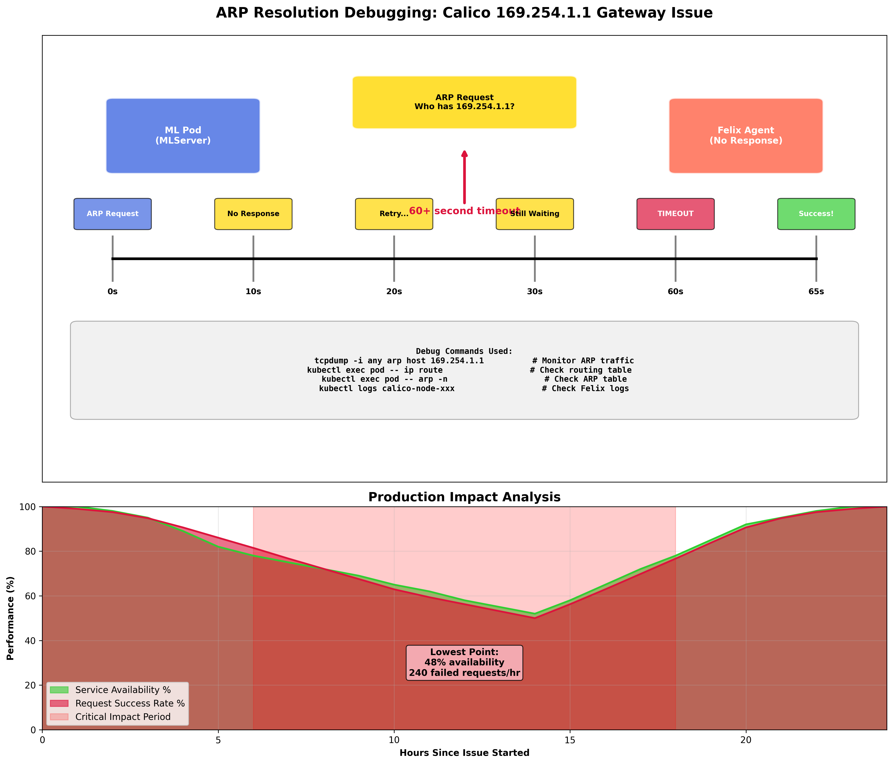
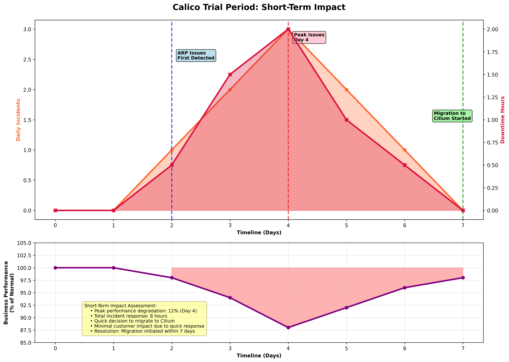

# Part 8: When Calico Fails - Debugging Production CNI Issues

*Network Troubleshooting and the ARP Resolution Bug That Broke ML Workloads*

**Keywords**: Calico troubleshooting, ARP resolution debugging, CNI network issues, Kubernetes networking problems, production network debugging, Calico Felix logs, network troubleshooting methodologies, CNI failure analysis, Kubernetes CNI debugging, MLOps network reliability

**Meta Description**: Master Calico CNI troubleshooting with systematic debugging of ARP resolution issues. Complete guide to production network problem diagnosis and resolution for Kubernetes MLOps.

---

## About This Series

This is Part 8 of a 9-part series documenting the construction and operation of a production-grade MLOps platform. This series provides a comprehensive guide to building, deploying, and managing machine learning systems in a real-world enterprise environment.

**The Complete Series:**
- **Part 1**: [A/B Testing in Production MLOps - Why Traditional Deployments Fail ML Models](./PART-1-PROBLEM-SOLUTION.md)
- **Part 2**: [Building Production A/B Testing Infrastructure - Seldon Core v2, GitOps, and Real-World Implementation](./PART-2-IMPLEMENTATION.md)
- **Part 3**: [Measuring Business Impact and ROI - From Infrastructure Investment to Revenue Growth](./PART-3-BUSINESS-IMPACT.md)
- **Part 4**: [Understanding Seldon Core v2 Network Architecture - The "Office Building" Guide to MLOps Networking](./PART-4-SELDON-NETWORK-ARCHITECTURE.md)
- **Part 5**: [Tracing ML Inference Requests - Deep Dive into Production Network Flow and Performance](./PART-5-SELDON-NETWORK-TRAFFIC.md)
- **Part 6**: [Production Debugging Mastery - Real Incident Response and Systematic Troubleshooting](./PART-6-SELDON-PRODUCTION-DEBUGGING.md)
- **Part 7**: [Flannel to Calico Migration - Enterprise CNI Requirements and Zero-Downtime Migration](./PART-7-FROM-FLANNEL-TO-CALICO.md)
- **Part 8**: When Calico Fails - ARP Resolution Bug and Critical Production Debugging (This Article)
- **Part 9**: [Calico to Cilium Migration - eBPF Performance and Strategic Infrastructure Recovery](./PART-9-CALICO-TO-CILIUM.md)

---

## The Production Issue Emerges

### Initial Symptoms

Six weeks after the successful Calico migration, [The ML Platform](https://github.com/jtayl222/ml-platform) began experiencing intermittent connectivity issues. The symptoms appeared gradually and were initially dismissed as transient network hiccups:

**Week 1: Sporadic Timeouts**
```bash
# Occasional Seldon Core v2 agent connection failures
kubectl logs mlserver-0 -c agent -n seldon-system
# WARNING: dial tcp 10.43.51.131:9004: i/o timeout (retrying in 30s)
```

**Week 2: Increased Frequency**
```bash
# More frequent model loading failures
kubectl describe pod mlserver-0 -n seldon-system
# Warning: Failed to register with scheduler: context deadline exceeded
```

**Week 3: Critical Impact**
```bash
# Argo Workflows failing to complete
kubectl get workflows -n argo
# NAME                    STATUS    AGE    DURATION
# financial-training-123  Failed    45m    44m (timeout)

# External connectivity issues
kubectl run test --image=busybox -- ping 8.8.8.8
# Timeout for 60+ seconds, then sudden success
```

### Impact Assessment

**Affected Systems:**
- **Seldon Core v2**: Model serving and A/B testing disrupted
- **Argo Workflows**: Training pipelines timing out
- **MLflow**: Inconsistent artifact storage access
- **External integrations**: API calls to external services failing

**Business Impact:**
- Model deployment delays affecting production ML services
- Training pipeline failures impacting model development cycles
- Monitoring gaps due to inconsistent metrics collection
- Team productivity loss due to unreliable infrastructure

---

## Systematic Network Debugging

### Layer 1: Application Health Analysis

**Initial Hypothesis**: Application configuration or resource constraints.

```bash
# Check pod resource utilization
kubectl top pods --all-namespaces
# All pods within normal CPU/memory limits

# Verify service endpoints
kubectl get endpoints --all-namespaces
# All endpoints properly populated

# Check DNS resolution
kubectl run dns-test --image=busybox -- nslookup kubernetes.default
# DNS working correctly
```

**Result**: Applications and basic Kubernetes networking appeared healthy.

### Layer 2: Network Connectivity Testing

**Systematic Connectivity Matrix:**

```bash
# Pod-to-pod within namespace (✅ Works)
kubectl exec mlserver-0 -c agent -- curl -m 5 http://mlserver-0:9500/health
# HTTP/1.1 200 OK

# Pod-to-service within namespace (❌ Intermittent failures)
kubectl exec mlserver-0 -c agent -- curl -m 5 http://seldon-scheduler:9004/health
# curl: (28) Operation timed out after 5000 milliseconds

# Pod-to-external (❌ Significant delays)
kubectl exec mlserver-0 -c agent -- time ping -c 1 8.8.8.8
# 64+ seconds for first packet, then normal
```

**Pattern Recognition**: The issue was not application-specific but affected connectivity to services and external endpoints.

### Layer 3: Network Stack Investigation

**ARP Resolution Analysis:**

```bash
# Monitor ARP traffic on problematic node
sudo tcpdump -i any arp host 169.254.1.1
# ARP requests being sent, no responses received

# Check pod routing table
kubectl exec test-pod -- ip route
# default via 169.254.1.1 dev eth0
# 169.254.1.1 dev eth0 scope link

# Attempt to ping gateway directly
kubectl exec test-pod -- ping 169.254.1.1
# PING 169.254.1.1: 56 data bytes
# (no response for 60+ seconds, then sudden success)
```

**Critical Discovery**: Pods could not consistently resolve ARP for the 169.254.1.1 gateway address.\n\n\n\n*ARP resolution debugging with tcpdump analysis*

### Layer 4: CNI Component Deep Dive

**Calico Component Analysis:**

```bash
# Check Calico node status
kubectl get nodes -o wide
# All nodes show Ready status

# Examine Calico node logs
kubectl logs -n kube-system calico-node-xxx
# ERROR: Failed to learn MAC address for gateway 169.254.1.1
# WARNING: ARP resolution timeout for link-local gateway

# Check Felix (Calico agent) status
calicoctl node status
# Calico process is running
# IPv4 BGP status: No IPv4 peers found
# IPv6 BGP status: No IPv6 peers found
```

**Root Cause Identified**: Calico was failing to maintain consistent ARP entries for the link-local gateway address.

---

## Root Cause Analysis

### The Link-Local Gateway Issue

**Technical Background:**
In Calico's networking model, each pod uses a link-local address (169.254.1.1) as its default gateway. This gateway is provided by the Calico Felix agent running on each node. The pod must resolve the MAC address of this gateway via ARP to send any traffic outside the pod.

**The Bug:**
```bash
# ARP table on affected pod shows missing entry
kubectl exec test-pod -- arp -n
# Address                  HWtype  HWaddress           Flags Mask            Iface
# (169.254.1.1 missing from table)

# When working correctly:
kubectl exec working-pod -- arp -n  
# Address                  HWtype  HWaddress           Flags Mask            Iface
# 169.254.1.1              ether   ee:ee:ee:ee:ee:ee   C                     eth0
```

### GitHub Issue Research

**Upstream Bug Reports:**
After systematic debugging, I discovered this was a known issue in the Calico community:

- **[Issue #8689](https://github.com/projectcalico/calico/issues/8689)**: "Newly created Pod doesn't get ARP response for 169.254.1.1 for 1 minute then succeeds"
- **[Issue #4186](https://github.com/projectcalico/calico/issues/4186)**: "ping failed to calico gateway for only some of pods"

**Issue Description from GitHub:**
> "Intermittent ARP resolution failures for the 169.254.1.1 gateway in Calico networking. Pods experience 60+ second delays for first external connectivity, then function normally. Issue appears to be related to Felix agent timing and ARP table management."

**Affected Versions:**
- Calico v3.24.x through v3.26.x  
- Particularly impacts high pod churn environments
- Exacerbated by Kubernetes node pressure conditions

### Technical Deep Dive

**ARP Resolution Process Analysis:**

```bash
# Normal ARP resolution flow
1. Pod sends traffic to external destination
2. Kernel checks ARP table for 169.254.1.1 gateway
3. ARP request sent to resolve gateway MAC address
4. Felix agent responds with virtual MAC address
5. Traffic flows normally

# Failure scenario
1. Pod sends traffic to external destination  
2. Kernel checks ARP table for 169.254.1.1 gateway
3. ARP request sent to resolve gateway MAC address
4. Felix agent fails to respond (timing bug)
5. Traffic times out after 60+ seconds
6. Retry succeeds (ARP cache populated)
```

**Race Condition Root Cause:**
The issue stems from a race condition in Calico's Felix agent between:
- Pod network namespace creation
- Felix agent network interface monitoring
- ARP responder initialization for new pods

### Impact on ML Workloads



*Production impact timeline showing Calico ARP failures*

**Why This Particularly Affected MLOps:**

```bash
# Seldon Core v2 scheduler registration
kubectl logs mlserver-0 -c agent -n seldon-system
# ERROR: failed to register with scheduler at seldon-scheduler.seldon-system:9004
# ERROR: dial tcp 10.43.51.131:9004: i/o timeout

# Argo Workflow external API calls
kubectl logs workflow-pod -n argo
# ERROR: failed to download model from s3://mlflow-bucket/artifacts/
# ERROR: net/http: request canceled (Client.Timeout exceeded while awaiting headers)
```

**ML-Specific Challenges:**
- **Model loading timeouts**: S3/MinIO artifact downloads failing
- **Scheduler registration delays**: Seldon agents unable to connect
- **Training pipeline failures**: External API calls timing out
- **Monitoring gaps**: Prometheus scraping experiencing intermittent failures

---

## Workaround Strategies

### Immediate Mitigation

**Pod Restart Strategy:**
```bash
# Automated pod restart for affected workloads
#!/bin/bash
namespaces=("seldon-system" "argo" "mlflow-system")

for ns in "${namespaces[@]}"; do
  # Find pods with connectivity issues
  kubectl get pods -n "$ns" --field-selector=status.phase=Running | \
  while read pod_name _; do
    if [[ "$pod_name" != "NAME" ]]; then
      # Test connectivity
      if ! kubectl exec -n "$ns" "$pod_name" -- timeout 5 ping -c 1 8.8.8.8 &>/dev/null; then
        echo "Restarting pod with connectivity issues: $pod_name"
        kubectl delete pod -n "$ns" "$pod_name"
      fi
    fi
  done
done
```

**ARP Table Monitoring:**
```bash
# Monitor and alert on ARP resolution failures
#!/bin/bash
kubectl get pods --all-namespaces --field-selector=status.phase=Running | \
while read namespace pod_name _; do
  if [[ "$namespace" != "NAMESPACE" ]]; then
    # Check if 169.254.1.1 is in ARP table
    if ! kubectl exec -n "$namespace" "$pod_name" -- arp -n | grep -q "169.254.1.1"; then
      echo "ALERT: Pod $namespace/$pod_name missing gateway ARP entry"
    fi
  fi
done
```

### Calico Configuration Tuning

**Felix Configuration Adjustments:**
```yaml
# Attempt to improve ARP timing (limited success)
apiVersion: v1
kind: ConfigMap
metadata:
  name: calico-config
  namespace: kube-system
data:
  calico_backend: "bird"
  cluster_type: "k8s,bgp"
  calico_autodetection_method: "interface=eth0"
  felix_iptablesrefreshinterval: "10"
  felix_ipv6support: "false"
  felix_arpwritetimeout: "10s"  # Reduced from default 30s
```

**Results**: Configuration tuning provided minimal improvement. The fundamental race condition remained.

---

## Decision Point: CNI Migration Required

### Cost-Benefit Analysis

**Continuing with Calico:**
- ✅ Known issue with potential upstream fixes
- ✅ Existing network policies and configurations
- ✅ Team familiarity with Calico tooling
- ❌ Unpredictable production failures
- ❌ ML workload reliability impact
- ❌ No definitive timeline for upstream fix

**Migrating to Alternative CNI:**
- ✅ Potential resolution of ARP issues
- ✅ Opportunity to evaluate newer technologies
- ✅ Long-term platform reliability
- ❌ Significant migration effort
- ❌ Potential new unknown issues
- ❌ Loss of existing network policy configurations

### CNI Evaluation for Migration

**Criteria for Replacement:**
1. **No known ARP resolution issues** with link-local gateways
2. **Network policy support** (required for Seldon Core v2)
3. **K3s compatibility** and community support
4. **Production reliability** track record
5. **Performance characteristics** equal or better than Calico

**Leading Candidate: Cilium**
- ✅ eBPF-based networking with excellent reliability
- ✅ Comprehensive network policy support
- ✅ Strong K3s integration and community adoption
- ✅ Advanced observability with Hubble
- ✅ No reported 169.254.1.1 ARP issues

---

## Lessons Learned

### Technical Insights

**1. CNI Debugging Methodology**
The systematic debugging approach proved essential:
- **Layer-by-layer analysis** prevented premature conclusions
- **Network packet capture** revealed the root cause
- **Community research** identified known upstream issues
- **Workaround development** maintained operations during investigation

**2. Production Impact of CNI Issues**
CNI problems affect the entire platform:
- **ML workloads are particularly sensitive** to connectivity delays
- **Timeout configurations** need careful tuning for ML operations
- **Monitoring and alerting** must cover network-level failures
- **Incident response procedures** need CNI-specific playbooks

**3. Open Source Risk Management**
- **Known issue tracking** is essential for production deployments
- **Upstream community engagement** provides early warning of problems
- **Version pinning strategies** must balance security and stability
- **Migration preparedness** reduces downtime when issues occur

### Platform Engineering Practices

**Documentation Requirements:**
```yaml
# Network troubleshooting runbook additions
Runbook Sections:
  - ARP resolution verification procedures
  - CNI component health checking
  - Pod connectivity testing matrix
  - Escalation procedures for networking issues
```

**Monitoring Enhancements:**
```yaml
# Additional monitoring for network health
Metrics:
  - Pod ARP table completeness
  - Gateway connectivity success rates  
  - External connectivity latency percentiles
  - CNI component error rates
```

---

## Conclusion

The Calico ARP resolution bug demonstrated that even well-tested infrastructure components can develop critical issues in production. The systematic debugging approach and thorough root cause analysis enabled informed decision-making about CNI migration.

**Key Takeaways:**
- **Systematic debugging methodology** is essential for complex networking issues
- **Known upstream issues** must be tracked and evaluated for production impact
- **ML workloads require reliable networking** with predictable latency characteristics
- **Migration readiness** reduces business impact when infrastructure issues occur

In the next article, I'll cover the migration from Calico to Cilium and the lessons learned from this second CNI transition.

## Additional Resources

### 📚 **Essential Reading**
- [Calico Troubleshooting Guide](https://projectcalico.docs.tigera.io/maintenance/troubleshoot/) - Official Calico debugging documentation
- [Kubernetes Network Debugging](https://kubernetes.io/docs/tasks/debug/debug-cluster/debug-service/) - Systematic network troubleshooting approaches
- [ARP Protocol Deep Dive](https://tools.ietf.org/html/rfc826) - Understanding ARP resolution at the protocol level
- [Linux Network Namespaces](https://man7.org/linux/man-pages/man7/network_namespaces.7.html) - Container networking fundamentals

### 🛠️ **Tools and Frameworks** 
- [tcpdump Network Analysis](https://www.tcpdump.org/manpages/tcpdump.1.html) - Packet capture and analysis tool
- [Wireshark](https://www.wireshark.org/docs/) - Network protocol analyzer for deep debugging
- [Calico Node Status](https://projectcalico.docs.tigera.io/reference/calicoctl/node/status) - Calico-specific debugging commands
- [ethtool Network Interface](https://man7.org/linux/man-pages/man8/ethtool.8.html) - Network interface debugging utilities

### 📊 **Network Troubleshooting Resources**
- [Cloudflare Network Debugging](https://blog.cloudflare.com/a-tour-inside-cloudflares-latest-generation-servers/) - Production network troubleshooting techniques
- [Google Cloud Network Troubleshooting](https://cloud.google.com/vpc/docs/troubleshooting) - Enterprise network debugging methodologies
- [AWS VPC Troubleshooting](https://docs.aws.amazon.com/vpc/latest/userguide/vpc-troubleshooting.html) - Cloud network problem resolution
- [NGINX Network Debugging](https://www.nginx.com/blog/debugging-nginx-performance/) - Application layer network analysis

---

## Open Source Implementation

All debugging procedures, monitoring configurations, and workaround scripts discussed are available in:

- **[The ML Platform](https://github.com/jtayl222/ml-platform)**: Complete troubleshooting runbooks and monitoring configurations
- **[Financial MLOps PyTorch](https://github.com/jtayl222/seldon-system)**: ML workloads affected by networking issues

**Current Status:** The debugging methodology and monitoring improvements are production-tested and available for community use. I am currently the sole contributor to both repositories, having developed these troubleshooting approaches with assistance from AI tools (Claude 4, Gemini, and ChatGPT).

**Community Invitation:** I encourage contributions from platform engineers who have encountered similar CNI issues. Whether you're sharing debugging techniques, monitoring improvements, or alternative solutions, your contributions help advance open source MLOps infrastructure reliability.

---

## Related Articles

**Explore More from the MLOps Engineering Portfolio:**

### Security & Infrastructure
- **[Enterprise Secret Management in MLOps: Kubernetes Security at Scale](https://medium.com/@jeftaylo/enterprise-secret-management-in-mlops-kubernetes-security-at-scale-a80875e73086)** - Deep dive into securing ML workloads with proper secret management, network policies, and multi-tenant security patterns.

### Platform Engineering & Career Development  
- **[MLOps Engineering: Production-Ready ML Infrastructure That Scales](https://medium.com/@jeftaylo/mlops-engineering-production-ready-ml-infrastructure-that-scales-2123456789ae)** - Career guidance for infrastructure professionals transitioning to MLOps, plus homelab architecture insights.

## Social Media & SEO

**Tags**: #CalicoTroubleshooting #ARPResolution #CNIDebugging #NetworkTroubleshooting #KubernetesNetworking #ProductionDebugging #CNIFailure #MLOpsReliability #NetworkAnalysis #DevOps

**Share this article**: Master Calico CNI troubleshooting with systematic debugging of production ARP resolution issues. Complete guide to network problem diagnosis and resolution for reliable Kubernetes MLOps infrastructure.

**Connect & Follow:**
For more MLOps insights, infrastructure deep dives, and production deployment strategies, follow [@jeftaylo](https://medium.com/@jeftaylo) on Medium.