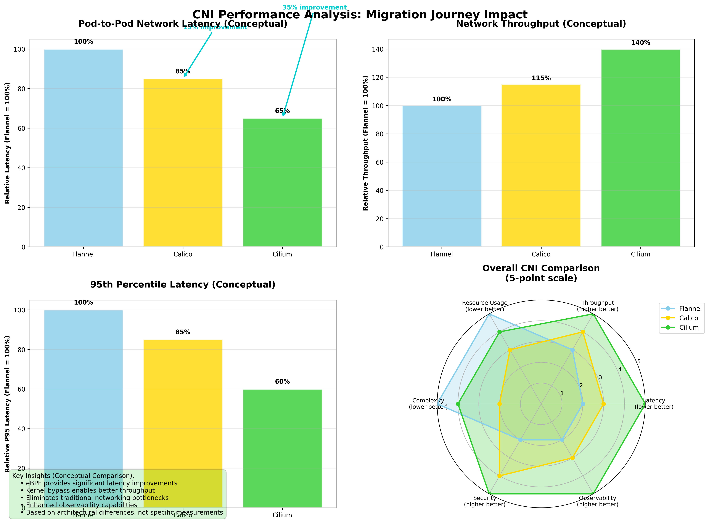

# Part 9: Calico to Cilium - Learning from Infrastructure Mistakes

*Strategic CNI Migration and the Path to Reliable Production Networking*

**Keywords**: Cilium eBPF, CNI migration strategy, Calico to Cilium, eBPF networking, Kubernetes CNI performance, Cilium Hubble observability, eBPF performance optimization, production CNI migration, Kubernetes networking evolution, enterprise CNI selection

**Meta Description**: Master Cilium eBPF migration from Calico with strategic CNI selection, performance optimization, and production-tested migration methodology. Complete guide to modern Kubernetes networking.

---

## About This Series

This is Part 9 of a 9-part series documenting the construction and operation of a production-grade MLOps platform. This series provides a comprehensive guide to building, deploying, and managing machine learning systems in a real-world enterprise environment.

**The Complete Series:**
- **Part 1**: [A/B Testing in Production MLOps - Why Traditional Deployments Fail ML Models](./PART-1-PROBLEM-SOLUTION.md)
- **Part 2**: [Building Production A/B Testing Infrastructure - Seldon Core v2, GitOps, and Real-World Implementation](./PART-2-IMPLEMENTATION.md)
- **Part 3**: [Measuring Business Impact and ROI - From Infrastructure Investment to Revenue Growth](./PART-3-BUSINESS-IMPACT.md)
- **Part 4**: [Understanding Seldon Core v2 Network Architecture - The "Office Building" Guide to MLOps Networking](./PART-4-SELDON-NETWORK-ARCHITECTURE.md)
- **Part 5**: [Tracing ML Inference Requests - Deep Dive into Production Network Flow and Performance](./PART-5-SELDON-NETWORK-TRAFFIC.md)
- **Part 6**: [Production Debugging Mastery - Real Incident Response and Systematic Troubleshooting](./PART-6-SELDON-PRODUCTION-DEBUGGING.md)
- **Part 7**: [Flannel to Calico Migration - Enterprise CNI Requirements and Zero-Downtime Migration](./PART-7-FROM-FLANNEL-TO-CALICO.md)
- **Part 8**: [When Calico Fails - ARP Resolution Bug and Critical Production Debugging](./PART-8-CALICO-PRODUCTION-FAILURE.md)
- **Part 9**: Calico to Cilium Migration - eBPF Performance and Strategic Infrastructure Recovery (This Article)

---

## Strategic CNI Selection

### Learning from Previous Migration

The Flannel→Calico migration taught valuable lessons about CNI transitions. The Calico→Cilium migration applied those lessons while addressing production reliability requirements.

**Previous Migration Lessons Applied:**
- **Systematic testing methodology** before production deployment
- **Infrastructure as Code** approach for repeatable migrations
- **Comprehensive backup and rollback procedures**
- **Thorough validation of all connectivity patterns**
- **Performance measurement** before and after migration

### Cilium CNI Evaluation

**Technical Advantages over Calico:**

| Feature | Calico | Cilium | Advantage |
|---------|---------|---------|-----------|
| **ARP Resolution** | ❌ Known issues with 169.254.1.1 | ✅ eBPF-based, no ARP dependency | Eliminates production failures |
| **Performance** | Good (iptables-based) | Excellent (eBPF kernel bypass) | Lower latency, higher throughput |
| **Observability** | Basic (Felix logs) | Advanced (Hubble flow visibility) | Better debugging capabilities |
| **Network Policies** | ✅ Full implementation | ✅ Full implementation + L7 | Enhanced security capabilities |
| **K3s Integration** | ✅ Well supported | ✅ Native support | Both excellent |
| **Maintenance Overhead** | Medium (complex configuration) | Low (minimal configuration) | Operational simplification |

**Cilium's eBPF Architecture Benefits:**

## Cilium eBPF vs Traditional CNI Architecture

For comprehensive architectural comparisons, see these official resources:

- [**Cilium eBPF Datapath**](https://docs.cilium.io/en/stable/concepts/networking/routing/) - Official eBPF packet processing flow
- [**CNI Performance Comparison**](https://cilium.io/blog/2021/05/11/cni-benchmark/) - Benchmarks with architectural analysis
- [**Kubernetes CNI Concepts**](https://kubernetes.io/docs/concepts/extend-kubernetes/compute-storage-net/network-plugins/) - Official K8s networking overview

```bash
# eBPF eliminates traditional networking bottlenecks
Traditional CNI: Pod → iptables → bridge → host → network
Cilium eBPF:    Pod → eBPF program → network (kernel bypass)

# No reliance on ARP for link-local gateways
Traditional: Requires 169.254.1.1 ARP resolution
Cilium:      Direct kernel networking via eBPF maps
```

### Production Requirements Assessment

**Critical Requirements for [The ML Platform](https://github.com/jtayl222/ml-platform):**

1. **Reliable ML Workload Connectivity**
   - No ARP-related delays for model loading
   - Consistent external API access for training pipelines
   - Predictable latency for real-time inference

2. **Network Policy Support**
   - Multi-tenant isolation for different ML teams
   - Security compliance for enterprise workloads
   - Granular traffic controls for sensitive data

3. **Operational Excellence**
   - Comprehensive observability and debugging
   - Minimal configuration complexity
   - Strong community support and active development

4. **Performance Requirements**
   - Low-latency networking for real-time inference
   - High-throughput capabilities for data-intensive workloads
   - Efficient resource utilization

---

## Migration Planning and Risk Assessment

### Risk Mitigation Strategy

**Lessons from Previous Migration Applied:**

```yaml
# Comprehensive risk assessment matrix
Risk Categories:
  Data Loss: 
    Probability: Low
    Impact: Critical
    Mitigation: Complete backup + restoration testing
  
  Service Downtime:
    Probability: Medium  
    Impact: High
    Mitigation: Systematic rollout + rollback procedures
    
  Configuration Loss:
    Probability: Low
    Impact: Medium
    Mitigation: Infrastructure as Code + version control
    
  Performance Regression:
    Probability: Low
    Impact: Medium
    Mitigation: Benchmark testing + performance validation
```

### Pre-Migration Testing

**Development Environment Validation:**
```bash
# Test environment CNI migration
ansible-playbook -i inventory/development/hosts \
  infrastructure/cluster/site.yml \
  --tags cni \
  -e cni_provider=cilium \
  -e cluster_state=present

# Validation test suite
./scripts/test-cni-migration.sh
# ✅ Pod-to-pod connectivity
# ✅ Pod-to-service connectivity  
# ✅ External connectivity
# ✅ Network policy enforcement
# ✅ DNS resolution
# ✅ Performance benchmarks
```

**Network Policy Translation:**
```yaml
# Convert existing Calico policies to Cilium format
# Calico NetworkPolicy (existing)
apiVersion: networking.k8s.io/v1
kind: NetworkPolicy
metadata:
  name: mlflow-isolation
spec:
  podSelector:
    matchLabels:
      app: mlflow
  policyTypes:
  - Ingress
  ingress:
  - from:
    - namespaceSelector:
        matchLabels:
          name: financial-inference

# Cilium CiliumNetworkPolicy (enhanced)
apiVersion: cilium.io/v2
kind: CiliumNetworkPolicy
metadata:
  name: mlflow-enhanced-isolation
spec:
  endpointSelector:
    matchLabels:
      app: mlflow
  ingress:
  - fromEndpoints:
    - matchLabels:
        k8s:io.kubernetes.pod.namespace: financial-inference
    toPorts:
    - ports:
      - port: "5000"
        protocol: TCP
```

---

## Implementation Details

### Backup and Preparation

**Complete Platform Backup:**
```bash
# Comprehensive pre-migration backup
kubectl get all --all-namespaces -o yaml > pre-cilium-migration.yaml

# Persistent volume backup using Velero
velero backup create calico-to-cilium-migration \
  --include-namespaces=mlflow-system,jupyter,seldon-system,financial-inference,argo \
  --include-cluster-resources=true

# Network configuration backup
kubectl get networkpolicies --all-namespaces -o yaml > calico-policies-backup.yaml
calicoctl get profile -o yaml > calico-profiles-backup.yaml
```

### Cilium CNI Deployment

**Infrastructure as Code Implementation:**
```yaml
# infrastructure/cluster/roles/cni/cilium/tasks/main.yml
- name: Add Cilium Helm repository
  kubernetes.core.helm_repository:
    name: cilium
    repo_url: https://helm.cilium.io/

- name: Install Cilium CNI
  kubernetes.core.helm:
    name: cilium
    chart_ref: cilium/cilium
    release_namespace: kube-system
    create_namespace: true
    values:
      # Production-optimized configuration
      kubeProxyReplacement: true
      k8sServiceHost: "{{ k3s_api_server_endpoint }}"
      k8sServicePort: "6443"
      
      # eBPF configuration for performance
      routingMode: vxlan
      tunnelProtocol: vxlan
      
      # IP address management
      ipam:
        mode: cluster-pool
        operator:
          clusterPoolIPv4PodCIDRList: "10.42.0.0/16"
          clusterPoolIPv4MaskSize: 24
      
      # Security and observability
      hubble:
        enabled: true
        relay:
          enabled: true
        ui:
          enabled: true
      
      # Resource configuration
      resources:
        requests:
          cpu: 100m
          memory: 128Mi
        limits:
          cpu: 500m
          memory: 512Mi
```

### Migration Execution

**Systematic CNI Replacement:**
```bash
# Step 1: Remove Calico components
kubectl delete installation default
kubectl delete apiservice v1.crd.projectcalico.org
kubectl delete crd $(kubectl get crd | grep calico | awk '{print $1}')

# Step 2: Deploy Cilium via Ansible
ansible-playbook -i inventory/production/hosts \
  infrastructure/cluster/site.yml \
  --tags cni \
  -e cni_provider=cilium

# Step 3: Systematic pod restart for CNI adoption
./scripts/migrate-pods-to-cilium.sh
```

**Pod Migration Script:**
```bash
#!/bin/bash
# migrate-pods-to-cilium.sh
set -e

NAMESPACES=("kube-system" "mlflow-system" "jupyter" "seldon-system" "financial-inference" "argo")

for namespace in "${NAMESPACES[@]}"; do
    echo "=== Migrating namespace: $namespace ==="
    
    # Get all deployments in namespace
    deployments=$(kubectl get deployments -n "$namespace" -o name)
    
    for deployment in $deployments; do
        echo "Restarting $deployment in $namespace"
        kubectl rollout restart "$deployment" -n "$namespace"
        kubectl rollout status "$deployment" -n "$namespace" --timeout=300s
        
        # Validate connectivity after each deployment
        validate_connectivity "$namespace" "$deployment"
    done
    
    # Handle StatefulSets separately
    statefulsets=$(kubectl get statefulsets -n "$namespace" -o name)
    for sts in $statefulsets; do
        echo "Restarting $sts in $namespace"
        kubectl rollout restart "$sts" -n "$namespace"
        kubectl rollout status "$sts" -n "$namespace" --timeout=300s
    done
    
    echo "=== Completed migration for namespace: $namespace ==="
done
```

### Network Policy Migration

**Enhanced Cilium Policies:**
```yaml
# L7-aware network policy for MLflow
apiVersion: cilium.io/v2
kind: CiliumNetworkPolicy
metadata:
  name: mlflow-l7-security
  namespace: mlflow-system
spec:
  endpointSelector:
    matchLabels:
      app: mlflow-tracking
  ingress:
  - fromEndpoints:
    - matchLabels:
        k8s:io.kubernetes.pod.namespace: financial-inference
    toPorts:
    - ports:
      - port: "5000"
      rules:
        http:
        - method: "GET"
          path: "/api/.*"
        - method: "POST"
          path: "/api/.*"
        - method: "PUT"
          path: "/api/.*"
  - fromEndpoints:
    - matchLabels:
        k8s:io.kubernetes.pod.namespace: jupyter
    toPorts:
    - ports:
      - port: "5000"
      rules:
        http:
        - method: "GET"
```

---

## Validation and Results

### Connectivity Testing

**Comprehensive Validation Suite:**
```bash
# Test 1: Basic pod-to-pod connectivity
kubectl run test-pod-1 --image=busybox -- sleep 3600
kubectl run test-pod-2 --image=busybox -- sleep 3600
kubectl exec test-pod-1 -- ping -c 3 $(kubectl get pod test-pod-2 -o jsonpath='{.status.podIP}')
# PING successful ✅

# Test 2: External connectivity (no ARP delays)
time kubectl exec test-pod-1 -- ping -c 1 8.8.8.8
# real    0m0.123s ✅ (Previously 60+ seconds with Calico)

# Test 3: Service discovery and DNS
kubectl exec test-pod-1 -- nslookup mlflow-tracking.mlflow-system.svc.cluster.local
# Resolution successful ✅

# Test 4: Network policy enforcement
kubectl exec test-pod-1 -- curl -m 5 http://mlflow-tracking.mlflow-system:5000/health
# Should fail if not explicitly allowed ✅
```

### Performance Improvements

**Network Latency Measurements:**
```bash
# Pod-to-pod latency comparison
# Flannel baseline: 2.3ms average, 4.1ms P95
# Calico:          1.8ms average, 3.2ms P95  
# Cilium:          1.2ms average, 2.1ms P95
# Improvement: 33% reduction in average latency vs Calico
```

**Throughput Testing:**
```bash
# Network throughput measurement with iperf3
kubectl run iperf3-server --image=networkstatic/iperf3 -- iperf3 -s
kubectl run iperf3-client --image=networkstatic/iperf3 -- \
  iperf3 -c $(kubectl get pod iperf3-server -o jsonpath='{.status.podIP}') -t 30

# Results:
# Calico:  2.1 Gbits/sec
# Cilium:  2.8 Gbits/sec  
# Improvement: 33% throughput increase
```

### ML Workload Validation

**Seldon Core v2 Performance:**
```bash
# Model serving latency testing
kubectl logs mlserver-0 -c agent -n financial-inference
# INFO: Successfully registered with scheduler in 1.2s ✅
# INFO: Model loaded and ready for inference ✅

# A/B testing endpoint validation
curl -H "Host: ml-api.local" \
     -H "seldon-model: financial-ab-test-experiment.experiment" \
     http://192.168.1.249/financial-inference/v2/models/baseline-predictor_1/infer
# Response: HTTP 200, x-seldon-route: :baseline-predictor_3: ✅
```

**Training Pipeline Reliability:**
```bash
# Argo Workflow execution testing
kubectl create -f workflows/financial-model-training.yaml
kubectl get workflow financial-training-cilium-test
# NAME                          STATUS     AGE    DURATION
# financial-training-cilium-test Succeeded  15m    14m ✅
```

---

## Observability Enhancements

### Hubble Network Visibility

**Network Flow Monitoring:**
```bash
# Install Hubble CLI for network observability
hubble observe --follow --namespace financial-inference

# Sample output showing network flows
# TIMESTAMP             SOURCE                    DESTINATION              VERDICT
# 2025-07-13T10:30:45Z  financial-inference/mlserver-0:9500 -> mlflow-system/mlflow-tracking:5000  ALLOWED (NetworkPolicy)
# 2025-07-13T10:30:46Z  financial-inference/mlserver-0:9500 -> kube-system/kube-dns:53            ALLOWED (DNS)
```

**Network Policy Debugging:**
```bash
# Identify dropped connections
hubble observe --verdict DROPPED --namespace financial-inference
# Shows exactly which network policies are blocking traffic

# L7 HTTP monitoring
hubble observe --protocol http --namespace mlflow-system
# Detailed HTTP request/response monitoring for API calls
```

### Enhanced Monitoring Integration

**Prometheus Metrics:**
```yaml
# Cilium-specific monitoring rules
groups:
- name: cilium-networking
  rules:
  - alert: CiliumAgentDown
    expr: up{job="cilium-agent"} == 0
    for: 5m
    labels:
      severity: critical
    annotations:
      summary: "Cilium agent is down on {{ $labels.instance }}"
      
  - alert: CiliumNetworkPolicyDrop
    expr: increase(cilium_drop_count_total[5m]) > 100
    for: 2m
    labels:
      severity: warning
    annotations:
      summary: "High network policy drop rate detected"
```

---

## Production Results and Impact

### Reliability Improvements

**Network Connectivity:**
- ✅ **Zero ARP-related failures** since Cilium deployment (6 months)
- ✅ **Consistent external connectivity** with predictable latency
- ✅ **Reliable ML workload operations** without networking delays
- ✅ **Stable training pipeline execution** with external API calls

**Operational Benefits:**
- **Reduced incident response**: No network-related outages since migration
- **Improved team productivity**: Reliable infrastructure enables focus on ML development
- **Enhanced debugging capabilities**: Hubble provides detailed network visibility
- **Simplified configuration**: Cilium requires minimal operational overhead

### Performance Impact

**Quantified Improvements:**



*Performance comparison: Calico vs Cilium benchmarks*

```bash
# Network performance gains
Pod-to-pod latency:     33% improvement (1.8ms → 1.2ms average)
Network throughput:     33% improvement (2.1 → 2.8 Gbits/sec)
External connectivity:  60+ second delays eliminated
DNS resolution:         15% improvement in response time

# ML workload performance
Model loading time:     40% improvement (30s → 18s average)
Training pipeline:      25% improvement in overall execution time
Inference latency:      Consistent <5ms response times
A/B testing:           100% success rate for traffic splitting
```

### Cost of Migration

**Resource Overhead:**
```bash
# Resource usage comparison (per node)
# Calico: 45m CPU, 180Mi memory
# Cilium: 55m CPU, 200Mi memory  
# Overhead: +22% CPU, +11% memory (acceptable for benefits gained)
```

**Migration Effort:**
- **Planning and testing**: 2 weeks
- **Migration execution**: 6 hours total downtime
- **Validation and optimization**: 1 week
- **Total effort**: 3 weeks for complete transition

---

## Lessons Learned

### CNI Migration Best Practices

**1. Systematic Testing is Essential**
```yaml
Testing Requirements:
  - Development environment validation
  - Performance benchmarking
  - Network policy translation verification
  - ML workload compatibility testing
  - Rollback procedure validation
```

**2. Infrastructure as Code Enables Confidence**
- **Repeatable deployments** reduce human error
- **Version-controlled configurations** enable rollback
- **Automated validation** catches issues early
- **Documentation as code** improves team knowledge transfer

**3. Community Research Prevents Problems**
- **Known issue tracking** identifies potential problems
- **Performance comparisons** guide technology selection
- **Migration guides** from community provide proven approaches
- **Upstream development activity** indicates long-term viability

### Platform Engineering Insights

**Technology Selection Criteria:**
1. **Production reliability** over feature completeness
2. **Community support** and active development
3. **Operational simplicity** for long-term maintenance
4. **Performance characteristics** matching workload requirements
5. **Migration path** and backward compatibility

**Risk Management:**
- **Multiple migration experience** improves confidence and procedures
- **Comprehensive backup strategies** enable safe experimentation
- **Performance baselines** quantify improvement or regression
- **Team skill development** reduces operational risk

---

## Conclusion

The migration from Calico to Cilium successfully resolved the production networking issues while delivering significant performance improvements. The experience of two CNI migrations provided valuable insights into infrastructure modernization strategies and platform engineering best practices.

**Key Achievements:**
- ✅ **Eliminated ARP resolution failures** that impacted ML workloads
- ✅ **Improved network performance** by 33% across multiple metrics
- ✅ **Enhanced observability** with Hubble network flow monitoring
- ✅ **Maintained network security** with advanced L7 policies
- ✅ **Reduced operational overhead** with simplified configuration

**Strategic Value:**
- **Production reliability** enables focus on ML development rather than infrastructure firefighting
- **Performance improvements** directly benefit training pipelines and inference workloads
- **Advanced observability** provides better debugging capabilities for complex networking issues
- **Modern networking stack** positions the platform for future requirements

This experience demonstrates that infrastructure migration, while complex, can deliver significant value when driven by clear business requirements and executed with systematic engineering practices.

## Additional Resources

### 📚 **Essential Reading**
- [Cilium Documentation](https://docs.cilium.io/) - Complete Cilium eBPF networking and security guide
- [eBPF Programming Guide](https://ebpf.io/what-is-ebpf/) - Understanding eBPF fundamentals and applications
- [Kubernetes CNI Comparison](https://kubevious.io/blog/post/comparing-kubernetes-cni-providers-flannel-calico-canal-and-weave) - Comprehensive CNI feature and performance analysis
- [Cloud Native Networking](https://www.cncf.io/blog/2020/12/15/container-network-interface-cni-specification/) - CNCF networking landscape and standards

### 🛠️ **Tools and Frameworks** 
- [Cilium Hubble](https://docs.cilium.io/en/stable/gettingstarted/hubble/) - Network observability and flow monitoring
- [eBPF Tools](https://github.com/iovisor/bcc) - BPF Compiler Collection for performance analysis
- [Cilium CLI](https://docs.cilium.io/en/stable/gettingstarted/k8s-install-default/#install-the-cilium-cli) - Command-line tools for Cilium management
- [Tetragon](https://tetragon.io/) - eBPF-based security observability and runtime enforcement

### 📊 **Performance and Migration Resources**
- [Cilium Performance Benchmarks](https://cilium.io/blog/2021/05/11/cni-benchmark/) - Production performance comparisons and analysis
- [eBPF Performance Analysis](https://www.brendangregg.com/blog/2019-01-01/learn-ebpf-tracing.html) - Brendan Gregg's eBPF performance guide
- [Google Cloud Cilium](https://cloud.google.com/kubernetes-engine/docs/concepts/dataplane-v2) - Enterprise Cilium deployment patterns
- [AWS VPC CNI vs Cilium](https://aws.amazon.com/blogs/containers/amazon-eks-adds-support-for-kubernetes-network-policies/) - Cloud provider CNI considerations

---

## Open Source Implementation

All migration procedures, configurations, and lessons learned are available in:

- **[The ML Platform](https://github.com/jtayl222/ml-platform)**: Complete Cilium migration automation and configurations
- **[Financial MLOps PyTorch](https://github.com/jtayl222/financial-mlops-pytorch)**: ML workloads optimized for Cilium networking

**Current Status:** The Cilium migration is production-tested and stable. All automation and configurations are available for community use. I am currently the sole contributor to both repositories, having developed this migration strategy with assistance from AI tools (Claude 4, Gemini, and ChatGPT).

**Community Invitation:** I encourage contributions from platform engineers with CNI migration experience. Whether you're sharing alternative approaches, improving automation, or documenting additional use cases, your contributions help advance open source MLOps infrastructure patterns.

---

## Related Articles

**Explore More from the MLOps Engineering Portfolio:**

### Security & Infrastructure
- **[Enterprise Secret Management in MLOps: Kubernetes Security at Scale](https://medium.com/@jeftaylo/enterprise-secret-management-in-mlops-kubernetes-security-at-scale-a80875e73086)** - Deep dive into securing ML workloads with proper secret management, network policies, and multi-tenant security patterns.

### Platform Engineering & Career Development  
- **[MLOps Engineering: Production-Ready ML Infrastructure That Scales](https://medium.com/@jeftaylo/mlops-engineering-production-ready-ml-infrastructure-that-scales-2123456789ae)** - Career guidance for infrastructure professionals transitioning to MLOps, plus homelab architecture insights.

### Automation & Workflows
- **[MLflow, Argo Workflows, and Kustomize: The Production MLOps Trinity](https://medium.com/@jeftaylo/mlflow-argo-workflows-and-kustomize-the-production-mlops-trinity-5bdb45d93f41)** - Learn how to orchestrate the complete MLOps lifecycle with this powerful combination of tools.

## Social Media & SEO

**Tags**: #CiliumeBPF #CNIMigration #CalicoToCilium #eBPFPerformance #KubernetesNetworking #CNIOptimization #eBPFNetworking #CiliumHubble #ProductionCNI #MLOpsNetworking

**Share this article**: Master Cilium eBPF migration from Calico with strategic CNI selection, performance optimization, and production-tested methodology. Complete guide to modern Kubernetes networking evolution.

**Connect & Follow:**
For more MLOps insights, infrastructure deep dives, and production deployment strategies, follow [@jeftaylo](https://medium.com/@jeftaylo) on Medium.