# Seldon Architecture Confusion: Avoiding the Quicksand

## The Problem: Mixed Signals in Documentation

Seldon Core v2 has **two fundamentally different architecture patterns** that are often mixed together in examples and documentation, leading to deployment failures and hours of debugging.

## Root Cause Analysis

### Why This Happens
1. **Inconsistent Examples**: Official Seldon docs show both centralized and distributed patterns without clear separation
2. **Terminology Overlap**: "Centralized" can mean different things (scheduler vs. MLServer vs. both)
3. **CRD Interdependencies**: SeldonRuntime automatically creates services that conflict with centralized patterns
4. **DNS Conflicts**: External DNS records can override internal service resolution

### The Two Valid Patterns

#### Pattern 1: Fully Centralized (Recommended for Single Teams)
```yaml
# seldon-system namespace:
- seldon-v2-controller-manager
- seldon-scheduler (centralized)
- seldon-envoy (centralized)
- seldon-modelgateway (centralized)

# application namespace (seldon-system):
- models only (no SeldonRuntime)
- server resources only
```

#### Pattern 2: Distributed per Namespace (Multi-tenant)
```yaml
# seldon-system namespace:
- seldon-v2-controller-manager (global coordinator)

# application namespace (seldon-system):
- SeldonRuntime with full stack
- seldon-scheduler (per-namespace)
- seldon-envoy (per-namespace)
- seldon-modelgateway (per-namespace)
- models and servers
```

## The Confusion Matrix

| What You Think | What You Try | What Actually Happens | Why It Fails |
|---|---|---|---|
| "Centralized scheduler" | Deploy SeldonRuntime with replicas=0 | Controller tries to connect to non-existent scheduler | SeldonRuntime creates services even with replicas=0 |
| "Dedicated MLServer" | Deploy SeldonRuntime + Server | MLServer can't connect to scheduler | DNS conflicts, network policies, or scheduler not ready |
| "Use both patterns" | Mix centralized + distributed | Connection timeouts, 404 errors | Services conflict, DNS resolution issues |

## Definitive Decision Tree

```mermaid
graph TD
    A[Starting Seldon Deployment] --> B{Multiple Teams?}
    B -->|Yes| C[Pattern 2: Distributed]
    B -->|No| D[Pattern 1: Centralized]
    
    C --> E[Deploy SeldonRuntime per namespace]
    E --> F[Full scheduler stack per namespace]
    
    D --> G[Deploy models/servers only]
    G --> H[Use centralized scheduler in seldon-system]
    
    F --> I[✅ Working Multi-tenant]
    H --> J[✅ Working Single-tenant]
    
    K[Mixed Approach] --> L[❌ DNS conflicts, connection timeouts]
```



## Quick Diagnostic Commands

### Check Current Architecture
```bash
# Check if you have distributed schedulers
kubectl get pods -A | grep seldon-scheduler

# Check if models are trying to connect to wrong scheduler
kubectl logs -n seldon-system seldon-v2-controller-manager-* | grep "connection error"

# Check for DNS conflicts
kubectl run debug --rm -it --image=busybox -- nslookup seldon-scheduler.seldon-system
```

### Identify the Problem
If you see:
- **Multiple scheduler pods**: You're using distributed pattern
- **Connection timeouts to 10.43.x.x:9004**: Controller can't reach scheduler
- **External IP in nslookup**: DNS conflict with external records
- **"no matching servers available"**: Models not registered with scheduler

## Recovery Strategies

### From Mixed to Centralized
1. **Delete SeldonRuntime**: `kubectl delete seldonruntime -n <namespace>`
2. **Keep only models/servers**: Models will connect to centralized scheduler
3. **Verify centralized scheduler**: `kubectl get pods -n seldon-system | grep scheduler`

### From Mixed to Distributed
1. **Ensure SeldonRuntime has full stack**: Set all replicas to 1
2. **Remove centralized dependencies**: Models should connect to local scheduler
3. **Fix network policies**: Allow cross-namespace communication

## Prevention Guidelines

### For Future Deployments

1. **Start with Architecture Decision**:
   - Single team → Centralized
   - Multiple teams → Distributed
   - Document the choice in `docs/architecture-decisions/`

2. **Use Templates**:
   ```bash
   # Centralized template
   kubectl apply -f templates/centralized-seldon/
   
   # Distributed template  
   kubectl apply -f templates/distributed-seldon/
   ```

3. **Validation Checklist**:
   - [ ] Only one scheduler pattern in use
   - [ ] DNS resolution works for scheduler
   - [ ] Models can connect to intended scheduler
   - [ ] Network policies allow required communication

### Documentation Requirements

Every Seldon deployment should include:

1. **Architecture Decision Record** (ADR):
   - Which pattern chosen and why
   - Expected namespace layout
   - Scheduler connectivity plan

2. **Troubleshooting Runbook**:
   - How to check scheduler connectivity
   - Common failure modes and fixes
   - Rollback procedures

3. **Monitoring Setup**:
   - Scheduler health checks
   - Model loading success rates
   - Connection timeout alerts

## Common Pitfalls to Avoid

### ❌ Don't Do This
```yaml
# Mixed pattern - will fail
apiVersion: mlops.seldon.io/v1alpha1
kind: SeldonRuntime
spec:
  overrides:
  - name: seldon-scheduler
    replicas: 0  # Creates service but no pod
  - name: mlserver
    replicas: 1  # Tries to connect to non-existent scheduler
```

### ✅ Do This Instead
```yaml
# Pure centralized - no SeldonRuntime needed
apiVersion: mlops.seldon.io/v1alpha1
kind: Server
metadata:
  name: mlserver
spec:
  replicas: 1
  # Automatically connects to centralized scheduler
---
apiVersion: mlops.seldon.io/v1alpha1
kind: Model
metadata:
  name: my-model
spec:
  server: mlserver
  # Managed by centralized scheduler
```

## Testing Your Architecture

### Validation Script
```bash
#!/bin/bash
# seldon-architecture-test.sh

echo "🔍 Testing Seldon Architecture..."

# Check scheduler count
SCHEDULER_COUNT=$(kubectl get pods -A | grep seldon-scheduler | wc -l)
echo "Scheduler pods found: $SCHEDULER_COUNT"

if [ $SCHEDULER_COUNT -eq 1 ]; then
    echo "✅ Centralized pattern detected"
    # Test centralized connectivity
    kubectl get svc -n seldon-system seldon-scheduler
elif [ $SCHEDULER_COUNT -gt 1 ]; then
    echo "🔄 Distributed pattern detected"
    # Test distributed connectivity
    kubectl get svc -A | grep seldon-scheduler
else
    echo "❌ No schedulers found - deployment issue"
    exit 1
fi

# Test model connectivity
echo "🧪 Testing model connectivity..."
kubectl get models -A --no-headers | while read ns name ready; do
    echo "Model $name in $ns: $ready"
done
```

## Future-Proofing Recommendations

### 1. Template-Based Deployment
Create deployment templates that enforce architectural consistency:
- `k8s/templates/centralized-seldon/`
- `k8s/templates/distributed-seldon/`

### 2. Automated Validation
Add CI/CD checks that verify:
- Only one scheduler pattern in use
- DNS resolution works correctly
- Models can connect to schedulers

### 3. Clear Documentation Hierarchy
```
docs/
├── architecture-decisions/
│   ├── seldon-pattern-choice.md
│   └── dedicated-mlserver-rationale.md
├── troubleshooting/
│   ├── seldon-architecture-confusion.md  # This file
│   └── seldon-connectivity-issues.md
└── templates/
    ├── centralized-seldon/
    └── distributed-seldon/
```

## Summary

The key insight is that **Seldon's flexibility is also its biggest trap**. The system allows you to mix patterns that shouldn't be mixed, leading to subtle failures. The solution is to:

1. **Choose one pattern** and stick to it
2. **Document the choice** prominently
3. **Validate the architecture** before deploying models
4. **Use templates** to prevent mixing patterns

This prevents teams from spending hours debugging what are essentially architectural mismatches rather than actual bugs.